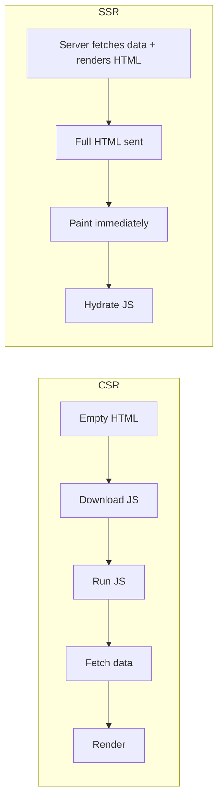

# SSR — Job Tune Cheat Sheet

## Core definitions

| Term | Definition |
|---|---|
| SSR | HTML generated on the server, per request |
| CSR | HTML generated in the browser via JS, after bundle loads |
| Hydration | Client JS attaches event listeners/state to existing server-rendered DOM, without rebuilding it |
| Hydration mismatch | Server HTML ≠ first client render → framework discards/patches DOM, loses SSR benefit |
| SSG | HTML generated at build time (see Static Site Generators topic) |
| ISR | Next.js: static page regenerated in the background after a stale period |
| RSC | React Server Components — components that render only on the server, ship zero JS |
| Islands architecture | Astro model: static HTML by default, opt-in hydration per component |

## CSR vs SSR



| Metric | CSR | SSR |
|---|---|---|
| TTFB | Fast (static shell) | Slower (server does work) |
| FCP / first paint | Slow (blank until JS runs) | Fast (content in initial HTML) |
| SEO (crawlability) | Weak without prerendering | Strong — real content in response |
| Server cost | Low | Higher (compute per request) |
| Interactivity | Immediate once JS runs | Delayed until hydration completes |

## Framework matrix

| Framework | Base | Default hydration | Data-fetch API | Standout feature |
|---|---|---|---|---|
| Next.js | React | Full (Pages Router) / selective streaming (App Router) | `getServerSideProps`, `fetch` in RSC | ISR, App Router + RSC |
| Nuxt.js | Vue | Full | `useAsyncData`/`asyncData` | Vue ecosystem SSR |
| SvelteKit | Svelte | Full, lighter (no vdom) | `load` functions | Compiles away runtime overhead |
| Astro | Any/none | **None by default** | Top-level `await` in frontmatter | Islands (`client:load/idle/visible/media`) — ships minimal JS |

## Hydration mismatch triggers (memorize)

- `Date.now()` / `new Date()` rendered directly
- `Math.random()` in render
- `window`/`document`/`localStorage` read during render (crashes on server, absent)
- Locale/timezone-dependent formatting differing server vs client
- Unstable object key iteration order

**Fix pattern:** render a placeholder identical on server & first client pass; fill real value in `useEffect` (client-only).

```jsx
const [time, setTime] = useState(null);
useEffect(() => setTime(new Date().toLocaleString()), []);
return <span>{time ?? '—'}</span>;
```

## React Router note

Classic React Router usage = CSR/SPA (no server rendering). Modern React Router v7 (post-Remix) supports SSR via `loader`/`action` — check project config (`ssr: true/false`), don't assume by library name alone.

## Likely interview questions

**Q: What problem does SSR solve that CSR doesn't?**
A: SEO (crawlers get real HTML) and faster first contentful paint (no blank-page wait for JS + data fetch).

**Q: What is hydration?**
A: The client JS attaching event handlers/state to server-rendered DOM nodes in place, rather than re-rendering from scratch.

**Q: What causes a hydration mismatch?**
A: Non-deterministic or environment-dependent render output (dates, random values, browser-only globals) differing between server and client render passes.

**Q: Is SSR always faster than CSR?**
A: No — TTFB is usually slower (server compute per request); FCP is usually faster. Depends on caching/CDN strategy.

**Q: How does Astro differ from Next.js in hydration?**
A: Astro hydrates nothing by default (ships static HTML); components opt in via `client:*` directives. Next.js hydrates the whole tree by default (though App Router/RSC narrows this).

**Q: What's ISR?**
A: Next.js Incremental Static Regeneration — a statically generated page is served from cache and regenerated in the background after a configured revalidation window, avoiding a full rebuild for updates.

**Q: Why might you still fetch data client-side in an SSR app?**
A: For data that's user/session-specific after initial load, real-time updates, or content behind interaction (e.g., paginated results) — avoids blocking the initial server render.

---
**Where this fits:** Web Components / Type Checkers → SSR → GraphQL → Static Site Generators → PWAs → Mobile Apps / Desktop Apps
