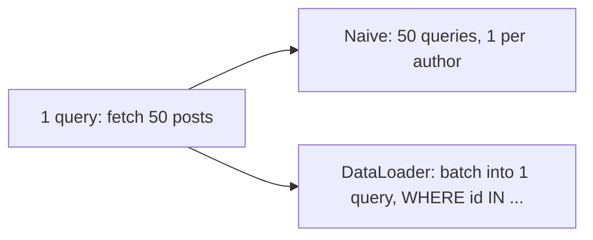

# GraphQL — Job Tune Cheat Sheet

## Core definitions

| Term | Definition |
|---|---|
| GraphQL | Query language + runtime for APIs; client specifies exact data shape |
| Schema | Typed contract of all types/fields/operations the API supports |
| Query | Read operation |
| Mutation | Write operation |
| Subscription | Real-time/streaming operation (usually WebSocket-based) |
| Resolver | Server function that fetches the value for one field |
| N+1 problem | Naive per-item resolver triggers one extra query per list item |
| DataLoader | Batches + caches per-request lookups to fix N+1 |
| Normalized cache | Client cache keyed by `__typename:id`, shared across queries |

## REST vs GraphQL

| | REST | GraphQL |
|---|---|---|
| Endpoints | Many (`/users/1`, `/posts/1/comments`) | One (`/graphql`) |
| Response shape | Fixed per endpoint | Client-defined per query |
| Over-fetching | Common | Avoided |
| Under-fetching | Common (needs multiple calls) | Avoided (nested query in one call) |
| HTTP caching | Native (URL-keyed) | Needs normalized client cache (URL doesn't vary) |
| Versioning | `/v1`, `/v2` endpoints | Schema evolves via deprecation, additive fields |

### Example contrast

REST: `GET /posts/42` + `GET /users/7` + `GET /posts/42/comments` (3+ round trips, extra fields).

GraphQL:
```graphql
query {
  post(id: 42) {
    title
    author { name }
    comments(limit: 3) { text author { name } }
  }
}
```
One request, exact shape, one response.

## N+1 problem



Fix: `DataLoader` — batches per-tick lookups + caches per-request.

```js
const userLoader = new DataLoader(ids => db.users.findByIds(ids));
// resolver: author: (post) => userLoader.load(post.authorId)
```

## Apollo Client vs Relay

| | Apollo Client | Relay Modern |
|---|---|---|
| Setup | Light, no compiler needed | Requires `relay-compiler` |
| Data declaration | Ad hoc per query | Fragment colocation per component |
| Pagination | Manual (`fetchMore`) | Built-in cursor conventions (`@connection`) |
| Best for | Most apps, fast iteration | Large-scale orgs, compile-time data guarantees |
| Cache | Normalized, `InMemoryCache` | Normalized, Relay Store |

## Common mistakes (rapid fire)

- No pagination args on list fields → unbounded result sets
- Forgetting `id` in query → cache can't normalize/merge object
- No query depth/complexity limiting → expensive nested queries abuse server
- Assuming GraphQL always outperforms REST — nested resolvers can be *more* expensive than a few flat REST calls
- Forgetting mutation cache updates (`refetchQueries` / cache `update` / relying on returned `id`)

## Likely interview questions

**Q: What's the core advantage of GraphQL over REST?**
A: Client-specified response shape via a single endpoint, eliminating over-fetching and under-fetching.

**Q: Explain the N+1 problem in GraphQL.**
A: Each resolved field can trigger its own data fetch; resolving a relation across a list naively fires one query per item. Fixed via batching (DataLoader).

**Q: How does GraphQL caching differ from REST caching?**
A: REST caches by URL (each resource has a stable address). GraphQL uses one URL for everything, so clients use a normalized in-memory cache keyed by object type+id instead of HTTP URL caching.

**Q: Apollo vs Relay — when would you pick each?**
A: Apollo for faster setup and most app sizes; Relay for very large codebases wanting compile-time enforced data-fetching discipline via fragment colocation.

**Q: Does GraphQL eliminate over-fetching entirely?**
A: At the field level yes (client picks exact fields), but poorly designed schemas/resolvers can still cause performance over-fetching at the data-source level (e.g., N+1).

**Q: What's a mutation, and how does the client stay in sync after one?**
A: A write operation; clients keep cache in sync via returned object `id`s (auto-merge in normalized cache), explicit `refetchQueries`, or manual cache `update` functions.

---
**Where this fits:** Web Components / Type Checkers → SSR → GraphQL → Static Site Generators → PWAs → Mobile Apps / Desktop Apps
