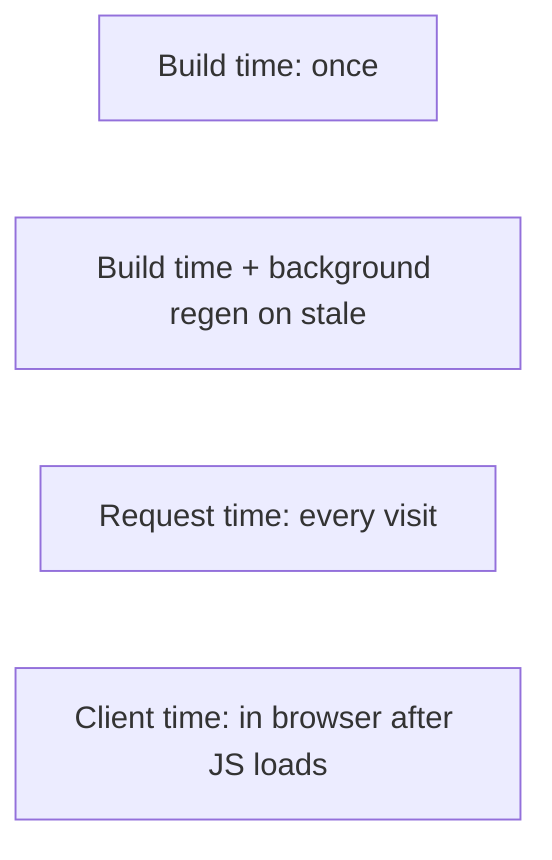

# Static Site Generators — Job Tune Cheat Sheet

## Core definitions

| Term | Definition |
|---|---|
| SSG | HTML rendered once at build time, served as static files |
| SSR | HTML rendered per request, on the server |
| CSR | HTML rendered in-browser via JS after load |
| ISR | Next.js: static page cached, regenerated in background after a stale window |
| On-demand revalidation | Webhook-triggered immediate regeneration of a specific static page |
| Islands architecture | Astro: static by default, opt-in per-component JS hydration |
| Hybrid rendering | Mostly static site with specific routes opted into SSR |

## Rendering time comparison

| Mode | When rendered | Server cost/request | SEO | Personalization |
|---|---|---|---|---|
| SSG | Build time | None | Excellent | Poor (same for all) |
| ISR | Build + periodic | Low (cached, occasional regen) | Excellent | Poor/moderate |
| SSR | Every request | High | Excellent | Good |
| CSR | Browser, post-load | None (server) | Poor without prerender | Excellent |

## Tool comparison

| Tool | Framework | Default JS shipped | Best for |
|---|---|---|---|
| Next.js (`getStaticProps`) | React | Full hydration | Mixed static+dynamic React apps |
| Astro | Any/none | **Zero** (opt-in islands) | Content sites, blogs, marketing, docs — performance-first |
| VuePress | Vue | Full Vue runtime | Documentation sites in Vue ecosystem |
| Eleventy (11ty) | None (templating only) | None by default | Framework-free simple/fast sites, full template control |

## Next.js specifics

- `getStaticProps` (build time) vs `getServerSideProps` (per request) — most common confusion point.
- `getStaticPaths` `fallback`: `false` = 404 on unknown path; `true` = loading state then generate+cache; `'blocking'` = SSR-like first request, cached after.
- `revalidate: N` in `getStaticProps` → ISR (regenerate at most once per N seconds, on-demand not proactive).
- App Router equivalent: `export const revalidate = N` + `fetch(..., { next: { revalidate: N } })`.

## Astro specifics

- Default `output: 'static'`; `'hybrid'` allows opting individual routes into SSR via `export const prerender = false`.
- Forgetting `prerender = false` on a session/cookie-dependent route bakes build-time values into a page meant to be per-request.

## Common mistakes (rapid fire)

- Using SSG for per-user personalized pages (wrong tool — use SSR/CSR)
- Treating ISR `revalidate` as instant (it's "at most every N seconds," not real-time)
- CMS-driven builds exploding in build time at scale (fix: ISR/on-demand instead of full rebuild)
- Assuming "static" means "zero JS" (only true for islands-based tools like Astro by default)
- Stale CDN cache after redeploy due to missing purge/cache headers

## Likely interview questions

**Q: What's the core difference between SSG, SSR, and CSR?**
A: When HTML is produced — SSG at build time (once), SSR per request (server), CSR in-browser after JS load (client).

**Q: What is ISR and why does it exist?**
A: Incremental Static Regeneration (Next.js) — a static page is cached and regenerated in the background after a stale window, giving near-SSG performance with periodically fresh content, avoiding full rebuilds.

**Q: When would you NOT use SSG?**
A: For highly personalized, per-user, or real-time content where pre-building a page per user isn't feasible — use SSR or client-fetched CSR instead.

**Q: How does Astro differ from Next.js SSG in terms of shipped JavaScript?**
A: Astro ships zero JS by default and hydrates only explicitly marked "island" components; Next.js hydrates the full page/component tree by default.

**Q: What's the difference between `fallback: true` and `fallback: 'blocking'` in `getStaticPaths`?**
A: `true` shows an immediate loading state while the page generates client-side then swaps in; `'blocking'` waits server-side (like SSR) before responding, then caches the result — no client-visible loading state.

**Q: Why might build times become a problem with SSG at scale, and how is it addressed?**
A: Pre-building every page for a huge catalog can take very long; addressed via ISR, on-demand generation (`fallback: 'blocking'`), or on-demand revalidation triggered by CMS webhooks instead of full rebuilds.

---
**Where this fits:** Web Components / Type Checkers → SSR → GraphQL → Static Site Generators → PWAs → Mobile Apps / Desktop Apps
