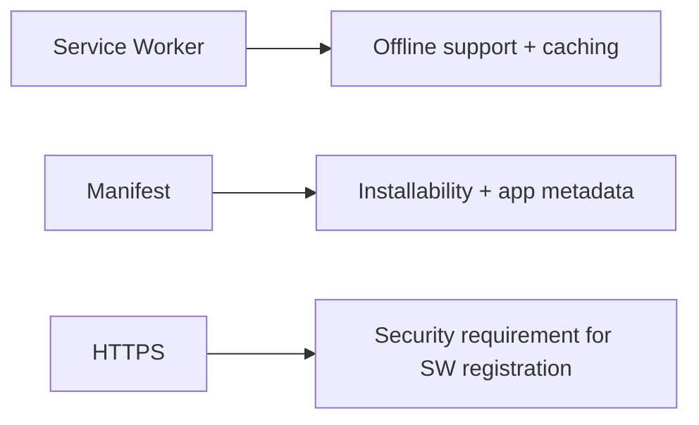
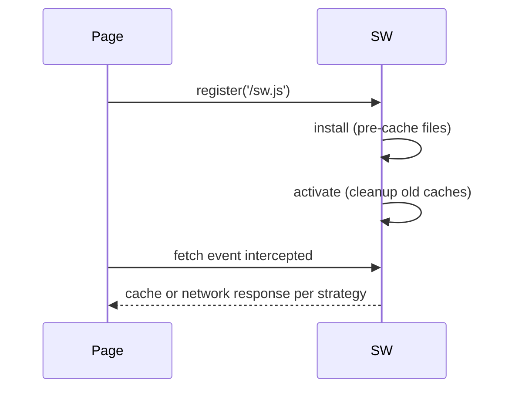

# PWAs — Job Tune Cheat Sheet

## Core definitions

| Term | Definition |
|---|---|
| PWA | Web app enhanced to be installable, offline-capable, native-feeling |
| Service Worker | Background script intercepting network requests (`fetch` events), enables offline/caching |
| Web App Manifest | `manifest.json` — name, icons, `display`, `start_url`, `scope` |
| HTTPS | Required for service worker registration (except `localhost`) |
| `skipWaiting()` | New SW activates immediately instead of waiting for old tabs to close |
| `clients.claim()` | New SW takes control of already-open pages immediately |
| Stale-while-revalidate | Serve cache instantly, refetch in background to update cache |

## Three pillars



## Service Worker lifecycle



Register → Install (`event.waitUntil(cache.addAll(...))`) → Activate (delete stale caches) → Fetch (intercept every request).

## Cache strategies

| Strategy | Behavior | Use case |
|---|---|---|
| Cache-first | Cache, else network | Static hashed assets (JS/CSS/fonts) |
| Network-first | Network, else cache | HTML pages, semi-fresh content |
| Stale-while-revalidate | Cache instantly + refresh in background | API responses |
| Network-only | Never cache | POST/analytics/real-time |
| Cache-only | Never network | Guaranteed pre-cached app shell |

## Minimal manifest.json

```json
{
  "name": "My Awesome PWA",
  "short_name": "AwesomePWA",
  "start_url": "/",
  "display": "standalone",
  "background_color": "#ffffff",
  "theme_color": "#317EFB",
  "icons": [{ "src": "/icons/icon-512.png", "sizes": "512x512", "type": "image/png" }]
}
```

## Registration snippet

```js
if ('serviceWorker' in navigator) {
  navigator.serviceWorker.register('/sw.js');
}
```

## Stale-tab update fix (the #1 real-world bug)

```js
// SW: install event
self.skipWaiting();
// SW: activate event
self.clients.claim();
```
Without these, a new SW sits in "waiting" until all old tabs close — users stay on stale cached version after deploy.

## Common mistakes (rapid fire)

- Cache-first applied to changing API data → indefinitely stale
- Forgetting `skipWaiting()`/`clients.claim()` → deploy "doesn't show up"
- Not bumping `CACHE_NAME` on deploy → stale cache never cleaned up
- No maskable icon → cropped icon on Android
- No offline fallback page → browser error shown instead of graceful offline UI
- Assuming `localhost` HTTPS exemption applies in production

## Likely interview questions

**Q: What are the three required pillars of a PWA?**
A: Service Worker, Web App Manifest, HTTPS.

**Q: Describe the service worker lifecycle.**
A: Register → Install (pre-cache assets) → Activate (clean old caches) → Fetch (intercept every network request going forward).

**Q: Why do users sometimes not see a PWA update after deploy?**
A: New service workers enter a "waiting" state until all tabs with the old version close; fix with `skipWaiting()` in install and `clients.claim()` in activate.

**Q: When would you use stale-while-revalidate vs cache-first?**
A: Cache-first for static, rarely-changing assets; stale-while-revalidate for data that should be fast but eventually fresh, like API responses.

**Q: Why is HTTPS required for service workers?**
A: Service workers can intercept/modify all network traffic for a page, so browsers require a secure origin to prevent man-in-the-middle abuse; `localhost` is exempted for development only.

**Q: What happens if you forget to version your cache name?**
A: Old and new cached assets coexist in the same bucket, activate-phase cleanup logic never identifies stale entries as removable, and storage/staleness issues accumulate.

---
**Where this fits:** Web Components / Type Checkers → SSR → GraphQL → Static Site Generators → PWAs → Mobile Apps / Desktop Apps
