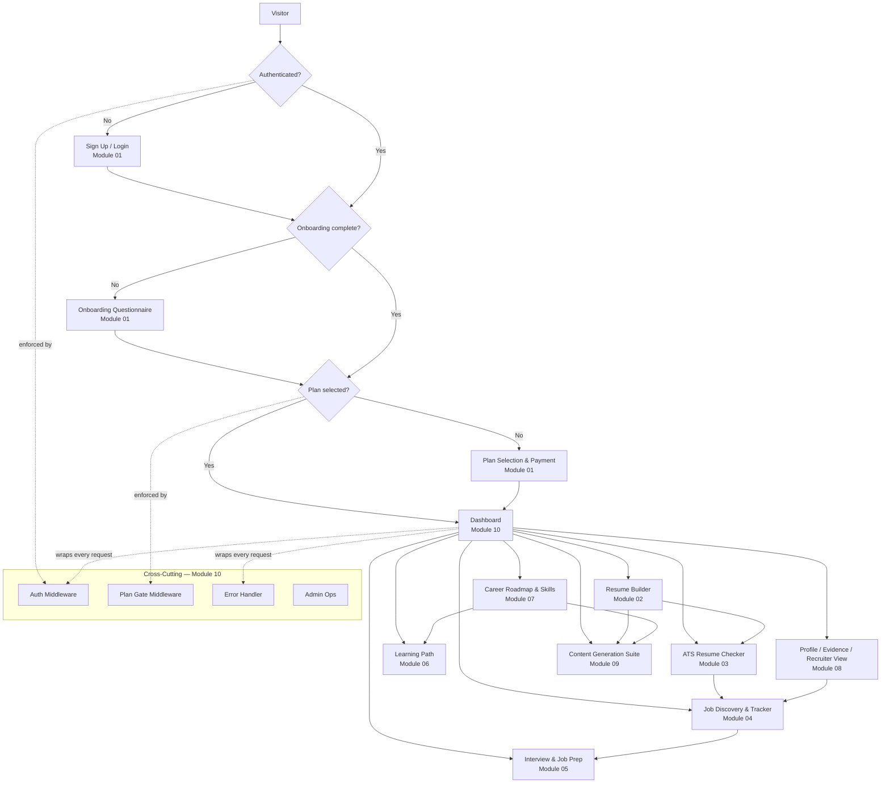

# JobTube Eco System — Module & Workflow Documentation

Internal reference documenting every module's architecture, user workflows, and API surface, grounded in the actual backend (`backend/src`) and frontend (`frontend/src`) code as of 2026-09-09. Built for research, onboarding, and identifying improvement opportunities.

Each module doc follows the same shape: key files, step-by-step workflows, a mermaid flowchart, an API endpoint table, and a "Notes / Gotchas" section listing only things actually observed in code (bugs, stubs, security concerns) — nothing speculative.

## Module Index

| # | Module | Covers |
|---|--------|--------|
| 01 | [Authentication & Onboarding](modules/01-auth-onboarding.md) | Sign up/login, onboarding questionnaire, plan selection & payment |
| 02 | [Resume Builder & Management](modules/02-resume-builder.md) | Resume creation/editing, history/versions, export & send |
| 03 | [ATS Resume Checker V2](modules/03-ats-checker.md) | Rule-based resume analysis pipeline, scoring, critique |
| 04 | [Job Discovery & Tracking](modules/04-job-discovery-tracker.md) | External job sources, fit analysis, application tracker |
| 05 | [Interview Prep & Job Preparation](modules/05-interview-prep.md) | Mock interviews, role-specific prep guides |
| 06 | [Learning Path](modules/06-learning-path.md) | Subject → tier → topic curriculum, progress tracking |
| 07 | [Career Roadmap & Skills Assessment](modules/07-career-roadmap-skills.md) | Skill scoring, roadmap generation, O*NET taxonomy, project ideas |
| 08 | [Profiles, Evidence & Recruiter Visibility](modules/08-profile-evidence-recruiter.md) | User profile, evidence tracking, recruiter-facing view, PII redaction |
| 09 | [Content Generation Suite](modules/09-content-generation.md) | Cover letters, achievement enhancer, resume consistency, GitHub/LinkedIn/portfolio |
| 10 | [Dashboard, Admin & Platform Infrastructure](modules/10-dashboard-admin-platform.md) | Request lifecycle, middleware, admin ops, frontend state/API client |

## System-Wide Flowchart

High-level view of how a user moves through the platform and which modules a request touches.

## Cross-Module Findings (from code, not speculation)

These surfaced independently across the 10 module reviews and matter for prioritizing fixes:

**Correctness bugs**
- ATS Checker: frontend calls `POST /api/resume/v2/optimize`, which doesn't exist in `resumeV2.js` — every "Optimize" click 404s silently. See [03-ats-checker.md](modules/03-ats-checker.md).
- ATS Checker: DB-save path references a non-existent key (`analysis.analysis.keywords...`), throws, and gets mislabeled as an unrelated "DB persist failed" error.
- Resume Builder: DOCX upload text extraction is unimplemented — silently returns empty string. ATS score in `/tune` and `/build` is artificially floored at 90%, and results are never persisted. See [02-resume-builder.md](modules/02-resume-builder.md).
- Learning Path: un-completing a topic never decrements the streak counter; content re-import destructively overwrites topic content with no versioning. See [06-learning-path.md](modules/06-learning-path.md).
- Dashboard/Admin: `initializeTables.js` and `runMigrations.js` define conflicting `resumes` table schemas (`overall_score` vs `original_score`/`optimized_score`); dashboard's first query assumes a column that may not exist depending on which boot path ran. See [10-dashboard-admin-platform.md](modules/10-dashboard-admin-platform.md).

**Security / data-exposure concerns**
- Profile/Evidence: PII redaction stores the *original* emails/phones/names in plaintext JSON (`pii_redactions.redaction_map`) — defeats the purpose if that table is ever exposed. Name-matching uses a ~30-name US-only list; phone regex is US-format only — most real PII is not actually redacted. See [08-profile-evidence-recruiter.md](modules/08-profile-evidence-recruiter.md).
- Dashboard/Admin: no rate-limiting middleware exists anywhere in the backend. The static `/admin` frontend bundle is served with no auth check at the Express layer (unlike every `/api/admin/*` route). Any admin can promote/demote any user's role, including their own, with no last-admin safeguard. See [10-dashboard-admin-platform.md](modules/10-dashboard-admin-platform.md).
- Auth: `/verify-payment` is a mock that always succeeds — no real payment gateway is wired up. Single-device session enforcement is IP-based (breaks under shared NAT / mobile IP changes). See [01-auth-onboarding.md](modules/01-auth-onboarding.md).

**Inconsistent plan-gating** (some endpoints require a paid tier, sibling endpoints in the same route file don't)
- Job Tracker: `POST /api/jobs` requires plan tier 3; `PATCH`/`DELETE`/`GET` only require auth.
- Interview: `POST /api/interview/start` requires plan tier 3; `/respond` and all `/job-prep/*`, `/guides/*` only require auth.
- Learning Path: `learningPath.js` has no plan gate at all, unlike `learning.js`.

**Stale documentation vs. actual code**
- `ATS_CHECKER_V2_IMPLEMENTATION.md` and `RESUME_ANALYZER_V2_IMPLEMENTATION.md` describe an LLM-based enhancement/critic stage that doesn't exist — the real pipeline is 100% rule-based analyzers.
- `ATS_CHECKER_V2_UX_GUIDE.md` claims "no paywall," but the real routes require `requirePlan(2)`.

**Stub / non-functional frontend features** (UI exists, no real backend behind it)
- `PortfolioBuilder.jsx` — fully static, no API calls, no-op buttons, no backend route.
- `ResumeBuilder.jsx`, `ResumeHistory.jsx`, `ResumeSend.jsx` — static "Coming Soon" placeholders; the real, wired resume UI is `ResumeOptimizer.jsx` at `/resume`.
- GitHub Optimizer's "Generator" tab is 100% client-side templating with no persistence (matches its own plan doc's intent).

**Architectural duplication / dead code**
- Two independent frontend auth clients (`useAuthStore.js` and `lib/auth-client.js`) manage the same localStorage token keys separately; `auth-client.js` appears unused.
- `recommendationEngine.js` is a learning-plan recommender, unrelated to job recommendations despite the name.
- Two unrelated "roadmap" features exist (`/api/career/roadmap` → `phases[]` vs `/api/learning/generate-roadmap` → `weeks[]`) with no shared schema.
- Scoring "strategies" (`backend/src/services/scoring/strategies`) is currently a directory holding exactly one strategy, wired with a plain `require`, not a real registry/dispatch pattern.

## How to Extend

When a module changes meaningfully, update its doc under `docs/modules/` directly rather than adding a new file — keep one doc per module. If a genuinely new module is added, give it the next number and add a row to the index table and system flowchart above.
