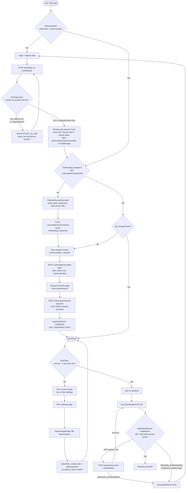

# Authentication & Onboarding

This module covers how a JobTube user signs up or logs in, how their session is issued and kept alive across devices, how they're guided through the initial questionnaire, and how they select and pay for a subscription plan. It combines a JWT + refresh-token session layer (with a strict single-active-device policy) with a two-step onboarding flow (questionnaire → plan selection → mock payment) that gates access to the rest of the product via plan tiers.

## Key Files

**Backend**
- [auth.js](../../backend/src/routes/auth.js) — signup, login, refresh, logout, session listing/revocation, and `/me` endpoints.
- [subscriptions.js](../../backend/src/routes/subscriptions.js) — plan listing, recommendation engine call, order creation, mock payment verification, and onboarding-complete check.
- [planService.js](../../backend/src/services/planService.js) — DB access for plans, user subscriptions, onboarding responses, and plan orders.
- [sessionService.js](../../backend/src/services/sessionService.js) — creates/refreshes/revokes JWT-backed sessions, enforces single-active-device rule, owns the `user_sessions` and `user_progress` table DDL.
- [auth.js (middleware)](../../backend/src/middleware/auth.js) — `authenticateToken`: verifies the JWT and checks the session is still active.
- [requirePlan.js](../../backend/src/middleware/requirePlan.js) — server-side tier gate (`requirePlan(minTier)`) for protecting plan-restricted routes.
- [auditLogger.js](../../backend/src/middleware/auditLogger.js) — logs every `/api` request (method, URL, status, redacted body) to `audit_logs`, tagged with `req.user.id` when available.
- [errorHandler.js](../../backend/src/middleware/errorHandler.js) — global Express error handler; hides internal error messages unless `NODE_ENV=development`.
- [progress.js](../../backend/src/routes/progress.js) — generic per-user keyed progress storage (`user_progress` table), used by `PreparationOnboarding.jsx` to persist prep-track answers.

**Frontend**
- [Login.jsx](../../frontend/src/pages/Login.jsx) — combined login/signup form, handles the "account already in use" (single-device) conflict UI.
- [Onboarding.jsx](../../frontend/src/pages/Onboarding.jsx) — orchestrates the two-step onboarding flow (questionnaire → plan selection).
- [PreparationOnboarding.jsx](../../frontend/src/pages/PreparationOnboarding.jsx) — a **separate**, later-stage onboarding flow (3 questions) that recommends a "preparation track" and stores the answer via `PATCH /api/progress/preferences`. Not part of the signup-time onboarding.
- [PlanSettings.jsx](../../frontend/src/pages/PlanSettings.jsx) — post-onboarding "manage your plan" page; lets an already-onboarded user switch plans and view their active device session.
- [PaymentConfirm.jsx](../../frontend/src/pages/PaymentConfirm.jsx) — lands after plan selection; calls the mock payment verifier and redirects to the dashboard.
- [OnboardingQuestionnaire.jsx](../../frontend/src/components/OnboardingQuestionnaire.jsx) — the 4-question form (career goal, experience, pain points, field of interest) used during first-time onboarding.
- [PlanSelection.jsx](../../frontend/src/components/PlanSelection.jsx) — displays recommended + all plans and creates a pending order when a plan is chosen.
- [PlanChangeModal.jsx](../../frontend/src/components/PlanChangeModal.jsx) — confirmation modal shown before switching plans, diffing gained/lost features.
- [PlanGate.jsx](../../frontend/src/components/PlanGate.jsx) — client-side tier gate component; blocks a tool's UI if the user's plan tier is below the tool's required tier.
- [SessionBlocked.jsx](../../frontend/src/components/SessionBlocked.jsx) — full-screen notice shown when the session was superseded by a sign-in on another device.
- [useAuthStore.js](../../frontend/src/store/useAuthStore.js) — Zustand store: the axios instance (`api`), token storage, login/signup/logout, and the 401-refresh interceptor.
- [useSubscriptionStore.js](../../frontend/src/store/useSubscriptionStore.js) — Zustand store for plans, recommendation, orders, and `hasAccess()` tool-check helper.
- [auth-client.js](../../frontend/src/lib/auth-client.js) — a second, parallel auth API wrapper ("Better Auth client wrapper"). **Not imported anywhere in `frontend/src`** — appears to be dead code duplicating `useAuthStore.js`.

## Workflow: Sign Up / Login

1. **Signup** — `POST /api/auth/signup` ([auth.js](../../backend/src/routes/auth.js)) takes `email`, `password`, optional `github_username`/`linkedin_url`. Validates both required fields are present, checks for an existing user by email (400 `User already exists` if found), hashes the password with `bcrypt` (salt rounds 10), and inserts the user row.
2. Immediately after insert, the backend calls `sessionService.createSession(user.id, meta)` to issue a session (see step 5) and returns `201` with `{ user, token, refreshToken, session }`.
3. **Login** — `POST /api/auth/login` looks up the user by email, compares the password with `bcrypt.compare`, and returns `400 Invalid credentials` on any mismatch (same message for "no such user" and "wrong password", avoiding user enumeration). Password comparisons and lookups use plain string params (parameterized `pool.query` calls — no string concatenation).
4. **Single-device session enforcement** ([sessionService.js](../../backend/src/services/sessionService.js) `createSession`): before issuing a new session, it checks for an existing active session for that user (`getActiveSession`). If one exists and its IP differs from the current request's IP and the caller didn't pass `replaceDevice: true`, the request is rejected with a thrown error tagged `code: 'ACCOUNT_IN_USE'`, which `handleAccountInUse` in `auth.js` turns into `409` with `{ error, code: 'ACCOUNT_IN_USE', activeSession: { deviceName, ipAddress, lastActiveAt, since } }`. If the IP matches (same device re-login) or `replaceDevice` was explicitly passed, all existing sessions for the user are revoked and a new one is created.
5. **Token issuance**: a random 48-byte refresh token is generated (`crypto.randomBytes`), SHA-256 hashed, and stored in `user_sessions.refresh_token_hash` (the raw refresh token is never persisted). A short-lived JWT access token is signed with `{ id: userId, sessionId }` using `process.env.JWT_SECRET` and `ACCESS_TOKEN_TTL` (env var, default `1h`). The refresh token's DB row expires after `REFRESH_TOKEN_DAYS` (env var, default 30 days).
6. Response body for both signup and login: `{ user, token, refreshToken, session: { id, deviceName, expiresAt, createdAt } }`. `sanitizeUser` strips `password_hash` from the login response (note: the signup response builds a fresh `SELECT` that never includes `password_hash`, so it doesn't need `sanitizeUser`).
7. **Frontend storage** ([useAuthStore.js](../../frontend/src/store/useAuthStore.js)): on successful `login`/`signup`, `persistSession()` writes `token`, `refreshToken`, and `sessionId` into `localStorage` (via `safeLocalStorage` wrappers that guard against non-browser/SSR contexts). The Zustand store also sets `isAuthenticated: true` and stores the `user` object in memory.
8. **Attaching auth to requests**: an axios request interceptor on the shared `api` instance reads the token from `localStorage` and sets `Authorization: Bearer <token>` on every outgoing request.
9. **Token refresh on 401**: an axios response interceptor detects `401` responses (excluding already-retried requests), reads the stored `refreshToken`, and calls `POST /api/auth/refresh`. On success it updates the stored access token/session id and retries the original request; concurrent 401s are queued (`refreshQueue`) so only one refresh call is in flight at a time. If there's no refresh token, or refresh itself fails, the store is reset (`resetAuth`) and the user is effectively logged out client-side.
10. **Session superseded**: if any response carries `code: 'SESSION_SUPERSEDED'` (meaning another device signed in and revoked this session — see `authenticateToken` middleware), the interceptor calls `handleSessionSuperseded()`, which clears local storage and sets `sessionBlocked: true` / `sessionBlockedMessage` in the store — rendered by [SessionBlocked.jsx](../../frontend/src/components/SessionBlocked.jsx).
11. **Logout**: `POST /api/auth/logout` first tries to verify the `Authorization` bearer token and revoke that specific session by `sessionId`; if the access token is missing/expired, it falls back to hashing the supplied `refreshToken` and revoking the matching session row directly. `POST /api/auth/logout-all` (authenticated) revokes every session for the user except the current one — used for "sign out of all other devices."
12. **Session management endpoints**: `GET /api/auth/sessions` lists all active (non-revoked, non-expired) sessions for the current user, flagging `isCurrent`; `DELETE /api/auth/sessions/:sessionId` revokes a specific session (remote sign-out), scoped to the requesting user's own sessions.

## Workflow: Onboarding Questionnaire

1. After signup/login, [Login.jsx](../../frontend/src/pages/Login.jsx) redirects (`window.location.href`, after a 500ms delay) to `/onboarding`.
2. [Onboarding.jsx](../../frontend/src/pages/Onboarding.jsx) guards the route: redirects to `/login` if not authenticated, and to `/dashboard` if `useSubscriptionStore.onboardingComplete` is already true. It fetches all plans (`fetchPlans()`) up front.
3. **Step 1 — Questionnaire**: [OnboardingQuestionnaire.jsx](../../frontend/src/components/OnboardingQuestionnaire.jsx) presents 4 questions: `career-goal` (single choice), `experience` (single), `pain-points` (multiple choice), `field-of-interest` (single). All four must be answered before "Get My Plan" is enabled.
4. On submit, the frontend calls `useSubscriptionStore.getRecommendation(careerGoal, experienceLevel, painPoints, fieldOfInterest)`, which hits `POST /api/subscriptions/recommend` (authenticated).
5. On the backend ([subscriptions.js](../../backend/src/routes/subscriptions.js) `/recommend`), the request is validated (`careerGoal`, `experienceLevel`, and a non-empty `painPoints` array are required, `400` otherwise), then `recommendationEngine.recommendPlan(...)` (not read in this pass — file not in the requested scope) computes a recommended plan.
6. The route then persists the answers via `planService.saveOnboardingResponse(userId, { career_goal, experience_level, pain_points, field_of_interest, recommended_plan_id })`, an upsert (`ON CONFLICT (user_id) DO UPDATE`) into the `onboarding_responses` table. **This save is wrapped in its own try/catch** — if it fails, a warning is logged but the recommendation response still succeeds (the questionnaire flow is not blocked by a DB write failure here).
7. On success, `Onboarding.jsx` moves to `STEPS.PLAN_SELECTION`, rendering [PlanSelection.jsx](../../frontend/src/components/PlanSelection.jsx) with the returned `recommendation`.
8. **Separate flow** — [PreparationOnboarding.jsx](../../frontend/src/pages/PreparationOnboarding.jsx) is a distinct, later-stage 3-question onboarding ("goal", "experience", "challenges") that recommends a *preparation track* (`zero-to-hero`, `learn-and-build`, `tune-and-polish`). It saves its answers via `PATCH /api/progress/preferences` (generic key/value progress store in [progress.js](../../backend/src/routes/progress.js), merged via `progressService.mergeProgress`), not via `planService`/`onboarding_responses`. This is unrelated to plan selection and appears to run inside the "Preparation" feature area rather than at signup.
9. Onboarding completion, in the plan-selection sense, is derived server-side by `GET /api/subscriptions/onboarded`, which returns `true` if the user has **either** a saved `onboarding_responses` row **or** an assigned plan (`planService.getUserOnboardingResponse` OR `planService.getUserPlan`, evaluated in parallel via `Promise.all`). The frontend caches this as `onboardingComplete` in `useSubscriptionStore`.

## Workflow: Plan Selection & Subscription

1. [PlanSelection.jsx](../../frontend/src/components/PlanSelection.jsx) shows all plans (from the store, or the recommendation payload's `allPlans` as fallback), highlighting the recommended one. Choosing a plan calls `useSubscriptionStore.createOrder(planId)`.
2. `createOrder` → `POST /api/subscriptions/create-order` (authenticated). Backend ([planService.js](../../backend/src/services/planService.js) `createOrder`) looks up the plan (404 `Plan not found` if missing), generates an `orderRef` (`ord_<userId>_<timestamp>_<random>`), and inserts a `plan_orders` row with `status: 'pending'`. **The plan is explicitly not assigned yet** — this is called out in a code comment in [subscriptions.js](../../backend/src/routes/subscriptions.js).
3. The frontend redirects (after 500ms) to `/payment-confirm?order=<orderRef>`.
4. [PaymentConfirm.jsx](../../frontend/src/pages/PaymentConfirm.jsx) requires authentication, shows a simulated "processing" UI, and on "Continue to Dashboard" (or automatically) calls `useSubscriptionStore.verifyPayment(orderRef)`.
5. `verifyPayment` → `POST /api/subscriptions/verify-payment`. Backend fetches the order by ref, checks it belongs to `req.user.id` (404 otherwise), and if already `paid` returns the plan with `alreadyPaid: true` (idempotent replay). Otherwise it calls `planService.markOrderPaid(orderRef)` (conditional `UPDATE ... WHERE status = 'pending'`, `409` if it couldn't transition — e.g., concurrent calls) and then `planService.assignPlan(userId, planId)`, an upsert into `user_subscriptions` (`ON CONFLICT (user_id) DO UPDATE SET plan_id`).
6. **No real payment gateway is wired up.** Both [subscriptions.js](../../backend/src/routes/subscriptions.js) and [PaymentConfirm.jsx](../../frontend/src/pages/PaymentConfirm.jsx) carry explicit comments stating `/verify-payment` is a mock verifier that always succeeds for a valid pending order, and must be replaced with real gateway signature verification (e.g., Razorpay) before accepting real money.
7. On success, the frontend sets `onboardingComplete: true` and stores the new `userPlan`, then redirects to `/dashboard`.
8. **Changing plans later** — [PlanSettings.jsx](../../frontend/src/pages/PlanSettings.jsx) lets an onboarded user pick a different plan; [PlanChangeModal.jsx](../../frontend/src/components/PlanChangeModal.jsx) shows a diff of gained/lost features and the price delta before confirming. Confirming calls `useSubscriptionStore.selectPlan(planId)`, which chains `create-order` immediately followed by `verify-payment` (same mock flow) without the redirect-to-payment-confirm step — the page shows its own inline loading/success state instead.
9. **Gating logic** — [PlanGate.jsx](../../frontend/src/components/PlanGate.jsx) is a client-side wrapper: while `onboardingComplete` is false it shows a loading state; otherwise it compares the user's plan tier (`PLAN_TIERS[userPlan.name]`) against the tool's required tier (`PLAN_TIERS[requiredPlan]`, falling back to `TOOL_ACCESS[toolName]`) and either renders `children` or a "Tool Locked" screen linking to `/dashboard/settings/plans` with the target plan pre-highlighted. This is explicitly UI-only.
10. **Server-side enforcement** — [requirePlan.js](../../backend/src/middleware/requirePlan.js) is the real gate: `requirePlan(minTier)` middleware (used after `authenticateToken` on plan-restricted routes elsewhere in the app) fetches the user's plan and rejects with `403 PLAN_UPGRADE_REQUIRED` if there's no plan or its `tier_level` is below `minTier`. Its doc comment explicitly notes this exists because API routes are reachable directly regardless of frontend gating.

## Flowchart

## API Endpoints

| Method | Path | Purpose | Auth required |
|---|---|---|---|
| POST | `/api/auth/signup` | Create a new user, issue session | No |
| POST | `/api/auth/login` | Authenticate, issue session (single-device gate) | No |
| POST | `/api/auth/refresh` | Exchange refresh token for new access token | No (refresh token in body) |
| POST | `/api/auth/logout` | Revoke current session (access token or refresh token fallback) | No (optional bearer token / refresh token) |
| POST | `/api/auth/logout-all` | Revoke all sessions except current | Yes |
| GET | `/api/auth/sessions` | List active sessions for current user | Yes |
| DELETE | `/api/auth/sessions/:sessionId` | Revoke a specific session (remote sign-out) | Yes |
| GET | `/api/auth/me` | Get current user profile + session id | Yes |
| GET | `/api/subscriptions/plans` | List all subscription plans | No |
| GET | `/api/subscriptions/my-plan` | Get current user's assigned plan | Yes |
| POST | `/api/subscriptions/recommend` | Get plan recommendation from questionnaire answers; saves onboarding response | Yes |
| POST | `/api/subscriptions/create-order` | Create a pending order for a plan (no assignment yet) | Yes |
| POST | `/api/subscriptions/verify-payment` | Mock-verify payment and assign the plan | Yes |
| GET | `/api/subscriptions/onboarded` | Check whether user has onboarding response or plan | Yes |
| GET | `/api/progress/:contextKey` | Read a keyed progress blob (e.g., preparation-onboarding answers) | Yes |
| PUT | `/api/progress/:contextKey` | Replace a keyed progress blob | Yes |
| PATCH | `/api/progress/:contextKey` | Merge into a keyed progress blob | Yes |

"Auth required" reflects whether `authenticateToken` middleware is attached to the route in [auth.js](../../backend/src/routes/auth.js), [subscriptions.js](../../backend/src/routes/subscriptions.js), and [progress.js](../../backend/src/routes/progress.js).

## Notes / Gotchas

- **No real payment gateway.** Both the backend route and the frontend confirmation page carry explicit comments stating `/verify-payment` is a mock that always succeeds for any valid pending order — it must be replaced with real gateway/signature verification before real money is involved.
- **`auth-client.js` appears to be dead code.** [frontend/src/lib/auth-client.js](../../frontend/src/lib/auth-client.js) implements a parallel "Better Auth client wrapper" (`authClient.signIn/signUp/signOut/getSession`) that duplicates the logic in `useAuthStore.js`, but a repo-wide search found no imports of it anywhere in `frontend/src`. It may be leftover from an earlier auth implementation.
- **Two unrelated "onboarding" concepts share the name.** The signup-time questionnaire → plan-selection flow (`onboarding_responses` table, `GET /api/subscriptions/onboarded`) is distinct from `PreparationOnboarding.jsx`'s 3-question "preparation track" quiz, which persists to the generic `user_progress` table via `/api/progress/preferences`. Reading only file names could easily conflate the two.
- **Single-device session policy is IP-based.** `sessionService.createSession` treats "same device" as "same request IP" (`existing.ip_address === ipAddress`). This means two different browsers/devices behind the same NAT/IP (e.g., same office or household network) would be treated as the same device and allowed to silently take over sessions without hitting the `ACCOUNT_IN_USE` conflict, while the same physical device on a new IP (e.g., mobile network change) would trigger the conflict.
- **`PlanGate` is UI-only.** Its own tier check is duplicated server-side in `requirePlan.js` specifically because, per that file's comment, API routes remain reachable directly regardless of frontend gating — so any route that should be plan-restricted must apply `requirePlan` itself; `PlanGate` alone does not protect data.
- **Onboarding-complete is an OR, not an AND.** `GET /api/subscriptions/onboarded` returns `true` if the user has *either* a saved onboarding response *or* an assigned plan — a user who was directly assigned a plan without ever answering the questionnaire (or vice versa) is still considered "onboarded."
- **`saveOnboardingResponse` failures are swallowed.** In `POST /api/subscriptions/recommend`, if writing the onboarding response to the DB throws, the error is caught, logged as a warning, and the recommendation is still returned to the client — so a user can proceed past onboarding even if their questionnaire answers were never persisted.
- **Logout accepts an unauthenticated request.** `POST /api/auth/logout` has no `authenticateToken` middleware; it tries to decode a bearer token if present, and otherwise falls back to hashing a `refreshToken` from the body. If neither is valid/present, it still responds `{ success: true }` without revoking anything — the endpoint cannot report failure to the caller.
- **`recommendationEngine.recommendPlan`** (called from `/api/subscriptions/recommend`) was out of scope for this document and not read — its internal recommendation logic is undocumented here.
