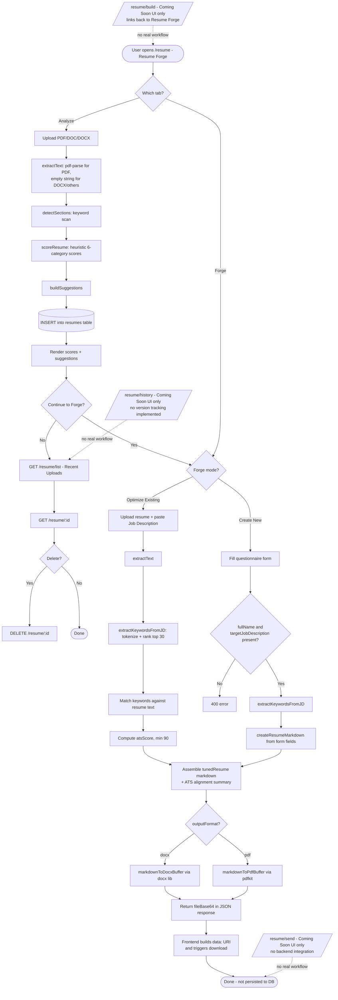

# Resume Builder & Management

This module covers resume upload/analysis, AI-assisted editing, ATS-focused "tuning" against a job description, from-scratch resume creation, a deterministic v2 scoring/export pipeline, and RAG-based chat over an uploaded resume. In the live frontend, the entire experience is consolidated into a single page called **"Resume Forge"** ([ResumeOptimizer.jsx](../../frontend/src/pages/ResumeOptimizer.jsx)), mounted at the `/resume` route with an "Analyze" tab and a "Forge" tab (itself split into "Optimize Existing Resume" and "Create New Resume" modes). The four files named in the task brief as `ResumeBuilder.jsx`, `ResumeHistory.jsx`, and `ResumeSend.jsx` are separate routes (`/resume/build`, `/resume/history`, `/resume/send`) that currently render static **"Coming Soon"** placeholders with no data wiring — this is a real finding, not an oversight in this doc (see Notes / Gotchas).

## Key Files

- [resume.js](../../backend/src/routes/resume.js) — Main resume API: legacy AI-assisted upload/analyze, `ai-edit`, ATS "tune" against a job description, and from-scratch "build". Mounted at `/api/resume`.
- [resumeV2.js](../../backend/src/routes/resumeV2.js) — Deterministic (non-AI) v2 ATS analysis, feedback, export, and history endpoints. Also mounted at `/api/resume` (paths prefixed `/v2/...`), gated behind `requirePlan(2)` for most routes.
- [resumeChat.js](../../backend/src/routes/resumeChat.js) — RAG chat over a stored resume: chunks + embeds resume text, then answers questions using the most similar chunks plus an LLM call. Mounted at `/api/resume-chat`.
- [resumeDatabase.js](../../backend/src/services/resumeDatabase.js) — Data-access class (`ResumeDatabase`) used by the v2 pipeline: save/update resumes, save detailed `analyses` rows, fetch history, fetch by id, save export records, delete.
- [resumeExport.js](../../backend/src/services/resumeExport.js) — `ResumeExport` class: parses raw resume text into sections via regex and renders a DOCX (used by [atsExport.js](../../backend/src/routes/atsExport.js), not directly by the routes read for this doc); also has a trivial `toTXT`.
- [ResumeBuilder.jsx](../../frontend/src/pages/ResumeBuilder.jsx) — "Coming Soon" placeholder page at `/resume/build`; no API calls, links back to `/resume` ("Resume Forge").
- [ResumeHistory.jsx](../../frontend/src/pages/ResumeHistory.jsx) — "Coming Soon" placeholder page at `/resume/history`; no API calls.
- [ResumeSend.jsx](../../frontend/src/pages/ResumeSend.jsx) — "Coming Soon" placeholder page at `/resume/send`; no API calls, describes a future "send to recruiters" feature that does not exist in the backend.
- [ResumeOptimizer.jsx](../../frontend/src/pages/ResumeOptimizer.jsx) — The actual working UI ("Resume Forge") at `/resume`: file upload + analysis, recent uploads list, resume detail view/delete, ATS "Forge" (optimize existing resume against a JD), and "Create New Resume" form. Calls the `resume.js` endpoints exclusively (`/resume/upload`, `/resume/list`, `/resume/:id`, `/resume/tune`, `/resume/build`) — it does **not** call any `/v2/*` endpoint.

Related but out of scope for deep coverage (per task instructions): the `services/v2/*` analyzer modules (`resumeAnalysisEngine.js`, `resumeCriticEngine.js`, `roleDetectionEngine.js`, `sectionAnalyzer.js`, `keywordsAnalyzer` equivalents, etc.) power `resumeV2.js`'s deterministic scoring, and `services/v2/resumeExportEngine.js` powers `/api/resume/v2/export`. The same v2 analysis/export engines are also used by the separate **ATS Checker** module (`routes/atsCheckerV2.js`, `routes/atsExport.js`), so the v2 resume pipeline and the ATS Checker module share underlying scoring/export code.

## Workflow: Create/Edit Resume

The live UI provides three distinct creation/edit paths, all inside the Forge tab of `ResumeOptimizer.jsx`:

**A. Analyze an existing resume (Analyze tab)**
1. User drags/drops or selects a PDF/DOC/DOCX file (client-side extension check only: `.pdf|.doc|.docx`).
2. `POST /api/resume/upload` (multipart, field `resume`) — [resume.js](../../backend/src/routes/resume.js) line 236.
3. Server extracts text with `pdf-parse` for PDFs (falls back to raw buffer-as-UTF8 on parse failure); DOCX/other types fall back to an **empty string** (`extractText`, no DOCX parser is used in this route — see Gotchas).
4. `detectSections(text)` flags presence of 6 sections via uppercase keyword matching: `summary`, `experience`, `education`, `skills`, `projects`, `certifications`.
5. `scoreResume(text, sections, fileName)` computes 6 heuristic scores (`ats`, `impact`, `skills`, `clarity`, `completeness`, `industry_fit`) from action-verb counts, quantified-metric regex matches, a fixed tech-keyword list, section count, and word count, then an `overall` average.
6. `buildSuggestions(...)` turns those signals into human-readable suggestion cards (`type`: success/warning/info).
7. Result row is inserted into the `resumes` table and returned to the client; frontend renders `ScoreRing`, per-category `ScoreBar`s, and suggestion cards.

**B. "Forge" — optimize an existing resume for a job description**
1. User uploads a resume file + pastes a job description + picks output format (`docx` or `pdf`) in the "Optimize Existing Resume" mode.
2. `POST /api/resume/tune` (multipart: `resume`, `jobDescription`, `outputFormat`) — [resume.js](../../backend/src/routes/resume.js) line 362.
3. Text is re-extracted the same way as `/upload`.
4. `extractKeywordsFromJD(jobDescription)` tokenizes the JD, strips a fixed stop-word list and pure numbers, and ranks the top 30 remaining tokens by frequency — this is the entire "keyword extraction" logic (no AI/embeddings here, despite the route file living outside `resumeV2.js`).
5. Matched vs. missing keywords are computed via plain substring checks against the lower-cased resume text; `atsScore = round(matched/total * 100)` but clamped to a minimum of 90 (`Math.max(90, ...)` — see Gotchas) and max 100.
6. A markdown document (`tunedResume`) is assembled: original resume text plus an "ATS Alignment Summary" section listing matched/missing/recommended keywords.
7. The markdown is rendered to a DOCX (via `docx` library, `markdownToDocxBuffer`) or PDF (via `pdfkit`, `markdownToPdfBuffer`) buffer and returned **base64-encoded in the JSON response** (not as a binary download) along with `atsScore`, `atsLabel`, keyword lists, and file metadata. The frontend converts this into a downloadable `data:` URI link client-side.

**C. "Create New Resume" — from a questionnaire**
1. User fills a form: `fullName`, `email`, `phone`, `linkedin`, `github`, `targetJobTitle`, `targetJobDescription` (required), `summary`, `skills`, `experience`, `education`, `projects`, `outputFormat`.
2. `POST /api/resume/build` (JSON body) — [resume.js](../../backend/src/routes/resume.js) line 664. Validates `targetJobDescription` and `fullName` are non-empty (400 otherwise).
3. JD keywords are extracted the same way as `/tune`. `createResumeMarkdown(...)` builds a full markdown resume from the form fields — skills are merged with JD keywords (deduped, capped at 40); experience/education/projects are turned into bullet lists (falling back to placeholder text like "Add your degree, university..." when a field is empty).
4. Same ATS scoring, DOCX/PDF rendering, and base64 response shape as `/tune`.

**Data model note:** There is no persistent "resume document" object with structured fields (name/experience/education as discrete editable entities) anywhere in this module. The two generation paths (`/tune`, `/build`) work entirely on markdown strings assembled per-request and are **not saved to the database** — only the `/upload` (analyze) path persists a row. `/build` and `/tune` results exist only in the HTTP response/browser session unless the user manually downloads the file.

## Workflow: Resume History & Versions

- **Analyze-tab history**: `GET /api/resume/list` returns the current user's 20 most recent uploaded/analyzed resumes (id, file_name, file_size, overall_score, scores, created_at), rendered as `RecentUploads` in `ResumeOptimizer.jsx`. Clicking one calls `GET /api/resume/:id` to load its full stored analysis (`scores`, `sections`, `suggestions`) plus reconstructed `content` (see below). `DELETE /api/resume/:id` removes a row (scoped to `user_id`).
- **No versioning of a single resume**: each `/upload` call creates a brand-new row in `resumes`; there is no concept of "version 2 of resume X" or diffing between uploads — the dedicated [ResumeHistory.jsx](../../frontend/src/pages/ResumeHistory.jsx) page that advertises "Track every version... compare ATS scores over time... Version Compare" is a non-functional placeholder with none of this implemented.
- **v2 history** (separate, unused by the current frontend): `GET /api/resume/v2/history` and `GET /api/resume/v2/:resumeId` in [resumeV2.js](../../backend/src/routes/resumeV2.js) read from the same `resumes` table via [ResumeDatabase](../../backend/src/services/resumeDatabase.js) (`getUserResumes`, `getResume`), plus a join against a separate `resume_exports` table for an `export_count`. `ResumeDatabase` also supports `updateOptimizedResume` (writes `optimized_resume`/`optimized_score` columns) and `saveAnalysis` (writes to a distinct `analyses` table with per-criterion breakdown columns) — these two methods are defined but not called from any route read in this module.
- **Schema (as reflected in code, not a single canonical migration file — see Notes)**: the `resumes` table is created/altered idempotently at process startup inside [resume.js](../../backend/src/routes/resume.js) (lines 32-77) with columns: `id`, `user_id`, `file_name`, `file_size`, `scores` (JSONB), `sections` (JSONB), `suggestions` (JSONB), `overall_score`, `created_at`, plus migrated-in columns `original_resume`, `optimized_resume`, `original_score`, `optimized_score`, `role_detected`, `keyword_coverage` (JSONB), `missing_info` (JSONB), `updated_at`. A separate `resume_embeddings` table (referenced in `resume.js` and `resumeChat.js` but not defined in any file read) stores `chunk_text`/`embedding` per `resume_id`/`user_id`/`chunk_index`. `backend/database.sql` defines an older/different `resumes` schema (MySQL-style `AUTO_INCREMENT`, `content`, `file_url` columns) that does not match the Postgres `pool` calls used at runtime — see Notes.
- **Resume chat / RAG "memory"**: `POST /api/resume-chat/embed` ([resumeChat.js](../../backend/src/routes/resumeChat.js)) chunks resume text (500-char chunks via `chunkText`) and stores an embedding per chunk in `resume_embeddings`, replacing any prior chunks for that `resume_id`. `POST /api/resume-chat/chat` fetches those chunks, finds the top-3 most similar to the user's question (`findTopSimilarChunks`), and asks an LLM to answer using only that context. `GET /api/resume/:id` also reconstructs the full resume `content` by concatenating `resume_embeddings.chunk_text` in order — meaning the "original text" of an analyzed resume is retrievable only if it was separately embedded (nothing in `resume.js`'s `/upload` handler calls the embed step itself).

## Workflow: Export & Send

- **`/tune` and `/build` (resume.js)**: export format is chosen by the user (`docx` default, or `pdf`) and produced synchronously in-process — DOCX via the `docx` npm package (`markdownToDocxBuffer`, mapping markdown `#`/`##`/`-` lines to headings/bullets), PDF via `pdfkit` (`markdownToPdfBuffer`, same line-type mapping with manual font sizes). Output is returned as `fileBase64` inside the JSON body, not as a file stream — the frontend (`handleDownloadGenerated`) builds a `data:<mimeType>;base64,...` URI and triggers a synthetic `<a download>` click.
- **`/api/resume/v2/export` (resumeV2.js)**: takes `{ resumeText, format }` (`pdf`/`docx`/`txt`) and delegates to `services/v2/resumeExportEngine.js`'s `ResumeExportEngine.export()`, which returns `{ content, mimeType, filename }`; the route validates the result via `validateExport` and streams it back as a real HTTP attachment (`Content-Disposition: attachment`), unlike the base64 approach in `resume.js`. This is the more conventional "download" implementation but is **not wired to the current frontend** (`ResumeOptimizer.jsx` never calls `/v2/export`).
- **"Send"**: there is no email/link/share-based sending anywhere in the backend routes read for this module. [ResumeSend.jsx](../../frontend/src/pages/ResumeSend.jsx) is purely a marketing placeholder ("Expert Review", "Recruiter Match", "Status Updates") with zero API integration — nothing exists server-side (no mailer call, no shareable link generation, no recruiter-facing endpoint) to back it.
- [ResumeExport.js](../../backend/src/services/resumeExport.js) (the service, distinct from the v2 export engine) is a third DOCX generator that regex-parses arbitrary resume text into sections and builds a styled DOCX with section headers/borders; it is used by `routes/atsExport.js` (ATS Checker module), not by any of the three resume route files central to this doc.

## Flowchart

## API Endpoints

| Method | Path | Purpose | Auth required |
|--------|------|---------|----------------|
| POST | `/api/resume/upload` | Upload + analyze a resume (extract text, detect sections, heuristic scores, suggestions); persists to `resumes` | Yes (`authenticateToken`) |
| GET | `/api/resume/list` | List current user's 20 most recent analyzed resumes | Yes |
| GET | `/api/resume/scores` | Latest scores/overall_score for the current user | Yes |
| GET | `/api/resume/:id` | Full analysis for one resume, plus reconstructed text from `resume_embeddings` if present | Yes |
| DELETE | `/api/resume/:id` | Delete a resume owned by the current user | Yes |
| POST | `/api/resume/tune` | ATS-match resume against a job description and generate an optimized DOCX/PDF (base64 in response) | Yes |
| POST | `/api/resume/ai-edit` | AI-powered instruction-based resume editing/suggestions via `callAI` | Yes |
| POST | `/api/resume/build` | Build a new resume from a questionnaire + JD, generate DOCX/PDF (base64 in response) | Yes |
| POST | `/api/resume/v2/analyze` | Deterministic (no AI) ATS analysis of resume text/file; persists via `ResumeDatabase.saveResume` | Yes + `requirePlan(2)` |
| POST | `/api/resume/v2/feedback` | Rule-based detailed feedback for given resume text | Yes + `requirePlan(2)` |
| POST | `/api/resume/v2/export` | Export given resume text as pdf/docx/txt as a real file download | Yes + `requirePlan(2)` |
| GET | `/api/resume/v2/history` | User's resume analysis history (joins `resume_exports` for counts) | Yes (no `requirePlan` on this route) |
| GET | `/api/resume/v2/:resumeId` | One resume record by id | Yes (no `requirePlan` on this route) |
| POST | `/api/resume-chat/chat` | RAG: answer a question about a stored resume using top-3 similar embedded chunks + LLM | Yes |
| POST | `/api/resume-chat/embed` | Chunk + embed a resume's text into `resume_embeddings` (fire-and-forget/background) | Yes |

## Notes / Gotchas

- **Three separate frontend routes are non-functional placeholders**: `ResumeBuilder.jsx` (`/resume/build`), `ResumeHistory.jsx` (`/resume/history`), and `ResumeSend.jsx` (`/resume/send`) all render static "Coming Soon" marketing content with zero `fetch`/`api` calls. The features they describe (guided templates, version diffing/timeline, recruiter submission) do not exist in the backend routes for this module. All three link back to `/resume` ("Resume Forge" / `ResumeOptimizer.jsx`), which is the only fully wired page.
- **`/api/resume/build` in the backend is unrelated by name to the `/resume/build` frontend route** — the working "Create New Resume" feature is actually reached from the Forge tab of `ResumeOptimizer.jsx` (route `/resume`), not from `ResumeBuilder.jsx`.
- **DOCX text extraction is missing in `resume.js`**: `extractText()` only parses PDFs (`pdf-parse`); for any other mimetype (including the DOCX files the upload filter explicitly allows) it falls through to `return ''`. This means uploading a `.docx` to `/upload` or `/tune` will silently analyze/tune against empty text. By contrast, `resumeV2.js`'s `/v2/analyze` does correctly use `mammoth` for DOCX.
- **ATS score is artificially floored at 90** in both `/tune` and `/build` (`Math.min(100, Math.max(90, Math.round(ratio * 100)))`), so even a resume matching very few JD keywords is reported as at least a 90% ATS match — likely a bug or placeholder logic rather than intended behavior.
- **Keyword extraction/matching is naive substring matching**, not semantic — `extractKeywordsFromJD` just frequency-ranks non-stopword tokens from the JD, and "matches" are plain `resumeLower.includes(token)` checks, so e.g. a keyword appearing inside an unrelated word would count as a match.
- **`/tune` and `/build` results are never persisted** — only `/upload` writes to the `resumes` table. If a user navigates away after forging/creating a resume without downloading it, the generated content is lost (no history entry, no way to "resume editing" the forged version).
- **Schema drift**: `backend/database.sql` defines a MySQL-flavored `resumes` table (`AUTO_INCREMENT`, `JSON` type, `content`/`file_url` columns) that doesn't match the Postgres (`pool.query` with `$1`-style placeholders, `JSONB`) schema actually created at runtime by `resume.js`'s startup migration block. `backend/database.sql` appears stale relative to the live schema. No dedicated `.sql` migration file for `resumes`, `resume_embeddings`, or `resume_exports` was found in `backend/src/migrations/` — the runtime schema evolves via the inline `CREATE TABLE IF NOT EXISTS` / `ALTER TABLE ADD COLUMN IF NOT EXISTS` block at the top of `resume.js` (called as an unawaited async IIFE at module load).
- **`resume_embeddings` and `resume_exports` tables are referenced but never defined** in any file read for this module — their `CREATE TABLE` statements exist elsewhere in the codebase (not part of this doc's file set) or are assumed to pre-exist.
- **Two v2 routes skip the plan gate**: `/api/resume/v2/history` and `/api/resume/v2/:resumeId` require only `authenticateToken`, while `/v2/analyze`, `/v2/feedback`, and `/v2/export` require `requirePlan(2)` ("Tune & Polish" tier) — an inconsistency worth confirming is intentional.
- **The v2 pipeline is effectively dead code from the frontend's perspective**: `ResumeOptimizer.jsx` never calls any `/api/resume/v2/*` endpoint; all its requests go to the plain `resume.js` routes, which require no plan gate at all. This means the "deterministic ATS Score Checker" pipeline (explicitly commented as AI-free in `resumeV2.js`'s file header) is unused by the current UI, while the AI-based legacy `/upload` and `/ai-edit` flow is what's actually live.
- **Resume chat depends on a separate, non-automatic embedding step**: nothing in `resume.js`'s `/upload` handler calls `/api/resume-chat/embed`. Unless some other part of the codebase (not in this module's file set) explicitly calls the embed endpoint after upload, chat and full-text reconstruction (`GET /api/resume/:id`'s `content` field) will return empty for resumes that were never embedded.
