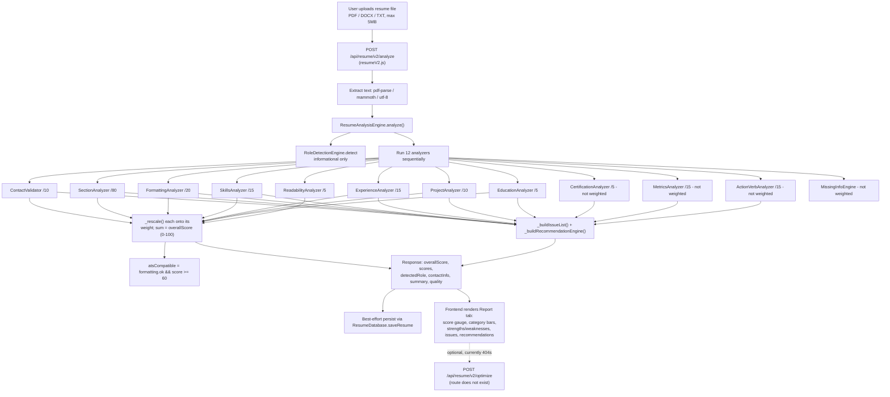

# ATS Resume Checker V2

The ATS Resume Checker V2 is a fully deterministic, rule-based resume scoring system: a user uploads a resume file (PDF/DOCX/TXT), the backend extracts text and runs it through a pipeline of independent analyzer modules (contact info, structure, formatting, skills, experience, projects, education, readability, metrics, action verbs), and returns a weighted 0–100 ATS Score plus a categorized list of issues and recommendations. Despite the name "V2" and despite older design docs describing an LLM-powered enhancement stage, **no AI/LLM is involved anywhere in this pipeline** — scoring, feedback, and recommendations are all produced by hand-written rules, and every deduction traces back to a specific, inspectable condition in code.

## Key Files

- [backend/src/routes/atsCheckerV2.js](../../backend/src/routes/atsCheckerV2.js) — exposes `POST /api/ats/v2/parse`, the file-upload → raw-text extraction endpoint (PDF/DOCX/TXT).
- [backend/src/routes/resumeV2.js](../../backend/src/routes/resumeV2.js) — the real analysis/feedback/export/history API (`/api/resume/v2/*`); this is what the frontend actually drives after parsing.
- [backend/src/routes/atsExport.js](../../backend/src/routes/atsExport.js) — a separate, older export/history API (`/api/ats/export/docx`, `/export/txt`, `/history`) built on non-V2 services (`resumeExport.js`, `resumeDatabase.js`), unrelated to `resumeExportEngine.js`.
- [frontend/src/pages/ATSCheckerV2.jsx](../../frontend/src/pages/ATSCheckerV2.jsx) — the single-page upload/report UI at route `/ats-checker-v2` (React, Tailwind).

Backend analyzers (all under `backend/src/services/v2/`, all pure-function/static-class, no I/O):
- [resumeAnalysisEngine.js](../../backend/src/services/v2/resumeAnalysisEngine.js) — orchestrator; runs every analyzer, rescales/weights their scores into the 100-point total, builds `issues[]` and `recommendations[]`.
- [resumeCriticEngine.js](../../backend/src/services/v2/resumeCriticEngine.js) — turns the analysis report into a "feedback" shape (strengths/weaknesses/observations/hiringPerspective/nextSteps); rule-based despite the name, not AI.
- [roleDetectionEngine.js](../../backend/src/services/v2/roleDetectionEngine.js) — keyword-frequency role classifier (8 roles), informational only (does not affect the score).
- [contactValidator.js](../../backend/src/services/v2/contactValidator.js) — checks name/email/phone/LinkedIn/GitHub (max 10 raw pts → weight 10).
- [sectionAnalyzer.js](../../backend/src/services/v2/sectionAnalyzer.js) — checks presence of Summary/Skills/Experience/Projects/Education/Certifications (max 80 raw pts → weight 20, "structure").
- [formattingAnalyzer.js](../../backend/src/services/v2/formattingAnalyzer.js) — penalizes ATS-unfriendly text signatures: tables, multi-column layout, images, icons, header/footer repeats, text boxes (max 20 raw pts → weight 20).
- [skillsAnalyzer.js](../../backend/src/services/v2/skillsAnalyzer.js) — keyword-matches a curated skill list against the Skills section, penalizes duplicates (max 15 raw pts → weight 15).
- [experienceAnalyzer.js](../../backend/src/services/v2/experienceAnalyzer.js) — splits Experience into job entries, checks company/role/duration/description per entry (max 15 raw pts → weight 15).
- [projectAnalyzer.js](../../backend/src/services/v2/projectAnalyzer.js) — splits Projects into entries, checks name/description/technologies per entry (max 10 raw pts → weight 10).
- [educationAnalyzer.js](../../backend/src/services/v2/educationAnalyzer.js) — checks degree/institution/year per entry (max 5 raw pts → weight 5).
- [readabilityAnalyzer.js](../../backend/src/services/v2/readabilityAnalyzer.js) — resume length, bullet usage, formatting consistency (max 5 raw pts → weight 5).
- [certificationAnalyzer.js](../../backend/src/services/v2/certificationAnalyzer.js) — optional section, computed but **not** one of the 8 weighted categories in the final score.
- [metricsAnalyzer.js](../../backend/src/services/v2/metricsAnalyzer.js) — detects quantified achievements (%, $, multipliers, counts); feeds `issues`/`recommendations` but is **not** one of the 8 weighted categories.
- [actionVerbAnalyzer.js](../../backend/src/services/v2/actionVerbAnalyzer.js) — strong vs. weak verb detection; feeds `strengths`/summary counts but is **not** one of the 8 weighted categories.
- [missingInfoEngine.js](../../backend/src/services/v2/missingInfoEngine.js) — a second, independent gap-detection pass (contact/location/summary/experience/skills/education/projects/certifications) with its own completeness %; overlaps with, but is separate from, `sectionAnalyzer`/`contactValidator`.
- [resumeExportEngine.js](../../backend/src/services/v2/resumeExportEngine.js) — export to PDF (via `pdfkit`), DOCX (returns plain text with a DOCX mime type — not a real `.docx`), or TXT. Used only by `resumeV2.js`'s `/v2/export`, not by `atsExport.js`.

## Architecture: Analysis Pipeline

`ResumeAnalysisEngine.analyze(resumeText, fileContent)` in [resumeAnalysisEngine.js](../../backend/src/services/v2/resumeAnalysisEngine.js) is the single entry point and orchestrator:

1. **Role detection** runs first (`RoleDetectionEngine.detect`) — purely informational (`detectedRole` in the response); it does not influence the score or which keywords/skills are checked.
2. **Twelve analyzers run synchronously, in sequence**, each independent and stateless, each taking only `resumeText` (and `formattingAnalyzer` also takes the raw `fileContent` buffer, though it doesn't currently use it for anything beyond the text-based heuristics): `ContactValidator`, `SectionAnalyzer`, `FormattingAnalyzer`, `SkillsAnalyzer`, `ExperienceAnalyzer`, `ProjectAnalyzer`, `EducationAnalyzer`, `CertificationAnalyzer`, `ReadabilityAnalyzer`, `MetricsAnalyzer`, `ActionVerbAnalyzer`, `MissingInfoEngine`. There is no parallelism (no `Promise.all`) because every call is synchronous CPU work — the whole pipeline typically finishes in well under 100ms.
3. **Rescaling.** Each analyzer reports a raw score against its own max (e.g. `SectionAnalyzer` scores out of 80, `ContactValidator` out of 10). The orchestrator's `_rescale(raw, rawMax, weight)` linearly maps each into its slice of the final 100-point formula:

   | Category | Raw max | Weight in final score |
   |---|---|---|
   | Contact | 10 | 10 |
   | Structure (sections) | 80 | 20 |
   | Formatting | 20 | 20 |
   | Skills | 15 | 15 |
   | Experience | 15 | 15 |
   | Projects | 10 | 10 |
   | Education | 5 | 5 |
   | Readability | 5 | 5 |

   These 8 weights sum to 100. **Metrics, Action Verbs, Certifications, and MissingInfo are computed but excluded from this weighted sum** — they only influence `issues[]`, `recommendations[]`, and the `keyStrengths`/`keyWeaknesses` summary, not `overallScore` directly.
4. **Aggregation.** `overallScore` = sum of the 8 rescaled category scores, rounded and capped at 100. `atsCompatible` = `formattingAnalysis.atsCompatible && overallScore >= 60`. A separate `_calculateCompleteness()` produces a 0–100% "fields present" ratio from contact/section/skills/experience/project/education signals (distinct from `overallScore`).
5. **Issue + recommendation generation.** `_buildIssueList()` walks every analyzer's output and emits one `{severity, message}` entry per concrete problem (missing contact field, missing section, formatting penalty, no skills, duplicate skills, incomplete job/project/education entries, zero metrics). `_buildRecommendationEngine()` then maps each issue's message through a keyword-matching rule table (`if msg.includes('linkedin') → ...`) into a de-duplicated, human-readable recommendation with a `reason`.
6. **Critique.** [resumeCriticEngine.js](../../backend/src/services/v2/resumeCriticEngine.js)'s `generateQuickFeedback(analysis)` is a *separate, optional* call (used by `/v2/feedback`, not by `/v2/analyze`) that reformats the same analysis object into `{strengths, weaknesses, observations, hiringPerspective, nextSteps}` using simple score-threshold prose templates (e.g. "score >= 80 → ...", "score >= 75 → hiring manager would move this to next round"). It reads `analysis.quality.keyStrengths`/`keyWeaknesses`/`recommendations` — it does not re-run any analyzer.

## Workflow: Upload → Analyze → Report

1. User navigates to `/ats-checker-v2` and drags/selects a resume file (PDF, DOCX, or TXT, max 5MB) — validated client-side in [ATSCheckerV2.jsx](../../frontend/src/pages/ATSCheckerV2.jsx).
2. Clicking "Check ATS Score" builds a `FormData` and calls `POST /api/resume/v2/analyze` (not `/api/ats/v2/parse` — the frontend sends the raw file directly to `resumeV2.js`, which does its own PDF/DOCX/TXT extraction inline via `pdf-parse`/`mammoth`).
3. The route extracts `resumeText`, calls `ResumeAnalysisEngine.analyze()`, best-effort persists the result via `ResumeDatabase.saveResume()` (failure here is caught and logged, not surfaced to the user), and returns `{status, resumeId, resumeText, analysis: {overallScore, detectedRole, scores, maxScores, contactInfo, summary, quality, issues, recommendations, processingTimeMs}, atsCompatible}`.
4. The frontend maps this into local state and switches to the "Report" tab, rendering: a circular 0–100 score gauge with a color/label band, detected role + confidence, completeness %, a bar per weighted category (Contact/Structure/Formatting/Skills/Experience/Projects/Education/Readability), a contact-fields checklist, strengths/weaknesses cards, an "Issues Found" list (severity-tagged), and a "Recommended Improvements" list (message + reason).
5. If the analyze response includes `resumeText`, the UI optimistically calls `enhanceResumeBackground()`, which posts to `POST /api/resume/v2/optimize` — **this route does not exist** in `resumeV2.js` (see Notes below); the call 404s, is caught, and silently clears the "analyzing" flag with no user-visible error.
6. There is no export or history UI wired into `ATSCheckerV2.jsx` — export (`/api/resume/v2/export`) and history (`/api/resume/v2/history`, or the separate `/api/ats/history` and `/api/ats/export/*`) exist as backend routes but are not called from this page.

## Flowchart

## API Endpoints

| Method | Path | Purpose | Auth required |
|---|---|---|---|
| POST | `/api/ats/v2/parse` | Extract raw text from an uploaded resume file (PDF/DOCX/TXT); returns `resumeText` only, does not analyze | JWT + `requirePlan(2)` |
| POST | `/api/resume/v2/analyze` | Extract text (if file uploaded) or accept `resumeText`, run full analyzer pipeline, return score/analysis, best-effort save | JWT + `requirePlan(2)` |
| POST | `/api/resume/v2/feedback` | Re-run analysis on provided `resumeText` and return `ResumeCriticEngine` rule-based feedback | JWT + `requirePlan(2)` |
| POST | `/api/resume/v2/export` | Export `resumeText` as `pdf`, `docx`, or `txt` via `ResumeExportEngine` (DOCX output is plain text, not real OOXML) | JWT + `requirePlan(2)` |
| GET | `/api/resume/v2/history` | List the current user's saved resume analyses (`limit` query param) | JWT only (no plan gate) |
| GET | `/api/resume/v2/:resumeId` | Fetch one saved resume analysis by id, scoped to the requesting user | JWT only (no plan gate) |
| POST | `/api/ats/export/docx` | Export a previously saved resume (`resumeId`) as DOCX via the older `resumeExport.js` service | JWT only |
| POST | `/api/ats/export/txt` | Export a previously saved resume (`resumeId`) as TXT via `resumeExport.js` | JWT only |
| GET | `/api/ats/history` | List resume history via `resumeDatabase.js` (separate from `/api/resume/v2/history`) | JWT only |

Note: the frontend also calls `POST /api/resume/v2/optimize`, which is **not implemented** anywhere in the backend (see Notes).

## Notes / Gotchas

- **No AI anywhere, despite docs implying otherwise.** The pre-existing `ATS_CHECKER_V2_IMPLEMENTATION.md` and `RESUME_ANALYZER_V2_IMPLEMENTATION.md` describe an LLM stage (Qwen 3.5 9B via LM Studio) for "enhancement"/"optimization"/"critic feedback." None of that exists in the actual `services/v2/` code — `resumeCriticEngine.js` is explicitly commented "No AI/LLM involved" and both `resumeAnalysisEngine.js` and `resumeV2.js` carry the same disclaimer in their file headers. Treat those two docs as describing an earlier or aspirational design, not the shipped code.
- **The frontend's "Enhance" flow is broken.** `ATSCheckerV2.jsx` calls `POST /api/resume/v2/optimize` expecting `{optimization: {originalScore, optimizedScore, improvement, optimizationNotes}, optimizedResume}`, but `resumeV2.js` defines no `/v2/optimize` route (only `analyze`, `feedback`, `export`, `history`, `:resumeId`). The request will 404; the UI swallows the error in a `catch` and just clears the loading flag, so there is no "Enhanced" tab and no visible failure to the user — this looks like an incomplete migration from an older two-stage (instant score + background AI enhancement) design described in `ATS_CHECKER_V2_UX_GUIDE.md`, which itself does not match the current single-tab (Input/Report) UI at all.
- **Route/file naming is confusing and there are two parallel "ATS" surfaces.** `atsCheckerV2.js` only does file→text parsing (`/api/ats/v2/parse`) and is barely used by the frontend page (which posts the file directly to `/api/resume/v2/analyze` instead). Meanwhile `atsExport.js`, mounted at the same `/api/ats` prefix, is a completely separate older export/history API built on `resumeExport.js`/`resumeDatabase.js` (not `services/v2/*`), duplicating (with different behavior/auth) the `/api/resume/v2/export` and `/api/resume/v2/history` routes in `resumeV2.js`.
- **Likely runtime bug in `/v2/analyze`'s DB-save path.** `resumeV2.js` (line ~89-92) builds the `ResumeDatabase.saveResume()` metadata using `analysis.analysis.keywords.keywords.found.length` and `analysis.analysis.missingInfo.missing` — but `ResumeAnalysisEngine.analyze()`'s returned `analysis` object has no `keywords` key at all (its sub-keys are `section, metrics, actionVerbs, formatting, skills, missingInfo, experience, projects, education, certifications, readability, contact`). This will throw a `TypeError` on every save attempt, which is caught by the surrounding `try/catch` and logged as "Resume analysis saved locally but DB persist failed" — masking what is actually a code defect, not a transient DB error. In practice this means resume history/persistence for `/api/resume/v2/analyze` is silently non-functional.
- **Auth/plan gating contradicts the UX doc.** `ATS_CHECKER_V2_UX_GUIDE.md` states "Plan: Accessible to all plans (no paywall)." In the actual code, `/api/ats/v2/parse`, `/api/resume/v2/analyze`, `/v2/feedback`, and `/v2/export` are all gated behind `requirePlan(2)` ("Tune & Polish" tier or above) in addition to JWT auth — a free-tier user will get a 403 `PLAN_UPGRADE_REQUIRED` before reaching the analyzer.
- **Only 8 of 12 computed analyzers count toward the score.** `CertificationAnalyzer`, `MetricsAnalyzer`, `ActionVerbAnalyzer`, and `MissingInfoEngine` all run and appear in the `analysis` payload, but their scores are not part of the `WEIGHTS` object and do not move `overallScore`. This is easy to miss since the old `RESUME_ANALYZER_V2_IMPLEMENTATION.md` doc lists a 5-component weighted average (Section/Metrics/ActionVerbs/Formatting/Keywords) that doesn't match either the analyzer set or the weights actually in code.
- **`resumeExportEngine.js`'s DOCX export is not a real DOCX.** `exportAsDOCX()` returns the raw resume text with a `.docx` filename and the OOXML mime type, explicitly commented "In production, use 'docx' npm package for true DOCX generation." Opening the downloaded file in Word will not produce a formatted document.
- **`FormattingAnalyzer`'s table/image/icon detection is text-heuristic only**, not real layout/vision analysis — it infers structure from artifacts left in extracted plain text (pipe-alignment for tables, repeated short lines for headers/footers, emoji ranges for icons), so it can both miss real ATS-hostile layouts and false-positive on resumes that happen to reuse a short line (e.g., a name or "References available on request") near both the top and bottom.
- **`SkillsAnalyzer` and `SectionAnalyzer` scope keyword checks to the detected section block** (e.g., only counts skills inside the text between the "Skills" heading and the next known heading), so a skill mentioned only in the Experience/Projects prose will not count toward the Skills score, even though it may be relevant.
- **`RoleDetectionEngine` has a fallback role (`software-engineer`) that isn't in its own `ROLES` map** — it's returned for empty/invalid input or as `topRole[0] ||` fallback, but since `ROLES` doesn't include a `software-engineer` entry, `getRoleDisplayName('software-engineer')` falls through to returning the raw key rather than a "friendly" display name.
