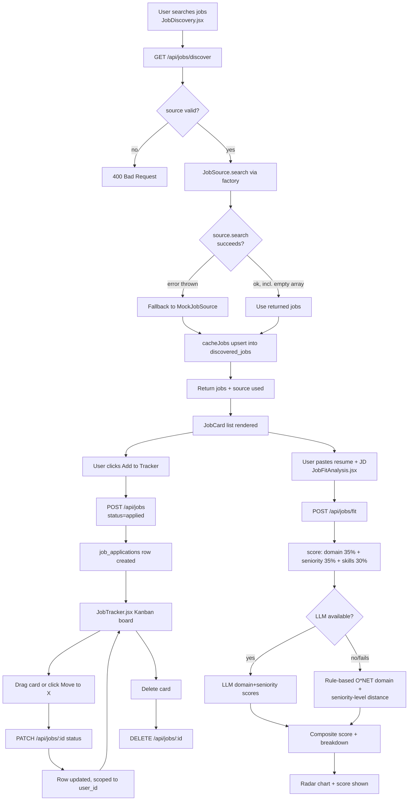

# Job Discovery & Tracking

This module lets a user search for jobs across pluggable external sources, analyze a raw job description into structured fields, score how well a resume fits a specific job, and track applications through a Kanban-style status pipeline (applied → interview → offer / rejected). The backend is a set of Express routers mounted under `/api/jobs`, backed by a small job-source adapter layer and a rule/LLM-hybrid fit scorer; the frontend is four standalone React pages (plus a fifth, related "matcher" page that lives outside this module's route files).

## Key Files

- [backend/src/routes/jobDiscovery.js](../../backend/src/routes/jobDiscovery.js) — `GET /api/jobs/discover`, fetches jobs from a source and caches them.
- [backend/src/routes/jobTracker.js](../../backend/src/routes/jobTracker.js) — CRUD for `job_applications` (the tracker board).
- [backend/src/routes/jobAnalyzer.js](../../backend/src/routes/jobAnalyzer.js) — `POST /api/jobs/analyze-description`, LLM extraction of skills/seniority/etc. from a job posting.
- [backend/src/routes/jobFit.js](../../backend/src/routes/jobFit.js) — `POST /api/jobs/fit`, resume-vs-job fit score.
- [backend/src/services/discovery/index.js](../../backend/src/services/discovery/index.js) — factory (`getSource`) mapping a source name to a `JobSource` subclass.
- [backend/src/services/discovery/JobSource.js](../../backend/src/services/discovery/JobSource.js) — abstract base class defining the `search(query, location)` contract.
- [backend/src/services/discovery/AdzunaSource.js](../../backend/src/services/discovery/AdzunaSource.js) — Adzuna API adapter (needs `ADZUNA_APP_ID`/`ADZUNA_APP_KEY`).
- [backend/src/services/discovery/RemotiveSource.js](../../backend/src/services/discovery/RemotiveSource.js) — Remotive public API adapter (no key required).
- [backend/src/services/discovery/MockJobSource.js](../../backend/src/services/discovery/MockJobSource.js) — static in-memory sample jobs, used as default and as error fallback.
- [backend/src/services/scoring/strategies/jobFit.js](../../backend/src/services/scoring/strategies/jobFit.js) — the actual scoring logic behind `jobFit.js` route (domain + seniority + skills, LLM with rule fallback).
- [backend/src/services/recommendationEngine.js](../../backend/src/services/recommendationEngine.js) — **not part of this module**; it scores learning-plan recommendations (`Learn & Build` / `Tune & Polish` / `Zero to Hero`), unrelated to job discovery/tracking despite being in scope for this doc's source review.
- [backend/src/middleware/requirePlan.js](../../backend/src/middleware/requirePlan.js) — server-side subscription-tier gate used by several of these routes.
- [frontend/src/pages/JobDiscovery.jsx](../../frontend/src/pages/JobDiscovery.jsx) — search UI, source picker, "Add to Tracker" action.
- [frontend/src/pages/JobTracker.jsx](../../frontend/src/pages/JobTracker.jsx) — Kanban board UI for `job_applications`.
- [frontend/src/pages/JobAnalyzer.jsx](../../frontend/src/pages/JobAnalyzer.jsx) — paste-a-JD UI for `analyze-description`.
- [frontend/src/pages/JobFitAnalysis.jsx](../../frontend/src/pages/JobFitAnalysis.jsx) — resume vs. JD fit UI (radar chart of domain/seniority/skills).
- [frontend/src/pages/JobMatcher.jsx](../../frontend/src/pages/JobMatcher.jsx) — a separate, simpler keyword-overlap matcher that calls `POST /api/profiles/jobmatch` (defined in `backend/src/routes/profiles.js`, **not** one of the four route files this doc covers).

## Architecture: Job Sources

The discovery layer uses an **adapter/strategy pattern**. [`JobSource`](../../backend/src/services/discovery/JobSource.js) is an abstract base class with a single contract method:

```js
async search(query, location) // -> Promise<Array of normalized job objects>
```

Every concrete source subclasses `JobSource` and implements `search()` to call a different backend, but all return the same normalized shape: `{ externalId, source, title, company, location, description, url, tags }`.

- **`MockJobSource`** — returns 5 hardcoded sample jobs. No network call, no config required. Used as the default source and as the automatic fallback when a live source errors.
- **`RemotiveSource`** — calls the public `https://remotive.com/api/remote-jobs` endpoint with a `search` query param, capped at 20 results. Lazy-`require`s `node-fetch` inside the method (comment notes this is to ease mocking in tests). Ignores the `location` parameter entirely (`_location`, unused). Any thrown error or non-OK response is swallowed and returns `[]` — it never throws.
- **`AdzunaSource`** — calls `https://api.adzuna.com/v1/api/jobs/{country}/search/1`, requiring `ADZUNA_APP_ID` and `ADZUNA_APP_KEY` env vars. It infers a country code (`us`, `in`, `gb`, `ca`, `au`) from keyword-matching the `location` string (e.g. "hyderabad" → `in`); defaults to `us` otherwise. Capped at 20 results (`MAX_RESULTS`). Returns `[]` on missing credentials, non-OK response, or any thrown error — also never throws.

[`services/discovery/index.js`](../../backend/src/services/discovery/index.js) is the factory: a `SOURCES` map (`{ mock, remotive, adzuna }`) and `getSource(sourceName)` that instantiates the matching class, plus `VALID_SOURCES` (the map's keys) used by the route to validate the `source` query param. Adding a new source means creating a new `JobSource` subclass and registering it in this map — no route-level changes needed.

## Workflow: Discover Jobs

1. User opens [`JobDiscovery.jsx`](../../frontend/src/pages/JobDiscovery.jsx) and fills in optional keyword (`query`), a location dropdown (fixed list of Indian cities or "Any Location"), and a source selector (`mock` / `remotive` / `adzuna`).
2. On submit, the frontend calls `GET /api/jobs/discover?query=...&location=...&source=...`.
3. In [`jobDiscovery.js`](../../backend/src/routes/jobDiscovery.js), the route requires auth (`authenticateToken`) and plan tier ≥ 2 (`requirePlan(2)`), then validates `source` against `VALID_SOURCES`.
4. It resolves the concrete `JobSource` via `getSource(sourceName)` and calls `source.search(query, location)`.
5. If the source throws (network error, etc.), the route catches it, logs it, and **falls back to `MockJobSource`**, overwriting `usedSource` to `'mock'`. Note: an empty result array (0 hits) is *not* treated as an error — no fallback occurs in that case, only actual exceptions trigger the mock fallback.
6. Results are upserted into the `discovered_jobs` table via `cacheJobs()` — `INSERT ... ON CONFLICT (source, external_id) DO NOTHING` for dedup. Cache write failures are caught and swallowed per-row; caching never fails the request.
7. Response returns `{ jobs, count, source: usedSource, cached: true }` via `apiResponse.ok`.
8. Frontend renders a `JobCard` per job. If `resultMeta.source !== source` (i.e. it silently fell back to mock), the UI shows an amber "(showing sample jobs — live API unavailable)" notice.
9. No recommendation/relevance scoring is applied to discovery results — jobs are shown in whatever order the source API returns them. (`recommendationEngine.js` is a separate, unrelated learning-plan scorer, not used here.)

## Workflow: Job Fit Analysis

1. User opens [`JobFitAnalysis.jsx`](../../frontend/src/pages/JobFitAnalysis.jsx). It loads the user's saved resumes (`GET /api/resume/list`) and preselects the first one, fetching its extracted text (`GET /api/resume/:id`); the user can toggle to paste resume text manually instead.
2. User pastes/selects a job description and clicks "Calculate Job Fit", which calls `POST /api/jobs/fit` with `{ resumeText, jobDescription }`.
3. [`jobFit.js`](../../backend/src/routes/jobFit.js) requires auth + plan tier ≥ 3 (`requirePlan(3)`), validates both fields are present, then delegates to `score()` in [`services/scoring/strategies/jobFit.js`](../../backend/src/services/scoring/strategies/jobFit.js).
4. The scorer computes three components, each 0–100:
   - **Skill overlap** — always rule-based: extracts known tech tokens (a fixed `SKILL_TOKENS` set) from both texts and computes the Jaccard index (intersection / union) between the two sets.
   - **Domain match** and **seniority match** — first attempts an LLM call (`tryLLMScore`, via local LM Studio, model from `LM_STUDIO_MODEL_FIT` env var, default `qwen2.5-7b`) that returns domain/seniority scores directly from short text snippets (first 300 chars of each).
   - If the LLM call fails or is unavailable, falls back to rule-based logic: `ruleDomainScore()` uses an O*NET occupation taxonomy lookup (`findOccupation`/`getDomain`) to compare inferred domains (exact match = 100, related domain = 60, one unknown = 50, unrelated = 20); `inferSeniority()` + `computeSeniorityScore()` infer a seniority level (via keyword or years-of-experience regex) and score based on the level-distance between resume and job.
5. Final score is a weighted composite: `0.35 * domain + 0.35 * seniority + 0.30 * skills`, rounded and clamped 0–100. Response includes `{ score, breakdown: {domain, seniority, skills}, method: 'llm'|'rule' }`.
6. Frontend renders a circular score gauge, a badge showing whether the score came from `llm` ("AI Calculated") or `rule` ("Rule Fallback"), and a Recharts radar chart plus per-component breakdown cards (Domain Fit, Seniority Equivalence, Skill Overlap).

Note: [`jobAnalyzer.js`](../../backend/src/routes/jobAnalyzer.js) (`POST /api/jobs/analyze-description`) is a related but separate workflow — it doesn't score fit against a resume, it just extracts structured fields (required/nice-to-have skills, seniority, experience level, responsibilities, keywords, salary range) from a raw job description via LLM, with a regex/keyword-based `generateFallbackAnalysis()` fallback if the LLM call fails or returns unparseable JSON. Requires auth + plan tier ≥ 3. The frontend [`JobAnalyzer.jsx`](../../frontend/src/pages/JobAnalyzer.jsx) is a standalone page for this (not chained into the fit-analysis flow in code).

## Workflow: Track Applications

1. [`JobTracker.jsx`](../../frontend/src/pages/JobTracker.jsx) loads on mount via `GET /api/jobs`, which requires only `authenticateToken` (no plan gate) and returns all of the user's `job_applications` rows plus aggregate stats (`total`, `interviews`, `offers`, `replyRate`) computed with SQL window functions (`COUNT(*) OVER()`, conditional `SUM(...) OVER()`).
2. A job can be added to the tracker two ways:
   - Manually via the "Add Application" form in `JobTracker.jsx` (`company`, `role`, `status`, `notes`) → `POST /api/jobs`.
   - Directly from Discovery: clicking "Add to Tracker" on a `JobCard` in `JobDiscovery.jsx` calls `POST /api/jobs` with `company`, `role: job.title`, `jobDescription`, `jobUrl`, `source`, and `status: 'applied'` hardcoded.
3. [`jobTracker.js`](../../backend/src/routes/jobTracker.js)'s `POST /` route requires auth + plan tier ≥ 3 (`requirePlan(3)`), validates `company` and `role` are present, and inserts into `job_applications`, returning the created row (201).
4. Status changes happen either by dragging a card between Kanban columns (`onDragStart`/`onDrop` handlers) or clicking a "Move to X" button that appears on hover — both call `PATCH /api/jobs/:id` with `{ status }` (also used for inline notes edits, `{ notes }`).
5. [`jobTracker.js`](../../backend/src/routes/jobTracker.js)'s `PATCH /:id` route requires only `authenticateToken` (no plan gate on this one), validates `status` is one of `['applied', 'interview', 'offer', 'rejected']` if provided, and does a `COALESCE`-based partial update scoped to `WHERE id = $1 AND user_id = $2` (so a user cannot patch another user's application). Returns 404 if no row matched.
6. Deleting a card calls `DELETE /api/jobs/:id` (auth only, no plan gate), hard-deletes the row scoped by `user_id`, returns 204 or 404.
7. The frontend re-renders columns by filtering the local `jobs` state by `status`; stats shown in the header cards come from the initial list fetch only and are not live-recomputed client-side after a status change (a fresh `GET /api/jobs` would be needed to refresh `stats`, which does **not** happen automatically after add/update/delete in the current code).

## Flowchart



## API Endpoints

All routes below are mounted at `/api/jobs` in `backend/src/app.js` (`jobTrackerRoutes`, `jobAnalyzerRoutes`, `jobDiscoveryRoutes`, `jobFitRoutes` are all mounted at the same `/api/jobs` prefix).

| Method | Path | Purpose | Auth Required |
|--------|------|---------|----------------|
| GET | `/api/jobs/discover` | Search jobs from a source (`mock`/`remotive`/`adzuna`); caches into `discovered_jobs` | `authenticateToken` + `requirePlan(2)` |
| GET | `/api/jobs` | List authenticated user's tracked applications + stats (total/interviews/offers/replyRate) | `authenticateToken` |
| POST | `/api/jobs` | Create a new tracked job application | `authenticateToken` + `requirePlan(3)` |
| PATCH | `/api/jobs/:id` | Update `status` and/or `notes` of a tracked application (scoped to owner) | `authenticateToken` |
| DELETE | `/api/jobs/:id` | Hard-delete a tracked application (scoped to owner) | `authenticateToken` |
| POST | `/api/jobs/analyze-description` | Extract skills/seniority/responsibilities/keywords from a pasted job description (LLM + regex fallback) | `authenticateToken` + `requirePlan(3)` |
| POST | `/api/jobs/fit` | Score resume-vs-job fit (domain/seniority/skills composite) | `authenticateToken` + `requirePlan(3)` |

Related but outside these four route files: `POST /api/profiles/jobmatch` (in `backend/src/routes/profiles.js`, `authenticateToken` only) — a simpler keyword-overlap matcher used by `JobMatcher.jsx`, distinct from the `/jobs/fit` domain/seniority/skills scorer.

## Notes / Gotchas

- **Adzuna requires credentials.** `AdzunaSource` returns `[]` silently (just a `console.warn`) if `ADZUNA_APP_ID`/`ADZUNA_APP_KEY` are not set in the environment — the route layer has no visibility into *why* zero results came back (missing creds vs. genuinely no matches), since empty-array is not distinguished from a real empty result and does not trigger the mock fallback.
- **Silent mock fallback on source errors.** `jobDiscovery.js` swaps to `MockJobSource` on any thrown error from the selected source, but only on a thrown error — an API returning 200 with an empty/malformed body from Remotive or Adzuna each independently catch their own errors and return `[]` rather than throwing, so the discovery route's own fallback logic never triggers for those cases; only truly unexpected exceptions (e.g. `getSource` returning null, JSON parse errors that escape the source's own try/catch) hit the outer fallback.
- **No rate limiting visible in these files.** Neither `AdzunaSource` nor `RemotiveSource` implement retry/backoff or client-side rate limiting; each source caps results at 20 (`MAX_RESULTS`) but does not defend against upstream 429s beyond treating any non-OK response as an empty result.
- **`RemotiveSource` ignores location.** The `location` parameter is accepted but named `_location` and never used in the Remotive query — only `AdzunaSource` uses location (to infer country) and it's a coarse keyword match, not a real geocoding lookup.
- **Plan-tier gating is inconsistent across the tracker's own endpoints.** `GET /api/jobs` and `PATCH/DELETE /api/jobs/:id` require only `authenticateToken`, while `POST /api/jobs` requires `requirePlan(3)`. This means a lower-tier user can view and modify (status/notes) applications, and even delete them, but cannot create new ones directly — except indirectly via `JobDiscovery.jsx`'s "Add to Tracker" button, which also calls `POST /api/jobs` and would be blocked the same way at tier < 3.
- **Job fit and job analysis both depend on a local LLM (LM Studio).** `jobFit.js`'s scorer and `jobAnalyzer.js` both call `callAI()` against what appears to be a local/self-hosted LM Studio instance (model names read from `LM_STUDIO_MODEL_FIT`, `LM_STUDIO_MODEL_JOB`, `LM_STUDIO_MODEL_SKILLS` env vars). Both have deterministic fallbacks (rule-based domain/seniority scoring; regex/keyword-based `generateFallbackAnalysis`) if the LLM is unreachable or returns unparseable output, so the features degrade gracefully rather than failing outright — but fallback quality is materially lower (e.g. domain scoring collapses to a coarse O*NET category match, and unknown domains just return a flat 50).
- **Stats on the tracker board can go stale.** `JobTracker.jsx` only refetches `/api/jobs` (and its bundled `stats`) on initial mount; after adding, updating, or deleting a job, it patches local `jobs` state directly but does not re-request stats, so the "Total Applied / Interviews / Offers / Reply Rate" tiles can drift from the Kanban board contents until the page is reloaded.
- **`discovered_jobs` caching is best-effort and per-row.** `cacheJobs()` in `jobDiscovery.js` iterates jobs one at a time with individual `try/catch` per insert; a single bad row won't abort the batch, and all cache errors are swallowed with no logging, so cache-write failures are invisible to both the caller and the logs.
- **`recommendationEngine.js` is unrelated to this module.** It was in scope for this review but implements learning-plan tier recommendations (`Learn & Build` / `Tune & Polish` / `Zero to Hero`) based on career goals — it has no connection to job discovery, fit scoring, or the tracker.
