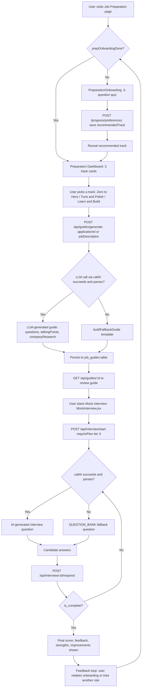

# Interview Prep & Job Preparation

This module covers the AI-assisted interview and job-readiness features of the platform: an AI-driven mock interview simulator, role-specific job preparation guides (questions, talking points, company research), and a set of career-coaching utilities (STAR stories, AI tutor, project suggestions, project blueprints) surfaced through an onboarding-driven "tracks" hub on the frontend. All AI generation goes through a local LM Studio (OpenAI-compatible) client with rule-based fallbacks when the AI backend is unavailable.

## Key Files

- [backend/src/routes/interview.js](../../backend/src/routes/interview.js) — Mock interview API: start session, respond to questions, fetch history. Mounted at `/api/interview` (see [app.js](../../backend/src/app.js)).
- [backend/src/routes/jobPreparation.js](../../backend/src/routes/jobPreparation.js) — Career-coaching utilities API: STAR stories, AI tutor chat, portfolio project suggestions, project blueprints. Mounted at `/api/job-prep`.
- [backend/src/routes/guides.js](../../backend/src/routes/guides.js) — Job preparation guide generation/retrieval API. Mounted at `/api/guides`.
- [backend/src/services/guides/jobGuideGenerator.js](../../backend/src/services/guides/jobGuideGenerator.js) — Core guide-generation logic: builds an LLM prompt from a job application or raw job description, falls back to a static template, and persists the result.
- [backend/src/utils/aiClient.js](../../backend/src/utils/aiClient.js) — Shared `callAI`/`extractJSON` helpers wrapping the local LM Studio OpenAI-compatible endpoint; used by all three route files and the guide generator.
- [backend/src/middleware/requirePlan.js](../../backend/src/middleware/requirePlan.js) — Subscription-tier gate; enforces `tier_level` requirements server-side.
- [frontend/src/pages/MockInterview.jsx](../../frontend/src/pages/MockInterview.jsx) — Mock interview UI: role selection, live chat-style Q&A, completion/score screen.
- [frontend/src/pages/JobPreparation.jsx](../../frontend/src/pages/JobPreparation.jsx) — "Preparation Dashboard" hub showing the three tracks (Zero to Hero, Tune & Polish, Learn & Build) after onboarding.
- [frontend/src/pages/PreparationOnboarding.jsx](../../frontend/src/pages/PreparationOnboarding.jsx) — 3-question onboarding quiz that recommends a track and persists the choice via `/progress/preferences`.

## Workflow: Mock Interview

1. **Session start** — The user picks a target role in [MockInterview.jsx](../../frontend/src/pages/MockInterview.jsx) (`ROLES` list: Frontend/Backend/Full Stack Developer, Data Analyst, DevOps Engineer) and clicks "Start Mock Interview", which calls `POST /api/interview/start`. This route requires `authenticateToken` **and** `requirePlan(3)` — i.e. only users on the "Zero to Hero" tier (tier level 3, see `TIER_NAMES` in [requirePlan.js](../../backend/src/middleware/requirePlan.js)) can start a session.
2. **First question generation** — The route builds a prompt from the fixed `INTERVIEWER_PROMPT` system prompt plus a per-role user prompt and calls `callAI(...)` with `model: process.env.LM_STUDIO_MODEL_INTERVIEW`. The AI is instructed to return strict JSON (`next_question`, `question_type`, `tips`, `is_complete`, etc.).
3. **Fallback question bank** — If the AI call fails (`aiResult.ok` false) or returns unparseable/incomplete JSON (`extractJSON` fails or `next_question` missing), the route falls back to `getFallbackResponse()`, which serves canned questions from the static `QUESTION_BANK` keyed by role (with a `'default'` bank for unlisted roles), advancing through the bank based on message count.
4. **Persistence** — A new row is inserted into the `mock_interviews` table (auto-created on module load via an IIFE `CREATE TABLE IF NOT EXISTS`) storing `user_id`, `role`, and a `messages` JSONB array seeded with the first interviewer message. The response returned to the client includes `interviewId`, the question, its type, tips, and an `ai_powered` flag indicating whether the AI or the fallback bank produced it.
5. **Answering** — Each subsequent answer is sent via `POST /api/interview/:id/respond` (requires only `authenticateToken`, **not** `requirePlan` — see Notes). The route loads the interview row (scoped to `id` + `user_id`), appends the candidate's answer to `messages`, reconstructs the full conversation as plain text, and re-prompts the AI with `INTERVIEWER_PROMPT` plus the transcript. After 10 total messages (5 exchanges), the prompt tells the AI to wrap up.
6. **Evaluation / completion** — The AI response (or fallback) supplies `feedback` for the prior answer and either a `next_question` or, when `is_complete: true`, a `final_score`, `final_feedback`, `strengths`, and `improvements`. These are appended to `messages`, and the interview row is updated with the new `messages`, a `score` (from `final_score`, default 70 if AI omitted it, else 0 while in progress), and a `feedback` JSON blob (only populated on completion).
7. **Results shown** — The frontend renders interviewer/candidate messages as a chat thread with type badges (technical/behavioral/situational/feedback). When `is_complete` is true, [MockInterview.jsx](../../frontend/src/pages/MockInterview.jsx) switches to a "complete" screen showing the numeric score, `final_feedback`, and lists of `strengths`/`improvements`.
8. **History** — `GET /api/interview/history` (auth only) returns the user's last 20 interviews (`id`, `role`, `score`, `created_at`), though no page in the read set currently consumes this endpoint.

## Workflow: Job Preparation Guide

1. **Trigger** — `POST /api/guides/generate` (auth required) accepts either an `applicationId` (existing job application) or a raw `jobDescription` string, plus an optional `role`. At least one of `applicationId`/`jobDescription` is required or the route returns 400.
2. **Context resolution** — [jobGuideGenerator.js](../../backend/src/services/guides/jobGuideGenerator.js)'s `generateJobGuide()` resolves context: if `applicationId` is given, it loads the row from `job_applications` scoped to `id` + `user_id` (404 "not found" thrown if missing/not owned) and takes `company`, `role`, `job_description` from it, letting an explicit `role`/`jobDescription` argument still apply as an override default.
3. **LLM generation attempt** — `buildLLMGuide()` sends a system prompt requiring strict JSON `{ questions: string[], talkingPoints: string[], companyResearch: string }` and a user prompt embedding the company, role, and job description, asking for 5-8 questions, 4-6 talking points, and a company research summary. It strips markdown code fences before `JSON.parse`, and returns `null` on any parse/shape failure or AI failure (caught broadly in a try/catch).
4. **Fallback template** — If the LLM call returns `null`, `buildFallbackGuide()` produces a deterministic guide from `GENERIC_QUESTIONS` and `GENERIC_TALKING_POINTS` constants, appending role/company-specific lines, and a hard-coded `companyResearch` paragraph instructing generic research steps (company website, press releases, LinkedIn, Glassdoor).
5. **Persistence** — Whichever guide is produced (LLM or fallback) is inserted into `job_guides` (`user_id`, `application_id` nullable, `guide` JSONB) via `persistGuide()`; the generated row's `id` is returned as `savedId` alongside the guide fields.
6. **Retrieval** — `GET /api/guides/:id` (auth required) validates `id` is a positive integer, then calls `getJobGuide()` which fetches the row scoped to `id` + `user_id`, throwing a "not found" error (mapped to HTTP 404) if the guide doesn't belong to the requester.
7. **Frontend consumption** — None of the three read frontend pages ([MockInterview.jsx](../../frontend/src/pages/MockInterview.jsx), [JobPreparation.jsx](../../frontend/src/pages/JobPreparation.jsx), [PreparationOnboarding.jsx](../../frontend/src/pages/PreparationOnboarding.jsx)) call `/api/guides/*` directly — `JobPreparation.jsx` only routes users into one of three track pages (`/preparation/zero-to-hero`, `/preparation/tune-and-polish`, `/preparation/learn-and-build`), which are separate route components not included in this review. It is unclear from the files read which UI actually invokes guide generation; that consumer lives outside the files reviewed for this doc.

## Flowchart

## API Endpoints

| Method | Path | Purpose | Auth Required |
|--------|------|---------|----------------|
| POST | `/api/interview/start` | Start a new mock interview for a role; returns first question | `authenticateToken` + `requirePlan(3)` |
| POST | `/api/interview/:id/respond` | Submit an answer, get feedback + next question or final result | `authenticateToken` only |
| GET | `/api/interview/history` | List the user's last 20 mock interviews (id, role, score, date) | `authenticateToken` |
| POST | `/api/job-prep/star-stories` | Generate 2 STAR-format interview stories for a given topic | `authenticateToken` |
| POST | `/api/job-prep/tutor` | AI tutor chat reply for a beginner learning roadmap | `authenticateToken` |
| POST | `/api/job-prep/projects` | Suggest 3 targeted portfolio projects for a role/skill set | `authenticateToken` |
| POST | `/api/job-prep/project-blueprint` | Generate an architecture/setup/steps blueprint for a project idea | `authenticateToken` |
| POST | `/api/guides/generate` | Generate (and persist) an interview prep guide from an application or job description | `authenticateToken` |
| GET | `/api/guides/:id` | Fetch a previously generated guide by id (scoped to owner) | `authenticateToken` |

## Notes / Gotchas

- **External AI dependency is local, not cloud.** [aiClient.js](../../backend/src/utils/aiClient.js) targets a self-hosted LM Studio server (`LM_STUDIO_URL`, default `http://172.19.80.1:1234/v1`) using the OpenAI-compatible chat completions schema — there is no call to OpenAI/Anthropic/etc. in this module. All AI-labeled features are only as available as that local LM Studio instance.
- **Inconsistent plan gating.** `POST /api/interview/start` is gated behind `requirePlan(3)` (highest tier, "Zero to Hero"), but `POST /api/interview/:id/respond` has no `requirePlan` check at all — only `authenticateToken`. A user could not start a fresh interview without the required plan, but this is an inconsistency worth flagging if plan enforcement is meant to be uniform across the whole feature.
- **Every `/api/job-prep/*` and `/api/guides/*` route lacks `requirePlan`.** Only the interview-start endpoint enforces a subscription tier; STAR stories, tutor, project suggestions, blueprints, and guide generation/retrieval are available to any authenticated user regardless of plan.
- **Silent hard-coded fallbacks everywhere.** `jobPreparation.js` (STAR stories, projects, blueprints) and `jobGuideGenerator.js` all degrade to static, hard-coded example content when the AI call fails or returns unparseable JSON — the API still responds `success: true` with `ai_powered` not reported for these three job-prep endpoints (only the interview routes surface an `ai_powered` flag to the client). Callers cannot easily tell fallback content was served except by comparing to the known canned text.
- **No caching layer observed.** Every generate-type call (`start`, `respond`, `star-stories`, `tutor`, `projects`, `project-blueprint`, `guides/generate`) invokes the LLM fresh each time; there is no memoization/caching keyed on job description or role in the files reviewed.
- **Session state lives in Postgres, not memory.** Mock interview conversational state (`messages` JSONB array) is persisted per-row in `mock_interviews` and reloaded on every `/respond` call, rebuilt into a plain-text transcript for the next prompt — so there's no in-process session object, but also no cap on transcript growth beyond the "wrap up after 10 messages" instruction baked into the prompt (not enforced server-side; a non-compliant AI response could keep the interview going indefinitely).
- **`mock_interviews` table is created lazily.** The `CREATE TABLE IF NOT EXISTS` runs in an unawaited async IIFE at module load time in [interview.js](../../backend/src/routes/interview.js); a request arriving before this completes could theoretically race the migration, though in practice Node's module load order makes this unlikely to matter.
- **`job_guides` and `job_applications` table schemas are assumed, not shown.** [jobGuideGenerator.js](../../backend/src/services/guides/jobGuideGenerator.js) queries both tables directly but their `CREATE TABLE` definitions were not present in the files reviewed for this doc — column names (`company`, `role`, `job_description`) are inferred from the query/usage code only.
- **Frontend guide consumer not identified.** None of the three frontend files reviewed call `/api/guides/generate` or `/api/guides/:id`; the actual UI for guide generation/display (if any) lives in a track sub-page not included in this review's file list.
- **`getFallbackResponse` scoring is static.** The fallback interview completion always reports a fixed `final_score: 68` regardless of actual answer quality, since it does not evaluate content — genuine scoring only happens when the AI path succeeds and returns its own `final_score`.
