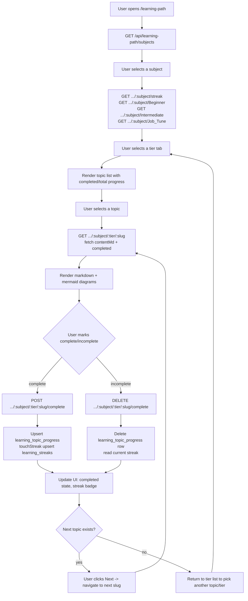

# Learning Path

The Learning Path module is a tiered curriculum browser: users pick a **subject** (currently only "Frontend"), choose a **tier** (Beginner / Intermediate / Job Tune), and read through an ordered list of **topics** rendered from stored markdown. Completing a topic updates a per-user, per-subject daily streak. The feature is backed by three Postgres tables (`learning_topics`, `learning_topic_progress`, `learning_streaks`) seeded from static curriculum content in [`Topic_workflows/Frontend`](../../Topic_workflows/Frontend/README.md), and is distinct from the older AI roadmap generator in `learning.js` and the unrelated general-purpose "career prep" pages (Zero to Hero / Learn & Build / Tune & Polish), which persist their own free-form wizard state through the generic `progress.js` API rather than the tiered topic model.

## Key Files

- [`backend/src/routes/learningPath.js`](../../backend/src/routes/learningPath.js) — REST API for subjects, tiers, topics, streak, and complete/incomplete toggling.
- [`backend/src/services/learningPathService.js`](../../backend/src/services/learningPathService.js) — data access and business logic for topics, progress, and streak math.
- [`backend/src/routes/learning.js`](../../backend/src/routes/learning.js) — unrelated legacy/AI feature: generates and stores 4-week AI skill-gap roadmaps (`learning_roadmaps` table); not part of the Subjects → Tiers → Topics hierarchy.
- [`backend/src/routes/progress.js`](../../backend/src/routes/progress.js) — generic per-user JSON progress blob API (get/put/patch), keyed by a fixed set of context keys.
- [`backend/src/services/progressService.js`](../../backend/src/services/progressService.js) — reads/writes the `user_progress` table backing `progress.js`.
- [`backend/scripts/import_learning_topics.js`](../../backend/scripts/import_learning_topics.js) — one-off importer that reads `Topic_workflows/Frontend/{Beginner,Intermediate,Job_Tune}/<NN-slug>/README.md` files and upserts them into `learning_topics`.
- [`backend/src/utils/initializeTables.js`](../../backend/src/utils/initializeTables.js) — DDL for `learning_topics`, `learning_topic_progress`, and `learning_streaks` (search for those table names).
- [`backend/src/services/taxonomy/onetLoader.js`](../../backend/src/services/taxonomy/onetLoader.js) — ONET occupation taxonomy loader/fuzzy matcher used by the job-fit scorer; **not used by the Learning Path feature** (included in scope for this doc but unrelated — see Notes).
- [`frontend/src/pages/LearningPathSubjects.jsx`](../../frontend/src/pages/LearningPathSubjects.jsx) — subject picker grid (`/learning-path`).
- [`frontend/src/pages/LearningPathTier.jsx`](../../frontend/src/pages/LearningPathTier.jsx) — tier tabs + topic list + streak badge (`/learning-path/:subject`).
- [`frontend/src/pages/LearningPathTopic.jsx`](../../frontend/src/pages/LearningPathTopic.jsx) — markdown topic reader with mermaid support, complete toggle, and prev/next nav (`/learning-path/:subject/:tier/:slug`).
- [`frontend/src/hooks/useUserProgress.js`](../../frontend/src/hooks/useUserProgress.js) — debounced load/save hook against `/api/progress/:contextKey`, used by the unrelated career-prep pages below (not by the Learning Path topic pages, which call `/learning-path/*` directly).
- [`frontend/src/pages/LearnAndBuildTrack.jsx`](../../frontend/src/pages/LearnAndBuildTrack.jsx), [`frontend/src/pages/ZeroToHeroTrack.jsx`](../../frontend/src/pages/ZeroToHeroTrack.jsx), [`frontend/src/pages/TuneAndPolishTrack.jsx`](../../frontend/src/pages/TuneAndPolishTrack.jsx) — separate "career prep" pages that consume `progress.js`/`useUserProgress` for their own wizard/kanban/tutor state; they do not read from `learning_topics` and are not part of the subject/tier/topic hierarchy.
- [`Topic_workflows/Frontend/README.md`](../../Topic_workflows/Frontend/README.md) — the static curriculum source (22 topics × 3 tiers) that `import_learning_topics.js` loads into the database.

## Data Model: Subjects → Tiers → Topics

The hierarchy lives entirely in the `learning_topics` table (see DDL in `initializeTables.js`):

- **Subject** — a free-text string column (`subject VARCHAR(100)`), e.g. `"Frontend"`. `listSubjects()` in `learningPathService.js` returns `SELECT DISTINCT subject FROM learning_topics ORDER BY subject`, so subjects are derived data, not a separate table — a subject exists only as long as at least one topic row references it. Today only `"Frontend"` has been imported (via `import_learning_topics.js`).
- **Tier** — a fixed enum enforced in code, not the DB: `TIER_ORDER = ['Beginner', 'Intermediate', 'Job_Tune']` in `learningPathService.js`. `validateTier()` checks membership in this array; both `learningPath.js` routes and the frontend (`LearningPathTier.jsx`'s `TIERS` constant) hardcode these three values. The DB column is just `tier VARCHAR(20)`.
- **Topic** — a row in `learning_topics`: `id`, `subject`, `tier`, `topic_order` (integer used for list ordering and prev/next navigation), `slug` (unique per subject+tier), `title`, `content_md` (the full markdown body rendered by the reader), `updated_at`. Uniqueness is enforced via `UNIQUE(subject, tier, slug)`, and lookups are indexed by `(subject, tier, topic_order)`.
- **Per-user progress** — tracked in a separate table, `learning_topic_progress`: `user_id`, `topic_id` (FK to `learning_topics`, cascade delete), `completed` (always `true` when a row exists), `completed_at`, unique on `(user_id, topic_id)`. There is no "incomplete" row — completion is modeled as row presence/absence: `markComplete` does an upsert, `markIncomplete` does a `DELETE`. `listTopics`/`getTopic` derive `completed` via a `LEFT JOIN ... (p.id IS NOT NULL) AS completed`.
- **Streaks** — tracked per `(user_id, subject)` in `learning_streaks`: `current_streak`, `longest_streak`, `last_active_date`. Streaks are subject-scoped, not tier- or topic-scoped — completing any topic in any tier of a subject on a given day advances that subject's streak once.

Content authoring flow: curriculum markdown lives as static files under `Topic_workflows/Frontend/<Tier>/<NN-slug>/README.md` (22 topics, numbered `01-internet` … `22-performance`, identical topic order across all three tiers per `Topic_workflows/Frontend/README.md`). `import_learning_topics.js` is run manually (`node backend/scripts/import_learning_topics.js`) to parse the folder name for `topic_order`/`slug`, map the slug to a display `title` via a hardcoded `TITLES_BY_SLUG` table, and upsert the file contents into `learning_topics.content_md`. This is a one-off/manual sync step — there is no automatic file-watcher or CI hook that re-imports on markdown changes.

## Workflow: Subject Picker → Tier → Topic Reader

1. User navigates to `/learning-path`. `LearningPathSubjects.jsx` calls `GET /api/learning-path/subjects` and renders one card per subject returned (e.g. "Frontend"), each linking to `/learning-path/:subject`.
2. Selecting a subject navigates to `LearningPathTier.jsx`, which on mount fires two independent effects: `GET /api/learning-path/:subject/streak` (for the streak badge) and, in parallel, `GET /api/learning-path/:subject/:tier` for **all three tiers** (`Beginner`, `Intermediate`, `Job_Tune`) simultaneously — each tier's loading/error state is tracked independently so one slow or failed tier doesn't block the others or clobber a previously-loaded tier's data.
3. The page defaults `activeTier` to `'Beginner'` and shows three tier tabs, each displaying a live `done/total` completion fraction and progress bar computed client-side from the already-fetched topic lists.
4. Clicking a tier tab switches `activeTier` (client-side state only, no refetch since all three tiers were preloaded) and renders that tier's topic list, each row showing a checkmark/circle icon (`completed`) and topic order/title.
5. Clicking a topic navigates to `/learning-path/:subject/:tier/:slug`, handled by `LearningPathTopic.jsx`, which calls `GET /api/learning-path/:subject/:tier/:slug` to fetch `contentMd`, `completed`, and `order`, and separately re-fetches the tier's full topic list (`GET /api/learning-path/:subject/:tier`) to compute prev/next sibling topics by sorting on `order`.
6. The markdown body (`contentMd`) is rendered with `react-markdown` + `remark-gfm` + `rehype-slug`, with a custom code-block renderer that detects ```` ```mermaid ```` fences and renders them via the `mermaid` library (theme synced to the app's dark-mode state).
7. Prev/Next buttons at the bottom navigate directly between sibling topic slugs within the same subject/tier without returning to the tier list view.

## Workflow: Progress Tracking

1. On the topic reader, the user clicks **Mark as complete** (or **Completed** to undo). `handleToggleComplete` in `LearningPathTopic.jsx` immediately flips `topic.completed` in local state (optimistic update) before the network call resolves.
2. It then calls `POST /api/learning-path/:subject/:tier/:slug/complete` (to mark complete) or `DELETE .../complete` (to unmark), which route through `learningPath.js` → `learningPathService.getTopic()` (to resolve the topic row, 404 if not found) → `markComplete`/`markIncomplete`.
3. `markComplete` upserts a row into `learning_topic_progress` (`ON CONFLICT (user_id, topic_id) DO UPDATE`) and then calls `touchStreak(userId, subject)`; `markIncomplete` deletes the progress row and calls `getStreak` (streak is **not** decremented or reset when un-completing a topic — see Notes).
4. `touchStreak` is a single upsert `INSERT ... ON CONFLICT (user_id, subject) DO UPDATE` whose `CASE` logic (evaluated entirely in Postgres using `CURRENT_DATE`) increments `current_streak` by 1 if `last_active_date` was yesterday, leaves it unchanged if already touched today (idempotent same-day), or resets to 1 otherwise; `longest_streak` is updated via `GREATEST(...)` in the same statement.
5. The API response (`{ completed, streak }`) is used to update `latestStreak` in the topic page (shown next to the toggle button) and to patch the cached `siblingTopics` list in memory so prev/next completion state stays in sync without a refetch.
6. Independently, `LearningPathTier.jsx` fetches the authoritative streak via `GET /api/learning-path/:subject/streak` on mount/subject change — it does not share live state with the topic page, so a completion made on the topic page updates that page's own streak display but the tier page's badge is only refreshed on next navigation/mount.
7. Separately, `progress.js`/`progressService.js` back a **different**, generic progress mechanism (`user_progress` table, one JSON blob per `(user_id, context_key)` with `context_key` restricted to `zero-to-hero`, `learn-and-build`, `tune-and-polish`, `preferences`). This is consumed via `useUserProgress.js` (debounced 700ms auto-save on `PUT`) by the career-prep pages, not by the Learning Path topic/tier/subject pages — the two progress systems do not interact.

## Flowchart



## API Endpoints

| Method | Path | Purpose | Auth Required |
|---|---|---|---|
| GET | `/api/learning-path/subjects` | List distinct subjects with any imported topics | `authenticateToken` |
| GET | `/api/learning-path/:subject/streak` | Get current/longest streak + last active date for a subject | `authenticateToken` |
| GET | `/api/learning-path/:subject/:tier` | List topics (with per-user completion) for a subject+tier | `authenticateToken` |
| GET | `/api/learning-path/:subject/:tier/:slug` | Get one topic's full content (`contentMd`) + completion state | `authenticateToken` |
| POST | `/api/learning-path/:subject/:tier/:slug/complete` | Mark a topic complete; upserts progress and bumps the subject streak | `authenticateToken` |
| DELETE | `/api/learning-path/:subject/:tier/:slug/complete` | Mark a topic incomplete; deletes the progress row | `authenticateToken` |
| POST | `/api/learning/generate-roadmap` | AI-generate (or fallback-generate) a 4-week skill-gap roadmap, saved to `learning_roadmaps` | `authenticateToken` + `requirePlan(1)` |
| GET | `/api/learning/roadmaps` | List the current user's last 10 saved AI roadmaps | `authenticateToken` + `requirePlan(1)` |
| GET | `/api/learning/resources` | Static hardcoded list of 3 example learning resources | none |
| GET | `/api/progress` | Get all saved progress blobs for the current user (all context keys) | `authenticateToken` |
| GET | `/api/progress/:contextKey` | Get one progress blob by context key | `authenticateToken` |
| PUT | `/api/progress/:contextKey` | Replace a progress blob wholesale | `authenticateToken` |
| PATCH | `/api/progress/:contextKey` | Shallow-merge fields into a progress blob | `authenticateToken` |

Routes are mounted in `backend/src/app.js`: `/api/learning-path` → `learningPath.js`, `/api/learning` → `learning.js`, `/api/progress` → `progress.js`.

## Notes / Gotchas

- **`learningPath.js` has no plan gate.** Unlike `learning.js`'s AI roadmap endpoints (`requirePlan(1)`), every route in `learningPath.js` only requires `authenticateToken` — any authenticated user, regardless of subscription tier, has full access to the tiered curriculum, streaks, and completion tracking.
- **Only one subject exists today.** `listSubjects()` is fully data-driven (`SELECT DISTINCT subject`), but `import_learning_topics.js` is hardcoded to `SUBJECT = 'Frontend'` and only reads from `Topic_workflows/Frontend`. Adding a new subject requires either a new import script or generalizing this one; there is no admin UI or generic importer for arbitrary subjects.
- **Tier enum is duplicated in three places** with no shared constant: `learningPathService.js` (`TIER_ORDER`), `LearningPathTier.jsx` (`TIERS`), and `LearningPathTopic.jsx` (`TIER_LABELS`). Adding/renaming a tier requires updating all three plus re-running the importer with matching folder names under `Topic_workflows/`.
- **Un-completing a topic does not decrement the streak.** `markIncomplete` deletes the `learning_topic_progress` row and returns the streak unchanged via `getStreak` — it never reduces `current_streak`. A user could complete a topic (streak +1), undo it, and the streak gain persists, meaning streaks can be inflated by toggle-spamming across day boundaries in edge cases (though same-day toggles don't compound since `touchStreak` is idempotent per day).
- **Streak is subject-scoped, not tier-scoped**, so completing one topic in `Job_Tune` and another in `Beginner` for the same subject on different days still forms one continuous streak — there's no per-tier progress signal beyond the `done/total` counts shown on the tier tabs.
- **`onetLoader.js` is unrelated to the Learning Path feature.** It loads O*NET occupation data (`onet_occupations` table) and provides fuzzy title-matching (`findOccupation`) used elsewhere for job-fit scoring; it shares no code, tables, or routes with `learning.js`/`learningPath.js`. It was included in the file list for this task but has no functional connection to Subjects/Tiers/Topics.
- **`LearnAndBuildTrack.jsx`, `ZeroToHeroTrack.jsx`, `TuneAndPolishTrack.jsx` are a separate feature**, despite being adjacent in naming/theme to "Learning Path." They use `/job-prep/*` and `/career/roadmap` AI endpoints and persist UI state (wizard answers, kanban tasks, chat history) via the generic `progress.js` API (`useUserProgress` hook) under fixed context keys (`zero-to-hero`, `learn-and-build`, `tune-and-polish`). None of them read or write `learning_topics`, `learning_topic_progress`, or `learning_streaks`.
- **No content versioning/audit trail.** `import_learning_topics.js` does a destructive upsert (`ON CONFLICT ... DO UPDATE SET title, content_md, topic_order`) — re-running the importer after editing a `Topic_workflows` README silently overwrites `content_md` with no history of the previous version.
- **Race/staleness in `LearningPathTopic.jsx`:** the sibling-topics fetch (for prev/next) is a separate, unguarded request from the main topic fetch — there's no cancellation-token check comparable to the one used in `LearningPathSubjects.jsx`/`LearningPathTier.jsx` effects (it does have a `cancelled` flag, but no loading/error UI state if it fails; it silently falls back to `[]`, disabling prev/next silently rather than surfacing an error).
