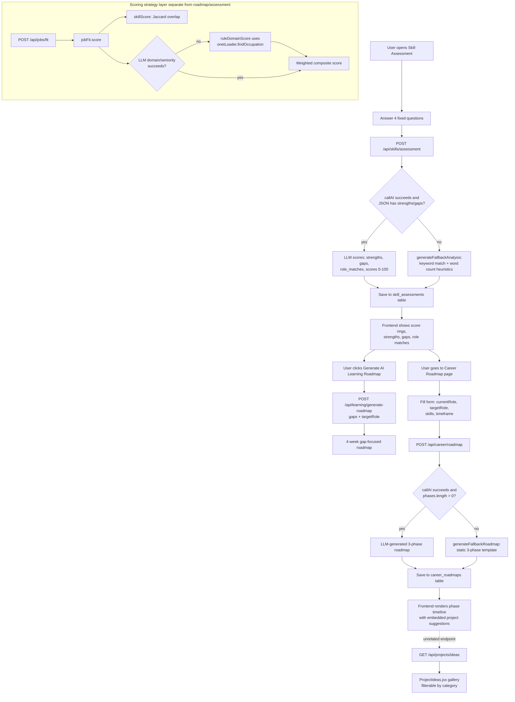

# Career Roadmap & Skills Assessment

This module lets a user take an AI-scored skills assessment, receive a strengths/gaps analysis, and generate a personalized multi-phase career roadmap (and, from the roadmap flow, a shorter gap-focused learning plan). It is backed by an LLM call with deterministic rule-based fallbacks, a small "scoring strategies" layer used for job-fit and benchmark scoring, and a bundled O\*NET occupation taxonomy used for domain matching. Results are persisted per-user in Postgres and are gated behind subscription plan tiers.

## Key Files

- [backend/src/routes/careerRoadmap.js](../../backend/src/routes/careerRoadmap.js) — `POST/GET /api/career/roadmap` — generates and fetches saved career roadmaps (3-phase plan), with a deterministic fallback generator.
- [backend/src/routes/skills.js](../../backend/src/routes/skills.js) — `POST /api/skills/assessment`, `GET /api/skills/history` — scores a 4-question technical/behavioral assessment via LLM, with a keyword-based fallback analyzer.
- [backend/src/routes/benchmarks.js](../../backend/src/routes/benchmarks.js) — `GET /api/benchmarks/run` (admin-only) — runs a named scorer strategy against a fixture dataset and returns accuracy metrics.
- [backend/src/services/benchmarks/scorerBenchmark.js](../../backend/src/services/benchmarks/scorerBenchmark.js) — fixture dataset (7 labelled resume/JD pairs), 3 lightweight scorer functions (`ats`, `hr`, `fit`), and MAE/Pearson/precision@threshold metric computation.
- [backend/src/services/scoring/strategies/jobFit.js](../../backend/src/services/scoring/strategies/jobFit.js) — the "job fit" scoring strategy: weighted composite of domain match, seniority match, and skill overlap; LLM-powered with a rule-based fallback.
- [backend/src/routes/jobFit.js](../../backend/src/routes/jobFit.js) — `POST /api/jobs/fit` — the only route consumer of the `jobFit` scoring strategy (not in the originally requested file list, but included here because it is the strategy's actual call site).
- [backend/src/services/taxonomy/onetLoader.js](../../backend/src/services/taxonomy/onetLoader.js) — loads bundled `data/onet/occupations.json` into memory, exposes `findOccupation()` (keyword-overlap fuzzy match) and `getDomain()`, and an unused `loadONET()` DB-upsert function.
- [backend/src/data/onet/occupations.json](../../backend/src/data/onet/occupations.json) — bundled O\*NET-derived occupation records (code, title, description, domain, skills, keywords).
- [frontend/src/pages/CareerRoadmap.jsx](../../frontend/src/pages/CareerRoadmap.jsx) — form → generating → display flow for the main career roadmap feature.
- [frontend/src/pages/SkillAssessment.jsx](../../frontend/src/pages/SkillAssessment.jsx) — question wizard → AI results (score rings, strengths/gaps/roles) → optional 4-week gap-roadmap view.
- [frontend/src/pages/ProjectIdeas.jsx](../../frontend/src/pages/ProjectIdeas.jsx) — static/DB-backed project idea gallery with category filters, loaded from `/api/projects/ideas` with a hardcoded fallback list.

## Architecture: Scoring Strategies

The codebase has a `backend/src/services/scoring/` directory with a single `strategies/` subfolder containing exactly one strategy today: [`jobFit.js`](../../backend/src/services/scoring/strategies/jobFit.js). There is no strategy registry/factory — `routes/jobFit.js` imports the `score()` function directly (`const { score } = require('../services/scoring/strategies/jobFit')`) and calls it inline. So "strategy selection" is really just "which module you `require`," not a runtime-pluggable dispatch table.

The `jobFit` strategy computes:

```
score = 0.35 * domainScore + 0.35 * seniorityScore + 0.30 * skillScore
```

- **Skill overlap** (`skillScore`) is always rule-based: it extracts tokens from a fixed ~90-item skill vocabulary (`SKILL_TOKENS`) out of resume and job-description text, then computes Jaccard similarity.
- **Domain + seniority** (`domainScore`, `seniorityScore`) are attempted via LLM first (`tryLLMScore`, calling `callAI` with `LM_STUDIO_MODEL_FIT`), and fall back to rule-based logic if the LLM call fails or returns unparseable JSON:
  - Rule-based domain match (`ruleDomainScore`) uses `findOccupation()` from the O\*NET loader to classify both the resume snippet and job description into a domain (e.g. "IT", "Data & Analytics"), then scores 100 for exact domain match, 60 for a related domain (via a small hardcoded `RELATED` map), 20 otherwise, or 50 if either side is unclassifiable.
  - Rule-based seniority match (`inferSeniority` + `computeSeniorityScore`) looks for explicit level keywords (intern/junior/mid/senior/lead/principal/staff) or a "N years" regex, then scores based on how far apart the two inferred levels are on a 0-5 ladder.

**How O\*NET taxonomy feeds in:** `onetLoader.js` requires `data/onet/occupations.json` once into an in-memory array (`getOccupations()`, lazily cached in module-level `_occupations`). `findOccupation(title)` tokenizes the input and scores it against each occupation's title + keywords via token-overlap, returning the best match (or `null` if nothing overlaps). `getDomain(occupation)` just reads the `.domain` field (defaulting to `"Unknown"`). This is the only place O\*NET data is used in request-serving code — it feeds the `jobFit` scoring strategy's domain-match component. `loadONET()` (which upserts the JSON into an `onet_occupations` Postgres table) exists but is not called anywhere outside `backend/tests/onetLoader.test.js` — the in-memory path is what's actually used at runtime.

The **career roadmap** (`careerRoadmap.js`) and **skills assessment** (`skills.js`) routes do **not** use the scoring-strategies module or O\*NET data at all — they call the LLM directly via `callAI`/`extractJSON` with their own prompts, independent of `services/scoring/`. The **benchmark** harness (`scorerBenchmark.js`) also defines its own separate, self-contained scorer functions (`atsScore`, `hrScore`, `fitScore`) rather than reusing `jobFit.js` — these are simple keyword-overlap heuristics used only to validate scoring approaches against labelled fixtures, not the same code path as the live `jobFit` strategy.

## Workflow: Skill Assessment

1. Frontend ([`SkillAssessment.jsx`](../../frontend/src/pages/SkillAssessment.jsx)) presents a fixed set of 4 hardcoded questions (React state, JS event loop, SQL optimization, conflict resolution) one at a time with a progress bar.
2. User types free-text answers into a textarea per question; answers are kept in local component state keyed by question id.
3. On the last question, clicking "Complete Assessment" calls `POST /api/skills/assessment` with `{ answers }` (both routes require `authenticateToken` + `requirePlan(1)`).
4. Backend ([`skills.js`](../../backend/src/routes/skills.js)) formats the 4 Q&A pairs into a prompt and calls `callAI()` with a system prompt instructing a FAANG-interviewer persona to return strict JSON (`strengths`, `gaps`, `role_matches`, `analysis`, `scores` with technical_depth/problem_solving/communication/industry_readiness, each 0-100).
5. If the AI call fails or returns unparseable/incomplete JSON, `generateFallbackAnalysis()` runs instead: it lowercases all answers, matches against a ~20-term tech keyword map to derive `strengths`, subtracts matched skills from a fixed gap list, and derives scores heuristically from detected-strength count and word count.
6. The result (whichever path produced it) is persisted to the `skill_assessments` table (`user_id`, raw `answers`, `strengths`, `gaps`, `role_matches` as JSON columns) and the freshly-inserted row is re-selected and returned, merged with `analysis`, `scores`, and an `ai_powered` boolean flag.
7. Frontend renders SVG "score ring" gauges for the 4 scores, lists strengths/gaps/role matches, and shows an "AI-Powered Analysis" badge only when `ai_powered` is true.
8. `GET /api/skills/history` returns all past assessments for the user, ordered newest-first (not currently wired into the `SkillAssessment.jsx` UI shown).

## Workflow: Career Roadmap Generation

1. Frontend ([`CareerRoadmap.jsx`](../../frontend/src/pages/CareerRoadmap.jsx)) on mount calls `GET /api/career/roadmap` to check for an existing saved roadmap; if found it renders it directly (skipping the form).
2. If none exists (404), the user fills a form: optional current role, required target role, optional comma-separated current skills, and a timeframe select (`3months` / `6months` / `1year`).
3. Submitting calls `POST /api/career/roadmap` with `{ currentRole, targetRole, currentSkills: string[], timeframe }` (requires `requirePlan(1)`). A `Map`-based `activeGenerations` guard rejects concurrent generation requests per-user with HTTP 429.
4. Backend validates `targetRole` is present, normalizes `timeframe` to one of the 3 valid values (defaulting to `6months`), and builds a prompt instructing the LLM to output exactly 3 phases (each with goals, skills, one project, resources, milestones) as strict JSON.
5. `callAI()` is invoked with `LM_STUDIO_MODEL_ROADMAP`. If it fails, or the parsed JSON lacks a non-empty `phases` array, `generateFallbackRoadmap()` produces a static 3-phase template (Foundation → Intermediate → Advanced) with role-aware skill suggestions (checks if `targetRole` contains "frontend"/"backend" as a substring) and generic projects/resources/tips.
6. The resulting roadmap object is inserted into `career_roadmaps` (`user_id`, `current_role`, `target_role`, `timeframe`, full `roadmap` JSON); the generated row id is attached back onto the response object. DB failure here is caught and logged but does not fail the request — the roadmap is still returned.
7. Response includes `aiPowered: boolean` so the frontend can indicate whether the plan came from the LLM or the static fallback (though the current JSX does not visibly surface this flag).
8. Frontend renders an expandable-phase timeline (goals, skills-as-chips, projects with difficulty badges, external resource links), plus a tips list and a checkbox-style key-metrics tracker.
9. **Project-idea tie-in**: [`ProjectIdeas.jsx`](../../frontend/src/pages/ProjectIdeas.jsx) is a separate page (not linked from the roadmap generation response) that fetches `GET /api/projects/ideas`. The live backend handler in `backend/src/routes/projects.js` currently returns only 2 hardcoded project objects; the frontend has its own richer 4-item `FALLBACK_PROJECTS` array used if the API call fails or returns empty. The roadmap's own `phases[].projects[]` entries (name/description/difficulty) are a **separate, unrelated** set of AI- or fallback-generated project suggestions embedded directly in the roadmap JSON — they are not sourced from or linked to the `/api/projects/ideas` endpoint.
10. A second, distinct roadmap flow exists: from the Skill Assessment results screen, "Generate AI Learning Roadmap" calls `POST /api/learning/generate-roadmap` (in `backend/src/routes/learning.js`, not one of the files this doc was scoped to) with `{ gaps, targetRole }`, producing a shorter 4-week `weeks[]`-structured plan — this is a different endpoint/shape than `/api/career/roadmap`'s `phases[]` structure, despite both being described as "roadmaps" in the UI.

## Flowchart



## API Endpoints

| Method | Path | Purpose | Auth Required |
|--------|------|---------|----------------|
| POST | `/api/career/roadmap` | Generate a personalized 3-phase career roadmap (LLM or fallback) and save it | `authenticateToken` + `requirePlan(1)` |
| GET | `/api/career/roadmap/:id` | Fetch a specific saved roadmap by id (must belong to the requesting user) | `authenticateToken` + `requirePlan(1)` |
| GET | `/api/career/roadmap` | Fetch the user's most recently generated roadmap | `authenticateToken` + `requirePlan(1)` |
| POST | `/api/skills/assessment` | Submit answers to the 4-question assessment and receive AI-scored analysis | `authenticateToken` + `requirePlan(1)` |
| GET | `/api/skills/history` | List all past assessments for the current user | `authenticateToken` + `requirePlan(1)` |
| GET | `/api/benchmarks/run?scorerName=&datasetName=` | Run a named scorer (`ats`/`hr`/`fit`) against the fixture dataset and return MAE/correlation/precision metrics | `authenticateToken` + admin role check (`requireAdmin`, queries `users.role`) |

*(For reference, `POST /api/jobs/fit`, the actual consumer of the `jobFit` scoring strategy discussed above, requires `authenticateToken` + `requirePlan(3)` — the highest tier of the three routes covered in this doc.)*

## Notes / Gotchas

- **`loadONET()` is dead code in production.** It upserts `occupations.json` into the `onet_occupations` Postgres table, but nothing in `app.js` or elsewhere calls it outside of `backend/tests/onetLoader.test.js`. Live domain-matching (`findOccupation`) reads only the in-memory JSON array, never the DB table, so the `onet_occupations` table (created in `initializeTables.js`) appears to go unused at runtime.
- **"Scoring strategies" is a directory of one.** `services/scoring/strategies/` currently contains only `jobFit.js`. There's no strategy interface, registry, or dynamic selection mechanism — it's a plain module import, so the plural "strategies" naming is aspirational/future-facing rather than describing current pluggable behavior.
- **Three independent scoring implementations for similar concepts exist and do not share code**: `scorerBenchmark.js`'s `atsScore`/`hrScore`/`fitScore` (keyword-overlap heuristics for benchmarking), `jobFit.js`'s `score()` (LLM + rule-based composite, used by the live `/api/jobs/fit` endpoint), and `skills.js`'s inline LLM-only assessment scoring. The benchmark harness does not actually benchmark the live `jobFit` strategy — it benchmarks its own separate, simpler heuristic functions of the same names/purpose.
- **Two different "roadmap" features with different data shapes and no shared code**: `POST /api/career/roadmap` (`careerRoadmap.js`) returns `{ phases: [...] }`, while `POST /api/learning/generate-roadmap` (`learning.js`, reached from the Skill Assessment results page) returns `{ weeks: [...] }`. Both are AI-generated career/learning plans but are entirely separate prompts, schemas, and DB storage (only `career_roadmaps` roadmap is persisted; the learning-gap roadmap's persistence was not verified as part of this doc's required file set).
- **`ProjectIdeas.jsx` and the roadmap's embedded `projects[]` are unrelated.** The roadmap phases contain their own ad hoc project suggestions (from the LLM or the fallback template); the dedicated Project Ideas page hits a different, mostly-stubbed endpoint (`GET /api/projects/ideas`, currently returning just 2 hardcoded items server-side) with its own richer 4-item client-side fallback list. There is no code path connecting a generated roadmap's skill gaps to the Project Ideas catalog.
- **`activeGenerations` in-memory `Map` guard is per-process, not distributed.** If the backend runs multiple instances/workers, a user could still trigger concurrent roadmap generations across different processes since the 429 guard only tracks state within a single Node process.
- **Skill assessment questions and scoring rubric are hardcoded** in both `skills.js` (backend, duplicated as the same 4 questions) and `SkillAssessment.jsx` (frontend) — there is no database-driven or configurable question bank.
- **Fallback quality varies in specificity.** `generateFallbackAnalysis` in `skills.js` does real (if simple) text analysis via keyword matching; `generateFallbackRoadmap` in `careerRoadmap.js` is a mostly-static template keyed only on whether `targetRole` contains the substring "frontend" or "backend" — most other target roles get generic "Full-stack fundamentals" content regardless of how specific the input was.
