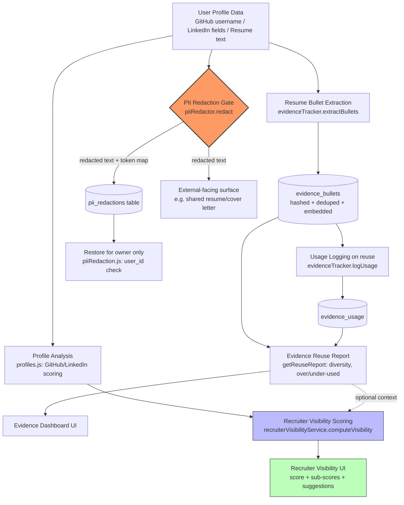

# Profiles, Evidence & Recruiter Visibility

This module cluster covers three related pieces of the JobTube platform. **Profiles** ([backend/src/routes/profiles.js](../../backend/src/routes/profiles.js)) is the data backbone — it audits and enriches a user's external presence (GitHub, LinkedIn) and matches it against target jobs. **Evidence** ([backend/src/routes/evidence.js](../../backend/src/routes/evidence.js), [backend/src/services/evidence/evidenceTracker.js](../../backend/src/services/evidence/evidenceTracker.js)) tracks proof-of-skill by extracting resume bullets, hashing/deduping them, and reporting how they're reused across applications. **Recruiter Visibility** ([backend/src/routes/recruiterVisibility.js](../../backend/src/routes/recruiterVisibility.js), [backend/src/services/recruiterVisibilityService.js](../../backend/src/services/recruiterVisibilityService.js)) combines resume/LinkedIn/GitHub signals into a single external-facing visibility score, and **PII Redaction** ([backend/src/routes/piiRedaction.js](../../backend/src/routes/piiRedaction.js), [backend/src/services/pii/piiRedactor.js](../../backend/src/services/pii/piiRedactor.js)) is the security gate that strips personal identifiers (emails, phones, addresses, names) from text before it is meant to be exposed externally.

## Key Files

**Profiles (GitHub/LinkedIn audit + job match)**
- [backend/src/routes/profiles.js](../../backend/src/routes/profiles.js) — GitHub 5-stage analysis pipeline, repo README generation, bio optimization, LinkedIn scoring, job-match keyword scoring
- Uses [backend/src/utils/aiClient.js](../../backend/src/utils/aiClient.js) (`callAI`, `extractJSON`) for optional LLM enhancement, with deterministic fallbacks throughout
- Persists to `github_analyses` table via `pool` from [backend/src/config/database.js](../../backend/src/config/database.js)

**Evidence (bullet tracking / reuse audit)**
- [backend/src/routes/evidence.js](../../backend/src/routes/evidence.js) — `GET /report` and `GET /bullets` endpoints
- [backend/src/services/evidence/evidenceTracker.js](../../backend/src/services/evidence/evidenceTracker.js) — bullet extraction, SHA-256 hashing/dedup, embedding, usage logging, diversity scoring
- [frontend/src/pages/EvidenceDashboard.jsx](../../frontend/src/pages/EvidenceDashboard.jsx) — diversity gauge, over/under-used bullet heatmap, all-bullets tab

**Recruiter Visibility (composite external-facing score)**
- [backend/src/routes/recruiterVisibility.js](../../backend/src/routes/recruiterVisibility.js) — single `POST /analyze` endpoint
- [backend/src/services/recruiterVisibilityService.js](../../backend/src/services/recruiterVisibilityService.js) — pure, deterministic scoring across resume/LinkedIn/GitHub/keywords with re-normalized weights
- [frontend/src/pages/RecruiterVisibility.jsx](../../frontend/src/pages/RecruiterVisibility.jsx) — input form (resume text, LinkedIn fields, GitHub username, target keywords) and results view

**PII Redaction (security gate)**
- [backend/src/routes/piiRedaction.js](../../backend/src/routes/piiRedaction.js) — `POST /redact` and `POST /restore`
- [backend/src/services/pii/piiRedactor.js](../../backend/src/services/pii/piiRedactor.js) — regex/name-list based redaction and token-based restoration
- Persists redaction maps to `pii_redactions` table (plaintext, see Notes/Gotchas)

## Workflow: Profile Management

1. User submits a GitHub username (or profile URL) to `POST /api/profiles/github/analyze`.
2. The route normalizes the username, then `fetchGitHubData()` calls the public GitHub REST API (user + repos + optional profile-README content).
3. `scorePortfolio()` deterministically scores 9 categories (profile README, bio, naming, descriptions, topics, README quality, hosting, activity, diversity) into a 0–100 overall score and a list of issues — no AI involved.
4. `categorizeProjects()` ranks repos by a weighted composite (stars, forks, recency, description/homepage presence) to pick up to 5 showcase projects.
5. `getAIEnhancements()` asks the configured LLM (via `callAI`) for a personalized profile README, bio suggestion, repo rename/description suggestions, hosting recommendations, and a recruiter summary; if the AI call fails or returns malformed JSON, `buildFallbackEnhancements()` produces the same shape deterministically.
6. `assembleFinalReport()` merges scores + AI output into ranked priorities, quick wins, and strengths.
7. The user can optionally call `POST /api/profiles/github/generate-repo-readme` (per-repo README) or `POST /api/profiles/github/optimize-bio` (bio rewrite) for follow-up edits.
8. `POST /api/profiles/github/save` persists the analysis (`user_id`, `username`, `overall_score`, `grade`, full JSON report) to `github_analyses`; `GET /api/profiles/github/history` returns the last 5 for that user.
9. Separately, `POST /api/profiles/linkedin/analyze` scores LinkedIn fields (headline, about, skills, experience, connections) with a hand-tuned weighted formula, and `POST /api/profiles/jobmatch` compares a job description's tech vocabulary against the user's listed skills.

All profile endpoints require `authenticateToken` and `requirePlan(2)` (job-match is auth-only, no plan gate).

## Workflow: Evidence Tracking

1. Resume bullets are extracted elsewhere in the tailoring pipeline (not in these route files) by calling `extractBullets(resumeText)`, which splits on `-`, `•`, or `*` markers and pulls a `text`/`skills`/`hash` object per line via `SKILL_KEYWORDS` matching.
2. Each bullet is persisted with `saveBullet(userId, bullet, sourceSection)`, which computes an embedding (`embedText`) and inserts into `evidence_bullets`, deduplicated per user by a `UNIQUE(user_id, bullet_hash)` constraint (`ON CONFLICT DO NOTHING`).
3. Whenever a bullet is reused in a tailored resume or cover letter, `logUsage(bulletId, applicationId, context)` inserts a row into `evidence_usage`, tying the bullet to an application and a context (`tailored_resume` | `cover_letter`).
4. The dashboard ([frontend/src/pages/EvidenceDashboard.jsx](../../frontend/src/pages/EvidenceDashboard.jsx)) calls `GET /api/evidence/report` and `GET /api/evidence/bullets` in parallel on load.
5. `getReuseReport(userId)` aggregates usage counts per bullet, splits them into `overUsed` (>2 uses) and `underUsed` (≤1 use), and computes a `diversity` score (0–100) from the coefficient of variation of usage counts — uniform reuse scores high, concentrated reuse scores low.
6. The dashboard renders a diversity gauge, stat cards, a heatmap of over-/under-used bullets, generated suggestions, and a full bullet list (optionally filterable by `applicationId` via `GET /api/evidence/bullets?applicationId=N`).

`GET /report` requires `requirePlan(3)`; `GET /bullets` requires only authentication (no plan gate).

## Workflow: Recruiter Visibility & PII Redaction

1. On the [RecruiterVisibility.jsx](../../frontend/src/pages/RecruiterVisibility.jsx) page, the user pastes resume text and/or LinkedIn fields and/or a GitHub username, plus optional target-role keywords.
2. If a GitHub username is given, the frontend first calls `POST /api/profiles/github/analyze` to get a real score, then forwards that result as `github` in the visibility request (falls back to `undefined` if that call fails).
3. The frontend calls `POST /api/recruiter-visibility/analyze` with `{ resumeText, linkedin, github, targetKeywords }`.
4. `computeVisibility()` scores each available source independently — `scoreResume()` (length, quantified impact, contact links, keyword density), `scoreLinkedIn()` (accepts either a pre-analyzed `{score,...}` object or raw fields), `scoreGitHub()` (same dual-shape handling) — and `scoreKeywords()` (keyword coverage against `targetKeywords` or a built-in recruiter vocabulary).
5. Missing sources are tolerated: weights are re-normalized over whichever sources are actually present, so a resume-only submission is still scored fairly, with "add X" suggestions surfaced first.
6. The result (`visibilityScore`, `scoreLabel`, per-source `subScores`, ranked `suggestions`, `missingSources`) is returned; the UI shows an overall score, a sub-score bar per source, matched/missing keyword chips, and a numbered suggestion list. This computed data does not itself get redacted before display — see Notes.
7. Independently, whenever raw resume/cover-letter text is about to be shown or sent externally, the app can call `POST /api/pii/redact` with `{ text, contextType: 'resume'|'cover_letter', contextId }`. `redact()` in [piiRedactor.js](../../backend/src/services/pii/piiRedactor.js) finds emails, US-style phone numbers, street addresses, and any name from static first/last-name lists, replaces each with a `[TYPE_N]` token, and returns the redacted text plus a `map` of token → original value.
8. The redaction map is persisted to `pii_redactions` (`user_id`, `context_type`, `context_id`, `redaction_map` as JSON) and an `id` is returned.
9. To reverse it (e.g. for the account owner's own internal view), `POST /api/pii/restore` takes `{ text, redactionId }`, loads the map by id, verifies `record.user_id === req.user.id` (403 otherwise), and calls `restore()` to substitute tokens back to original values.

Recruiter-visibility `/analyze` requires `requirePlan(2)`. Both PII endpoints require only authentication (no plan gate, no explicit ownership check on `/redact` since it always writes under the caller's own `user_id`).

## Flowchart

Note: as implemented today, `computeVisibility()` consumes raw `resumeText`/`linkedin`/`github` objects directly — the PII redaction gate (`K`) is a separate, opt-in pipeline invoked elsewhere in the app (e.g. before generating a shareable resume), not something the recruiter-visibility or evidence code paths call automatically. The flowchart shows the intended relationship, not an enforced call chain — see Notes/Gotchas.

## API Endpoints

| Method | Path | Purpose | Auth Required |
|---|---|---|---|
| POST | `/api/profiles/github/analyze` | Full 5-stage GitHub portfolio audit (fetch, score, categorize, AI-enhance, assemble report) | `authenticateToken` + `requirePlan(2)` |
| POST | `/api/profiles/github/generate-repo-readme` | Generate a README for a single repo (AI with template fallback) | `authenticateToken` + `requirePlan(2)` |
| POST | `/api/profiles/github/optimize-bio` | Rewrite a GitHub bio to under 160 chars (AI with rule-based fallback) | `authenticateToken` + `requirePlan(2)` |
| POST | `/api/profiles/github/save` | Persist a GitHub analysis to `github_analyses` | `authenticateToken` + `requirePlan(2)` |
| GET | `/api/profiles/github/history` | Last 5 saved GitHub analyses for the user | `authenticateToken` + `requirePlan(2)` |
| POST | `/api/profiles/linkedin/analyze` | Score LinkedIn profile fields (headline, about, skills, experience) | `authenticateToken` + `requirePlan(2)` |
| POST | `/api/profiles/jobmatch` | Compare job description keywords against user skills | `authenticateToken` (no plan gate) |
| GET | `/api/evidence/report` | Bullet reuse report (over/under-used, diversity score, suggestions) | `authenticateToken` + `requirePlan(3)` |
| GET | `/api/evidence/bullets` | List all tracked bullets, optionally filtered by `applicationId` | `authenticateToken` (no plan gate) |
| POST | `/api/recruiter-visibility/analyze` | Composite recruiter visibility score from resume/LinkedIn/GitHub/keywords | `authenticateToken` + `requirePlan(2)` |
| POST | `/api/pii/redact` | Redact PII (emails, phones, addresses, names) from text, store map | `authenticateToken` (no plan gate) |
| POST | `/api/pii/restore` | Restore original PII from a redaction map, owner-only | `authenticateToken` (no plan gate; explicit `user_id` ownership check) |

## Notes / Gotchas

- **PII redaction maps are stored in plaintext.** `POST /api/pii/redact` writes the full `redaction_map` (token → original email/phone/address/name) as plain JSON into the `pii_redactions` table ([piiRedaction.js:26-30](../../backend/src/routes/piiRedaction.js)). Anyone with direct DB access (or a future SQL-injection-adjacent bug, or a misconfigured admin/support tool reading that table) sees the unredacted PII. There is no column-level encryption or hashing of the stored map. This is the single biggest data-exposure risk in this module cluster and worth flagging for a follow-up (e.g. encrypt `redaction_map` at rest, or store it only transiently/client-side).
- **Name-based redaction is a static, small, US-centric list.** `FIRST_NAMES`/`LAST_NAMES` in [piiRedactor.js](../../backend/src/services/pii/piiRedactor.js) are ~30 common Western first/last names each. Any name outside that list (most non-Western names, uncommon names, nicknames) will **not** be redacted, meaning "redacted" text can still leak the candidate's actual name. This is a real gap if the redaction output is trusted as "safe for external sharing."
- **`POST /api/pii/redact` has no ownership/ratelimit concern but also no contextId validation** — `contextId` is accepted and stored as-is (nullable, no FK check shown in the route), so it could reference resumes/cover letters the caller doesn't own. Not a direct leak (map itself is scoped to `req.user.id`), but worth checking against the `context_id` foreign table if one exists.
- **`POST /api/pii/restore` correctly checks `record.user_id !== req.user.id` → 403**, which is good — only the owner can decode their own redaction map back to PII. This is the one place in this cluster with an explicit authorization check beyond auth+plan gating.
- **Recruiter Visibility does not redact PII from resume text before scoring or echoing signals back.** `scoreResume()` deliberately detects and rewards the presence of an email/LinkedIn/GitHub URL in resume text (used as a *positive* signal), and the raw text is never redacted before being processed. Since this endpoint's job is literally to simulate "how a recruiter sees you," this is arguably by design, but it means whatever PII the user pastes flows straight into the request/response cycle unredacted. If results or resumeText are ever logged (e.g. via `console.error` on the catch path elsewhere, or app-level request logging), PII would land in logs.
- **PHONE_REGEX is US-format only** (`\d{3}[-.\s]?\d{3}[-.\s]?\d{4}`), so international phone numbers will pass through unredacted.
- **The GitHub analysis pipeline calls the public GitHub API unauthenticated** (`fetchGitHubData` in [profiles.js](../../backend/src/routes/profiles.js)), which is subject to GitHub's low unauthenticated rate limit; no API token, retry/backoff, or rate-limit-aware error message is implemented — a burst of analyses could start returning generic 404s that read as "user not found."
- **AI-enhancement calls in profiles.js have solid deterministic fallbacks** (`buildFallbackEnhancements`) if the LLM call fails or returns malformed JSON — this is a good resilience pattern, consistently applied across `github/analyze`, `generate-repo-readme`, and `optimize-bio`.
- **Evidence bullet dedup is per-user and hash-only** (`UNIQUE(user_id, bullet_hash)`), so trivial rewording (even whitespace/punctuation changes) produces a different SHA-256 hash and is tracked as a "new" bullet, which could understate real reuse in the diversity/over-use report.
- **The Recruiter Visibility page's "Load Test Data" button** ([RecruiterVisibility.jsx:83-100](../../frontend/src/pages/RecruiterVisibility.jsx)) populates the form with a fabricated but realistic-looking name/email (`jane.doe@email.com`) and LinkedIn/GitHub handles — harmless as sample data, but worth confirming it's clearly labeled as a demo in the UI (it is, via the button label) so it's never mistaken for real user data in support/screenshots.
