# Content Generation Suite

The Content Generation suite covers the tools that turn a candidate's raw career facts into polished, ready-to-use written artifacts: AI-drafted cover letters, AI-rewritten resume bullet points, a cross-profile consistency checker, and a set of GitHub/LinkedIn/Portfolio "optimizer" pages. Three of these (Cover Letter, Achievement Enhancer, Resume Consistency Checker) are fully wired end-to-end with real backend routes and services. The GitHub/LinkedIn/Portfolio group is a mix: the GitHub Optimizer's Analyzer tab and the LinkedIn Optimizer both call real, plan-gated backend endpoints, the GitHub Optimizer's Generator tab is a 100%-client-side README builder with no backend at all (by design, per [`GITHUB_README_GENERATOR_PLAN.md`](../archive/GITHUB_README_GENERATOR_PLAN.md)), and the Portfolio Builder is a static, non-functional UI mock with no data persistence or API calls whatsoever.

## Key Files

**Cover Letter Generator**
- [`backend/src/routes/coverLetter.js`](../../backend/src/routes/coverLetter.js) — `POST /api/jobs/generate-cover-letter`, AI generation + deterministic fallback template.
- [`frontend/src/pages/CoverLetterGenerator.jsx`](../../frontend/src/pages/CoverLetterGenerator.jsx) — form (company, position, name, JD, background, tone), calls the route, copy/download actions.

**Achievement Enhancer**
- [`backend/src/routes/achievementEnhancer.js`](../../backend/src/routes/achievementEnhancer.js) — `POST /api/jobs/achievement-enhancer/enhance`, orchestrates context detection, impact extraction, AI rewrite, rule-based fallback.
- [`backend/src/services/achievementEnhancerService.js`](../../backend/src/services/achievementEnhancerService.js) — pure functions: `detectContext`, `extractImpact`, `generateFallbackBullet(s)`; reuses `ActionVerbAnalyzer` and `MetricsAnalyzer` from `services/v2`.
- [`frontend/src/pages/AchievementEnhancer.jsx`](../../frontend/src/pages/AchievementEnhancer.jsx) — textarea for newline-separated achievements + optional role hint, renders enhanced bullets with per-item and copy-all actions.

**Resume Consistency Checker**
- [`backend/src/routes/resumeConsistency.js`](../../backend/src/routes/resumeConsistency.js) — `POST /api/resume-consistency/check`, thin wrapper around the service.
- [`backend/src/services/resumeConsistencyService.js`](../../backend/src/services/resumeConsistencyService.js) — pure, deterministic (no LLM) cross-comparison engine; exports `checkConsistency`.
- [`frontend/src/pages/ResumeConsistency.jsx`](../../frontend/src/pages/ResumeConsistency.jsx) — three JSON textareas (Resume/LinkedIn/GitHub), renders score + categorized mismatch cards.

**GitHub Optimizer (Analyzer — real backend)**
- [`frontend/src/pages/GitHubOptimizer.jsx`](../../frontend/src/pages/GitHubOptimizer.jsx) — Analyzer tab posts to `/api/profiles/github/analyze` (route defined in `backend/src/routes/profiles.js`, not read in full for this doc but confirmed to exist, gated by `authenticateToken` + `requirePlan(2)`); Generator tab renders `GitHubReadmeGenerator`.

**GitHub Readme Generator (Generator tab — client-side only, no backend)**
- [`frontend/src/components/GitHubReadmeGenerator.jsx`](../../frontend/src/components/GitHubReadmeGenerator.jsx) — multi-section form (personal info, dev profiles, skills, GitHub stats toggles, extras, custom section); calls `generateReadme(formData)` on every keystroke, no API calls.
- [`frontend/src/components/GitHubReadmePreview.jsx`](../../frontend/src/components/GitHubReadmePreview.jsx) — hand-rolled markdown-to-HTML regex renderer (`renderMarkdown`) for live preview; copy/download buttons.
- [`frontend/src/utils/readmeGenerator.js`](../../frontend/src/utils/readmeGenerator.js) — `generateReadme()` string-builder and `SKILLS_BY_CATEGORY` skill list; pure client-side markdown templating, embeds third-party badge/stats image URLs (github-readme-stats.vercel.app, github-readme-streak-stats, visitorbadge.io).
- [`GITHUB_README_GENERATOR_PLAN.md`](../archive/GITHUB_README_GENERATOR_PLAN.md) — original design doc; states explicitly "No backend changes needed (100% client-side generation)" — matches implementation.

**LinkedIn Optimizer (real backend)**
- [`frontend/src/pages/LinkedInOptimizer.jsx`](../../frontend/src/pages/LinkedInOptimizer.jsx) — manual profile-stat form (headline, about, skills, experience count, years, connections tier, photo/featured checkboxes) posts to `/api/profiles/linkedin/analyze` (route confirmed present in `backend/src/routes/profiles.js`, gated by `authenticateToken` + `requirePlan(2)`; internal scoring logic not verified in this pass).

**Portfolio Builder (frontend-only mock, no backend)**
- [`frontend/src/pages/PortfolioBuilder.jsx`](../../frontend/src/pages/PortfolioBuilder.jsx) — drag-and-drop-style block editor UI with hardcoded initial `sections` state (`hero`, `about`). "Preview Site" and "Publish Portfolio" buttons and sidebar "add block" buttons have no `onClick` handlers at all — purely decorative. No `api` import, no persistence, no routes anywhere in the codebase serve it.

**Adjacent but out of scope for this doc (resume tooling, not content generation)**
- [`frontend/src/pages/ResumeOptimizer.jsx`](../../frontend/src/pages/ResumeOptimizer.jsx) and [`frontend/src/pages/ResumeComparison.jsx`](../../frontend/src/pages/ResumeComparison.jsx) — resume analyze/forge/compare features backed by `/api/resume/*` routes; distinct subsystem from the five modules covered here, included in the read list for contrast only.

## Workflow: Cover Letter Generation

1. User fills in company name, position title, their name, job description (pasted), optional background/experience, and selects a tone (`formal` / `friendly` / `confident`) in [`CoverLetterGenerator.jsx`](../../frontend/src/pages/CoverLetterGenerator.jsx).
2. Frontend validates required fields client-side, then `POST`s to `/api/jobs/generate-cover-letter`.
3. Route requires auth (`authenticateToken`) and plan tier 2+ (`requirePlan(2)`).
4. Server builds a system prompt ("expert career coach...") and a user prompt embedding candidate name, company, position, background, and the first 500 characters of the job description.
5. `callAI()` (`backend/src/utils/aiClient.js`, model from `LM_STUDIO_MODEL_JOB` or `LM_STUDIO_MODEL_RESUME` env vars) is invoked with `maxTokens: 800`, `temperature: 0.7`.
6. If the AI call succeeds, its trimmed text output is used as the letter.
7. If the AI call fails or returns nothing, `generateFallbackLetter()` deterministically fills a fixed 4-paragraph template with the tone-adjusted adverb and the supplied company/position/experience.
8. Response returns `{ letterText, generatedAt }`; frontend renders it with copy-to-clipboard and download-as-`.txt` actions.

## Workflow: Achievement Enhancement

"Enhancing" means rewriting a raw, informally-phrased achievement (e.g. `"Created Attendance System"`) into a single polished, resume-ready bullet with a strong action verb and implied impact — via AI rewrite when available, else a deterministic rule-based rewrite.

1. User enters achievements (newline-separated, or an array) plus an optional target-role hint in [`AchievementEnhancer.jsx`](../../frontend/src/pages/AchievementEnhancer.jsx); posts to `/api/jobs/achievement-enhancer/enhance` (auth + plan tier 2 required).
2. Route parses/normalizes input via `parseAchievements()` — caps at 15 items, 500 chars each.
3. **Stage 1 — Context Detection** (`achievementEnhancerService.detectContext`): scores the achievement text against keyword lists for 9 domains (software, data, design, marketing, sales, operations, leadership, finance, research) to pick the best-matching domain; also runs `ActionVerbAnalyzer.analyze()` to flag strong/weak verbs already present.
4. **Stage 2 — Impact Extraction** (`extractImpact`): runs `MetricsAnalyzer.analyze()` to detect existing quantifiable metrics, and checks whether the leading word is already a "strong" verb.
5. **Stage 3 — AI Enhancement**: a single batched prompt (system + numbered user prompt) is sent to `callAI()` (model from `LM_STUDIO_MODEL_RESUME`/`LM_STUDIO_MODEL_JOB`), instructing the model to rewrite each line into one bullet starting with a strong past-tense verb, implying impact without inventing fake numbers.
6. AI output is parsed line-by-line (`parseAIBullets`); only trusted if it returns at least as many lines as achievements submitted — otherwise treated as a miss.
7. **Fallback**: if AI is unavailable or the line count doesn't match, `generateFallbackBullets()` deterministically upgrades the leading verb via a hardcoded `VERB_UPGRADE` map (e.g. `created` → `Developed`, `helped` → `Spearheaded`), reshapes the object phrase, and appends a domain-specific impact phrase (from `IMPACT_PHRASES`) only if no metric was already present.
8. Response includes each result's `original`, `enhanced` text, detected `domain`, and `hasMetrics` flag, plus a `source` field (`'ai'` or `'rule-based'`) so the UI can show provenance.

## Workflow: Resume Consistency Check

Pure rule-based (no LLM) cross-comparison across up to three candidate-supplied profile documents: Resume, LinkedIn, GitHub. It detects:
- **Projects Missing in Resume** (medium) — GitHub repos/projects absent from the resume.
- **Projects Missing in GitHub** (low, informational) — resume projects with no matching public repo.
- **Skills Missing in LinkedIn** / **Skills Missing in Resume** (medium) — skill-list set differences between resume and LinkedIn.
- **Skills Missing in Resume** (low) — GitHub-evidenced languages (from repo `language` fields or a `languages` array) not listed on the resume.
- **Title Mismatches** (high) — same employer, differing job title, resume vs LinkedIn.
- **Date Mismatches** (high) — same employer, differing start/end year, resume vs LinkedIn.
- **Experience Missing in LinkedIn** (medium) — resume employer with no matching company on LinkedIn.
- **Headline Mismatches** (low) and **Name Mismatches** (medium) — direct string differences after normalization.

Steps:
1. User pastes JSON blobs for Resume / LinkedIn / GitHub (any subset, ≥2 recommended) into [`ResumeConsistency.jsx`](../../frontend/src/pages/ResumeConsistency.jsx); client parses/validates JSON before submit.
2. `POST /api/resume-consistency/check` (auth + plan tier 2 required); route rejects the request only if all three fields are empty.
3. `checkConsistency()` normalizes each profile's skills/projects into deduped, lowercased name sets (`skillSet`, `projectSet`, `nameSet`) and experience into a comparable list with parsed years (`experienceList`).
4. Pairwise comparisons run only for the pairs actually supplied (each `if (resume && github)` / `if (resume && linkedin)` guard skips comparisons when a source is missing).
5. Each detected mismatch category is pushed with a `category`, `severity` (`high`/`medium`/`low`), `source`, `target`, list of `items`, and human-readable `details`.
6. **Scoring**: starts at 100, subtracts `items.length * weight` per category (weights: high=8, medium=4, low=1.5), floors at 0. Score is `null` (not "0") when fewer than 2 sources were provided — flagged via `summary.comparable`.
7. Response returns `{ consistencyScore, summary: { totalMismatches, sourcesProvided, comparable }, mismatches[], generatedAt }`; frontend renders a score ring plus severity-colored mismatch cards.

## Workflow: GitHub Readme / LinkedIn / Portfolio

**GitHub Optimizer — Analyzer tab (real, backend-driven):** [`GitHubOptimizer.jsx`](../../frontend/src/pages/GitHubOptimizer.jsx) posts a GitHub username to `/api/profiles/github/analyze`. This route (in `backend/src/routes/profiles.js`, outside this doc's detailed-read scope but confirmed present, and gated by `authenticateToken` + `requirePlan(2)`) returns a profile health score, repo/star counts, detected languages, strengths/issues lists, and an AI/heuristic-generated `generatedReadme` string. This is a genuinely server-driven feature, distinct from the Generator tab below.

**GitHub Optimizer — Generator tab (client-only, no backend, matches the plan doc exactly):** Selecting "Generator" renders [`GitHubReadmeGenerator.jsx`](../../frontend/src/components/GitHubReadmeGenerator.jsx), a large controlled form (name, tagline, bio, dev-profile links, categorized skill picker, GitHub-stats-card checkboxes, Buy-Me-a-Coffee link, custom section). On every field change, `generateReadme(formData)` from [`readmeGenerator.js`](../../frontend/src/utils/readmeGenerator.js) runs synchronously in the browser and rebuilds a markdown string by concatenating template sections — no network call at all. [`GitHubReadmePreview.jsx`](../../frontend/src/components/GitHubReadmePreview.jsx) renders that markdown via a small hand-written regex-based markdown→HTML converter (not a real markdown library) and offers copy/download. `GITHUB_README_GENERATOR_PLAN.md`'s stated intent — "100% client-side generation," "no backend changes needed" — is exactly what is implemented; there is no persistence, so refreshing the page loses all form data.

**LinkedIn Optimizer (real, backend-driven, but manual-entry not scraped):** [`LinkedInOptimizer.jsx`](../../frontend/src/pages/LinkedInOptimizer.jsx) collects manually-entered profile stats (headline, about text, skills, experience count, years of experience, connection tier, photo/featured booleans — no actual LinkedIn OAuth or scraping) and posts to `/api/profiles/linkedin/analyze` (route confirmed present in `profiles.js`, plan-gated). The internal scoring/suggestion logic of that endpoint was not read for this doc and should be verified separately before relying on its "AI-Powered Suggestions" label.

**Portfolio Builder (stub / non-functional mock):** [`PortfolioBuilder.jsx`](../../frontend/src/pages/PortfolioBuilder.jsx) renders a two-panel "site builder" with a hardcoded `sections` array (one `hero` block, one `about` block) seeded directly in `useState`. There is no `api` import, no drag-and-drop implementation, no add/edit/delete handlers wired to the sidebar buttons, and the "Preview Site" / "Publish Portfolio" buttons have no `onClick` at all. This page is entirely decorative — it does not read, write, or generate anything. No backend route for portfolios exists anywhere in `backend/src/routes/`.

## Flowchart

```mermaid
flowchart TD
    subgraph CoverLetter["Cover Letter Generator"]
        A1[User fills form: company, position,\nname, JD, background, tone] --> A2[POST /api/jobs/generate-cover-letter]
        A2 --> A3{callAI succeeds?}
        A3 -->|yes| A4[Use AI-generated letter text]
        A3 -->|no / error| A5[generateFallbackLetter\ndeterministic template]
        A4 --> A6[Return letterText + generatedAt]
        A5 --> A6
    end

    subgraph Achievement["Achievement Enhancer"]
        B1[User enters achievements\n+ optional role hint] --> B2[POST /api/jobs/achievement-enhancer/enhance]
        B2 --> B3[parseAchievements: normalize, cap 15 items]
        B3 --> B4[detectContext: domain + verb signals]
        B4 --> B5[extractImpact: metrics + strong-verb check]
        B5 --> B6[callAI with batched prompt]
        B6 --> B7{Parsed AI lines\n>= achievement count?}
        B7 -->|yes| B8[Use AI bullets]
        B7 -->|no / error| B9[generateFallbackBullets\nverb upgrade + impact phrase]
        B8 --> B10[Return results with source: ai/rule-based]
        B9 --> B10
    end

    subgraph Consistency["Resume Consistency Checker"]
        C1[User pastes Resume / LinkedIn /\nGitHub JSON, 1-3 sources] --> C2[POST /api/resume-consistency/check]
        C2 --> C3[Normalize skills, projects,\nexperience per profile]
        C3 --> C4[Pairwise comparisons:\nprojects, skills, titles, dates, headline, name]
        C4 --> C5[Weighted score: 100 - penalty\nnull if fewer than 2 sources]
        C5 --> C6[Return consistencyScore + categorized mismatches]
    end

    subgraph GitHubAnalyzer["GitHub Optimizer - Analyzer tab"]
        D1[User enters GitHub username] --> D2[POST /api/profiles/github/analyze]
        D2 --> D3[Server: fetch GitHub data,\nscore profile, generate README]
        D3 --> D4[Return score, issues, strengths,\ngeneratedReadme]
    end

    subgraph LinkedInOpt["LinkedIn Optimizer"]
        E1[User manually enters profile stats] --> E2[POST /api/profiles/linkedin/analyze]
        E2 --> E3[Return score, metrics breakdown,\nsuggestions]
    end
```

*(The GitHub Readme Generator tab and the Portfolio Builder are intentionally excluded from this flowchart — they involve no backend logic to diagram.)*

## API Endpoints

| Method | Path | Purpose | Auth Required |
|--------|------|---------|----------------|
| POST | `/api/jobs/generate-cover-letter` | Generate a tailored cover letter (AI + deterministic fallback) | `authenticateToken` + `requirePlan(2)` |
| POST | `/api/jobs/achievement-enhancer/enhance` | Rewrite raw achievements into polished resume bullets (AI + rule-based fallback) | `authenticateToken` + `requirePlan(2)` |
| POST | `/api/resume-consistency/check` | Cross-compare Resume/LinkedIn/GitHub data and return a consistency score + mismatches | `authenticateToken` + `requirePlan(2)` |

Route mount points (from [`backend/src/app.js`](../../backend/src/app.js)): `coverLetterRoutes` is mounted at `/api/jobs` (so its internal `/generate-cover-letter` path becomes `/api/jobs/generate-cover-letter`); `achievementEnhancerRoutes` is mounted at `/api/jobs/achievement-enhancer` (internal `/enhance` → `/api/jobs/achievement-enhancer/enhance`); `resumeConsistencyRoutes` is mounted at `/api/resume-consistency` (internal `/check` → `/api/resume-consistency/check`).

Not included above (outside this doc's read scope, but referenced by the GitHub/LinkedIn pages and confirmed to exist in `backend/src/routes/profiles.js`): `POST /api/profiles/github/analyze`, `POST /api/profiles/github/generate-repo-readme`, `POST /api/profiles/github/optimize-bio`, `POST /api/profiles/github/save`, `GET /api/profiles/github/history`, `POST /api/profiles/linkedin/analyze` — all gated by `authenticateToken` + `requirePlan(2)`.

## Notes / Gotchas

- **GitHub Readme Generator tab has zero backend and zero persistence.** All state lives in React `useState` in `GitHubReadmeGenerator.jsx`; a page refresh discards the entire form. This is intentional per `GITHUB_README_GENERATOR_PLAN.md`, not a bug.
- **Portfolio Builder (`PortfolioBuilder.jsx`) is non-functional.** No API calls, no working buttons (the sidebar "add block" buttons and "Preview Site"/"Publish Portfolio" buttons have no handlers), hardcoded initial content. Treat this as an unbuilt placeholder page, not a real feature — do not assume any backend logic exists for it because none does anywhere in `backend/src/routes/`.
- **The GitHub Readme Generator's live preview is not a real markdown renderer.** `GitHubReadmePreview.jsx` uses a chain of hand-written regex replacements (`renderMarkdown`) rather than a markdown library; it will mis-render edge cases (nested lists, tables, mixed inline formatting) that a real parser like `react-markdown` would handle correctly.
- **The "GitHub Stats", "Streak Stats", "Top Languages", and "Visitors" badges** generated by `readmeGenerator.js` are just embedded `` URLs pointing at third-party free services (github-readme-stats.vercel.app, github-readme-streak-stats.herokuapp.com, api.visitorbadge.io) — nothing is verified or rendered server-side; if the candidate's `github` username field is empty, the "Visitors" badge URL is still emitted with an empty username segment.
- **Resume Consistency Checker requires no minimum sources at the route level** (`if (!resume && !linkedin && !github)` only rejects when *all three* are missing), but the score is explicitly `null` (not `0`) when fewer than two sources are given — the frontend surfaces this via `summary.comparable` and an amber warning message.
- **Achievement Enhancer's "impact phrasing" is fabricated wording, not fabricated numbers.** The code comment and prompt explicitly instruct the AI to "imply impact... Do NOT invent specific fake numbers," and the rule-based fallback only appends a generic domain-flavored phrase (e.g. "streamlining workflows and improving system reliability") when no metric is already present — it never invents a percentage or dollar figure.
- **All three real backend routes documented here require plan tier 2** (`requirePlan(2)`, labeled "Tune & Polish" in code comments) in addition to authentication — this is a paywalled feature set, not available on a free/tier-1 plan.
- **Cover Letter and Achievement Enhancer both share the same AI-with-deterministic-fallback pattern**, sourcing their model name from the same pair of env vars (`LM_STUDIO_MODEL_JOB`, `LM_STUDIO_MODEL_RESUME`, checked in opposite priority order in each route) — if the local LLM (LM Studio) is unavailable, both silently degrade to template-based output rather than failing the request.
- **`ResumeOptimizer.jsx` and `ResumeComparison.jsx`** (also in the original file list for this task) are a separate resume-analysis/tuning subsystem hitting `/api/resume/*` routes — they are not part of the Content Generation suite's five named modules and are only referenced here for completeness/contrast.
