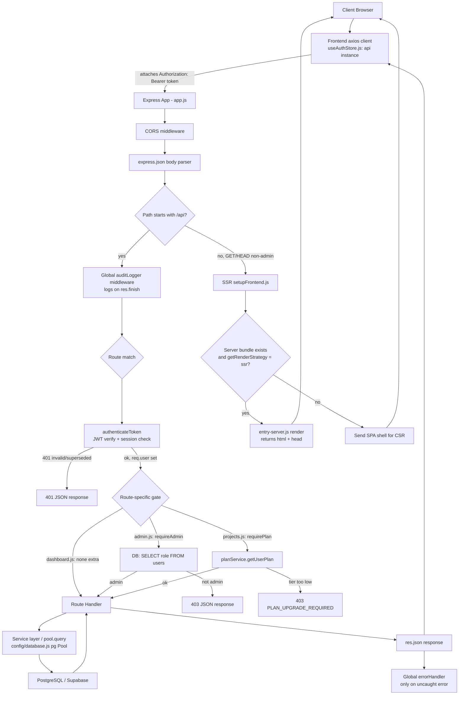

# Dashboard, Admin & Platform Infrastructure

This document covers the main user Dashboard (data aggregation across modules), the Admin panel (user/role/audit-log management), and the cross-cutting platform infrastructure that both depend on — Express middleware (auth, error handling, audit logging, plan gating), database config, the SSR/CSR frontend-serving layer, schema/migration approach, and the frontend's own state management and API client. It is written for internal engineering reference, grounded directly in the current source.

## Key Files

**Dashboard (backend)**
- [backend/src/routes/dashboard.js](../../backend/src/routes/dashboard.js) — `GET /api/dashboard/overview`, aggregates resume/interview/job/skill data for the logged-in user.

**Admin (backend)**
- [backend/src/routes/admin.js](../../backend/src/routes/admin.js) — stats, user list, audit log viewer, role update; gated by a local `requireAdmin` check.

**Projects (backend, referenced for the API table)**
- [backend/src/routes/projects.js](../../backend/src/routes/projects.js) — `GET /api/projects/ideas`, gated by `requirePlan(1)`.

**Middleware**
- [backend/src/middleware/auth.js](../../backend/src/middleware/auth.js) — `authenticateToken`: verifies JWT, checks session liveness via `sessionService`.
- [backend/src/middleware/errorHandler.js](../../backend/src/middleware/errorHandler.js) — final Express error handler (500 JSON response).
- [backend/src/middleware/auditLogger.js](../../backend/src/middleware/auditLogger.js) — `auditLogger(action, resource)`, writes a row to `audit_logs` on `res.on('finish')`.
- [backend/src/middleware/requirePlan.js](../../backend/src/middleware/requirePlan.js) — `requirePlan(minTier)`: server-side subscription tier gate, must run after `authenticateToken`.
- No dedicated rate-limiting middleware file exists in `backend/src/middleware/` (see Notes).

**Config**
- [backend/src/config/database.js](../../backend/src/config/database.js) — `pg` `Pool` setup; supports `DATABASE_URL` (Supabase-style) or discrete `DB_*` env vars.

**SSR**
- [backend/src/ssr/setupFrontend.js](../../backend/src/ssr/setupFrontend.js) — mounts the built frontend (`frontend/dist/client`) as static assets, then does SSR-or-CSR-shell rendering for non-`/api`, non-`/admin` GET/HEAD routes using `frontend/dist/server/entry-server.js`.

**Migrations / seed data**
- [backend/src/migrations/add-subscriptions.sql](../../backend/src/migrations/add-subscriptions.sql), [add-ats-tables.sql](../../backend/src/migrations/add-ats-tables.sql), [add-github-analyses.sql](../../backend/src/migrations/add-github-analyses.sql) — standalone idempotent (`CREATE TABLE IF NOT EXISTS`) SQL files.
- [backend/src/utils/initializeTables.js](../../backend/src/utils/initializeTables.js) and [backend/src/utils/runMigrations.js](../../backend/src/utils/runMigrations.js) — the actual code path run at boot (see Workflow/Notes); the `.sql` files above appear to be a secondary/reference copy of the same schema, not directly executed by `server.js`.
- [backend/src/data/onet/occupations.json](../../backend/src/data/onet/occupations.json) — static O*NET occupation reference data (not a migration).

**Frontend pages**
- [frontend/src/pages/Dashboard.jsx](../../frontend/src/pages/Dashboard.jsx), [Home.jsx](../../frontend/src/pages/Home.jsx), [Blog.jsx](../../frontend/src/pages/Blog.jsx), [ComingSoon.jsx](../../frontend/src/pages/ComingSoon.jsx), [ContentVault.jsx](../../frontend/src/pages/ContentVault.jsx).

**Frontend infra**
- [frontend/server/preview.mjs](../../frontend/server/preview.mjs) — standalone local SSR preview server (mirrors production Express SSR behavior, proxies `/api` to the real backend).
- [frontend/src/store/useAuthStore.js](../../frontend/src/store/useAuthStore.js) — Zustand store; owns the shared `axios` instance (`api`), JWT/refresh-token persistence, and auth state.
- [frontend/src/store/useSubscriptionStore.js](../../frontend/src/store/useSubscriptionStore.js) — Zustand store for plan/subscription state, layered on top of `api` from the auth store.
- [frontend/src/store/ssrReset.js](../../frontend/src/store/ssrReset.js) — resets both stores between SSR requests to avoid cross-request state leakage.
- [frontend/src/lib/browser.js](../../frontend/src/lib/browser.js) — SSR-safe `localStorage` guards (`isBrowser`, `safeLocalStorage`, etc.).
- [frontend/src/lib/auth-client.js](../../frontend/src/lib/auth-client.js) — a second, separate axios-based auth client ("Better Auth client wrapper"), duplicating token logic already in `useAuthStore.js` (see Notes).

**App wiring (read for context, not in the original file list but load-bearing)**
- [backend/src/app.js](../../backend/src/app.js) — actual Express middleware/route registration order.
- [backend/src/server.js](../../backend/src/server.js) — boot sequence: DB connect, `initializeTables`, `runMigrations`, `sessionService.ensureTables`, then `app.listen`.

## Architecture: Request Lifecycle

Based on [backend/src/app.js](../../backend/src/app.js), every request to the Express app passes through, in this order:

1. **CORS** (`cors()`) — origin allow-list built from `FRONTEND_URL` env var plus hardcoded localhost origins; `credentials: true`.
2. **Body parsing** (`express.json()`).
3. **Global audit logger** — `app.use('/api', auditLogger('API_REQUEST', 'system'))` runs for *every* `/api/*` request regardless of route, registering a `res.on('finish')` listener that inserts one row into `audit_logs` (fire-and-forget; failures are caught and only logged to console, never surfaced to the client).
4. **Route dispatch** — Express matches the path against the mounted routers (`/api/dashboard`, `/api/admin`, `/api/projects`, etc.).
5. **Per-route middleware**, applied inside each router, typically:
   - `authenticateToken` ([auth.js](../../backend/src/middleware/auth.js)) — reads `Authorization: Bearer <token>`, verifies with `jwt.verify(token, process.env.JWT_SECRET)`. If the decoded token carries a `sessionId`, it also checks `sessionService.isSessionActive(sessionId)` — this is how the app enforces "signed in on one device at a time"; a superseded session returns `401` with `code: 'SESSION_SUPERSEDED'` instead of a generic auth failure. On success it attaches the decoded payload to `req.user` and calls `sessionService.touchSession()` without awaiting it.
   - Route-specific authorization, e.g. `admin.js`'s own `requireAdmin` (queries `users.role` fresh from the DB on every request — see Admin Operations below), or `requirePlan(minTier)` ([requirePlan.js](../../backend/src/middleware/requirePlan.js)) which loads the user's plan via `planService.getUserPlan` and 403s with `PLAN_UPGRADE_REQUIRED` if the tier is insufficient.
6. **Route handler** — executes the business logic (DB queries via the shared `pg` `pool` from [database.js](../../backend/src/config/database.js)), and calls `res.json(...)` or `res.status(...).json(...)`.
7. **SSR/static fallback** — only reached for non-`/api` GET/HEAD requests that didn't match an API route; see the SSR section below.
8. **Global error handler** ([errorHandler.js](../../backend/src/middleware/errorHandler.js)) — registered last with `app.use(errorHandler)`. Catches anything passed to `next(err)`, logs the stack, and returns a generic `500` (`err.message` is only included when `NODE_ENV === 'development'`).

Important nuance: **there is no rate-limiting middleware anywhere in `backend/src/middleware/`** — the directory contains only `auth.js`, `errorHandler.js`, `auditLogger.js`, and `requirePlan.js`. See Notes.

Individual routes also wrap their own logic in `try/catch` and return their own `500` JSON bodies (e.g. `dashboard.js`, `admin.js`) rather than relying on the global `errorHandler` for expected failure paths — the global handler is really a last-resort net for uncaught/synchronous throws or `next(err)` calls.

## Architecture: Frontend State & API Client

State management is **Zustand**, not Redux/Context. Two stores currently exist:

- `useAuthStore` ([useAuthStore.js](../../frontend/src/store/useAuthStore.js)) is the foundation: it creates the single shared `axios` instance (`export const api`) used by essentially all authenticated frontend calls (`Dashboard.jsx`, `ContentVault.jsx`, etc. all `import { api } from '../store/useAuthStore'`). `api`'s `baseURL` resolves to `VITE_API_URL`, or `${window.location.origin}/api` in the browser, or `http://localhost:5000/api` during SSR (no `window`).
  - A **request interceptor** attaches `Authorization: Bearer <token>` from `safeLocalStorage('token')`.
  - A **response interceptor** handles two failure modes: (a) `code: 'SESSION_SUPERSEDED'` from the backend → clears local session and flips `sessionBlocked` state; (b) a plain `401` → attempts a token refresh via `POST /auth/refresh` (with request queuing via `refreshQueue` so concurrent 401s don't trigger parallel refreshes), retries the original request on success, or clears the session and resets auth state on failure.
  - The store itself exposes `login`, `signup`, `logout`, `checkAuth`, and session-block helpers, and persists `token`/`refreshToken`/`sessionId` to `localStorage` via the SSR-safe helpers in [browser.js](../../frontend/src/lib/browser.js).
- `useSubscriptionStore` ([useSubscriptionStore.js](../../frontend/src/store/useSubscriptionStore.js)) reuses the same `api` instance (imported from `useAuthStore`) for plan-related endpoints (`/subscriptions/plans`, `/subscriptions/my-plan`, `/subscriptions/create-order`, `/subscriptions/verify-payment`, etc.). Payment verification is explicitly a mock (`verifyPayment` comment: "no gateway wired up yet").
- `ssrReset.js` exports `resetStoresForSsr()`, which resets both stores to their default state — called (presumably by the SSR entry, not shown in the read list) between server-rendered requests so one user's in-memory Zustand state can't leak into another user's SSR render on the same Node process.

Pages call the backend exclusively through `api.get/post(...)` calls with relative paths like `/dashboard/overview` or `/learning/resources` (see `Dashboard.jsx`, `ContentVault.jsx`) — there is no generated API client/SDK layer; each page inlines its own `.then/.catch`, typically falling back to hardcoded static/mock data on request failure (e.g. `ContentVault.jsx`'s `FALLBACK_RESOURCES`, `Dashboard.jsx`'s hardcoded stat defaults).

**Duplicate auth-client note**: [frontend/src/lib/auth-client.js](../../frontend/src/lib/auth-client.js) is a second, independent axios client ("Better Auth client wrapper") that re-implements login/signup/logout/getSession and its own token persistence, separate from `useAuthStore.js`. Both read/write the same `localStorage` keys (`token`, `refreshToken`, `sessionId`) but do not appear to share code or interceptors. This is worth confirming whether `auth-client.js` is still consumed anywhere or is dead/legacy code.

## Workflow: Dashboard Data Aggregation

`GET /api/dashboard/overview` in [dashboard.js](../../backend/src/routes/dashboard.js), after `authenticateToken`, runs the following as one handler (not a service layer — all inline SQL):

1. **Resume scores** — `SELECT overall_score, created_at FROM resumes WHERE user_id = $1 ORDER BY created_at DESC LIMIT 10`. Takes the most recent as `latestResumeScore`.
2. **Mock interviews** — `SELECT score FROM mock_interviews WHERE user_id = $1 ORDER BY created_at DESC`, averages all scores into `avgInterviewScore`.
3. **Job applications** — `SELECT status FROM job_applications WHERE user_id = $1`, wrapped in its own `try/catch` (the comment notes it "assumes job_applications table exists"); computes totals, interview/offer/rejected counts, and a `replyRate` percentage. On query failure, silently falls back to a zeroed `jobStats` object and logs a warning — the endpoint does not fail overall.
4. **Skill assessment** — `SELECT * FROM skill_assessments WHERE user_id = $1 ORDER BY created_at DESC LIMIT 1`, also independently try/caught. Score extraction has three fallback paths: an explicit `score` column, an average of a `scores` JSON object, or a hardcoded default of `65` if a row exists but neither field does.
5. **Recent activity** — synthesized in-memory from the most recent resume and interview rows fetched in steps 1–2 (not a separate activity-log table).
6. **Readiness score & action items** — `readinessScore` is the unweighted average of `latestResumeScore`, `avgInterviewScore`, and `skillScore`. `generateActionItems()` (local helper) produces a prioritized, hardcoded rule-based checklist (resume/interview/skills/jobs/LinkedIn/GitHub) based on thresholds against that data, sorted by `priority` and truncated to 4 items.
7. **Onboarding profile** — `SELECT career_goal, experience_level, pain_points, field_of_interest FROM onboarding_responses WHERE user_id = $1`, also independently try/caught, used purely for personalization text on the frontend.
8. **Response assembly** — all of the above is merged into a single flat JSON object (`profile`, `readinessScore`, `resumeScore`, `resumeHistory`, `interviewsCompleted`, `avgInterviewScore`, `skillScore`, `jobsApplied`, `jobsInterviewing`, `offers`, `rejected`, `replyRate`, `recentActivity`, `actionItems`, `lastUpdated`) and returned once.

On the frontend, [Dashboard.jsx](../../frontend/src/pages/Dashboard.jsx) fetches this via `api.get('/dashboard/overview')` on mount, and separately calls `useSubscriptionStore.getUserPlan()` to determine which of the hardcoded `ALL_TOOLS` entries are unlocked (client-side only — `PLAN_TIERS` comparison), rendering locked tools with a `Lock` icon and reduced opacity. The stat tiles fall back to hardcoded placeholder numbers (`45/100`, `60/100`, etc.) if `overview` hasn't loaded or the fetch failed.

## Workflow: Admin Operations

[admin.js](../../backend/src/routes/admin.js) exposes 4 endpoints, all mounted under `/api/admin` in [app.js](../../backend/src/app.js):

| Endpoint | Purpose |
|---|---|
| `GET /stats` | Total users, total admins, total audit logs, and logs from the last 24h. |
| `GET /users` | Full user list (`id, name, email, role, created_at`) ordered by newest first — no pagination. |
| `GET /audit-logs` | Last 100 audit log rows, optionally filtered by `user_id` query param, joined against `users` for name/email, with `details` JSON parsed back into an object. |
| `PUT /users/:id/role` | Updates a user's `role` to `'user'` or `'admin'` (validated against a 2-value allow-list). |

**Access control**: The router applies `router.use(authenticateToken, requireAdmin)` once at the top of the file (line 20), so *every* route in `admin.js` requires both a valid JWT and admin role — there is no route in this file reachable by a non-admin authenticated user, and none reachable anonymously. `requireAdmin` is defined locally in this file (not in `backend/src/middleware/`) and does a fresh `SELECT role FROM users WHERE id = $1` per request (no caching, no reliance on a `role` claim baked into the JWT) — see Notes for the security implication.

There is a separate static admin UI mount in `app.js`: `app.use('/admin', express.static(path.join(__dirname, 'public/admin')))`. This serves static files (a separate admin frontend bundle) with **no authentication middleware at all** at the Express layer — any auth for that UI would have to happen client-side inside that bundle, which was not part of this review's file list.

## Flowchart

## API Endpoints

| Method | Path | Purpose | Auth Required |
|---|---|---|---|
| GET | `/api/dashboard/overview` | Aggregate readiness score, resume/interview/skill/job stats, recent activity, action items for the logged-in user | `authenticateToken` (JWT) |
| GET | `/api/admin/stats` | Admin dashboard counts: total users, admins, audit logs, recent logs | `authenticateToken` + `requireAdmin` |
| GET | `/api/admin/users` | List all users (id, name, email, role, created_at) | `authenticateToken` + `requireAdmin` |
| GET | `/api/admin/audit-logs` | List up to 100 audit log entries, optional `user_id` filter | `authenticateToken` + `requireAdmin` |
| PUT | `/api/admin/users/:id/role` | Change a user's role to `user` or `admin` | `authenticateToken` + `requireAdmin` |
| GET | `/api/projects/ideas` | Return static list of project idea suggestions | `authenticateToken` + `requirePlan(1)` ("Learn & Build" tier or higher) |

## Notes / Gotchas

- **No rate limiting anywhere.** `backend/src/middleware/` contains only `auth.js`, `errorHandler.js`, `auditLogger.js`, `requirePlan.js` — there is no rate-limit middleware applied globally or per-route in `app.js`. Login, admin, and all other endpoints are unthrottled at the application layer.
- **Admin role check re-queries the DB on every request and trusts no JWT claim.** `requireAdmin` in [admin.js](../../backend/src/routes/admin.js) does `SELECT role FROM users WHERE id = $1` fresh each time rather than trusting a role embedded in the JWT — this is actually the *safer* pattern (avoids stale-role JWTs granting admin after a demotion), but it does mean every admin request costs an extra DB round trip and a DB outage silently returns `500` (fails closed, which is correct) rather than `403`.
- **Admin role escalation path is minimally guarded.** `PUT /api/admin/users/:id/role` lets any existing admin promote *any* user (including themselves or another arbitrary id) to `admin`, or demote any admin, with only a value-in-allowlist check (`['user','admin']`) — there's no additional confirmation, no audit-specific alerting beyond the generic `auditLogger`, no protection against an admin demoting the last remaining admin, and no restriction preventing an admin from changing their own role.
- **Static `/admin` UI bundle has no auth middleware at the Express layer.** `app.use('/admin', express.static(...))` in `app.js` is mounted with no `authenticateToken`/`requireAdmin` in front of it, unlike every `/api/admin/*` route. If that static bundle doesn't enforce its own login gate client-side, the admin UI's HTML/JS/assets are publicly fetchable (though the API calls it makes would still be protected).
- **Global audit logging is best-effort and silently swallows failures.** `auditLogger` in `app.js` wraps *all* `/api/*` traffic, but errors writing to `audit_logs` are only `console.error`'d, never surfaced — if the audit table is unavailable, the app has no record of that and no fallback (e.g. to file/stdout structured logs).
- **Schema drift between the two migration mechanisms.** `backend/src/server.js` boots by calling `initializeTables()` and `runMigrations()` (in `backend/src/utils/`), not the `.sql` files under `backend/src/migrations/`. The two disagree on the `resumes` table shape: `initializeTables.js` creates `resumes` with an `overall_score` column, while `runMigrations.js` / `add-ats-tables.sql` define a `resumes` table with `original_score`/`optimized_score` (v2 ATS schema) and use `ALTER TABLE ... ADD COLUMN IF NOT EXISTS` to backfill v2 columns onto whichever version exists — but neither adds `overall_score` if only the v2 path ran first. `dashboard.js`'s very first query (`SELECT overall_score, created_at FROM resumes ...`) depends on the `initializeTables.js` shape; on an install where `runMigrations.js` created `resumes` first (e.g. `add-ats-tables.sql` semantics), that column may not exist and the dashboard endpoint would throw, returning the generic `500 Failed to fetch dashboard data`. This is a real schema-consistency risk worth resolving (pick one source of truth for `resumes`), not just a style nit.
- **No formal migration framework.** There's no migration runner with versioning/rollback (e.g. `node-pg-migrate`, `knex`, `umzug`) — schema evolution is done via idempotent `CREATE TABLE IF NOT EXISTS` / `ALTER TABLE ... ADD COLUMN IF NOT EXISTS` statements executed imperatively at every server boot (`initializeTables.js`, `runMigrations.js`). The `.sql` files in `backend/src/migrations/` do not appear to be executed by any code path read during this review — they read as a documentation/reference snapshot of the schema rather than an active migration mechanism, which is worth confirming with whoever owns deployment.
- **Two independent frontend auth clients.** `frontend/src/store/useAuthStore.js` and `frontend/src/lib/auth-client.js` both implement login/signup/logout/session-fetch against `/auth/*` and both read/write the same `localStorage` keys, but are separate axios instances with no shared interceptor logic (only `useAuthStore`'s `api` has the 401-refresh interceptor). Worth checking whether `auth-client.js` is still imported anywhere or is legacy/dead code, since having two divergent token-handling paths against the same storage keys is a source of subtle bugs.
- **Dashboard route has no `requirePlan` gate**, unlike `projects.js`; every authenticated user (any/no plan) can call `/api/dashboard/overview`, with tool-visibility gating enforced only client-side in `Dashboard.jsx` via `PLAN_TIERS` — consistent with `requirePlan.js`'s own comment that UI gating alone isn't sufficient for routes that do need protecting, but dashboard read access itself appears intentionally ungated.
- **`job_applications` and `skill_assessments` queries are defensively wrapped** in dashboard.js specifically because the code doesn't assume those tables exist/are populated — a pragmatic but implicit signal that schema completeness isn't guaranteed across environments.
